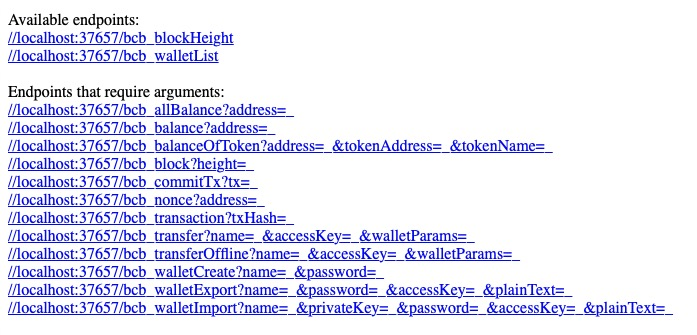
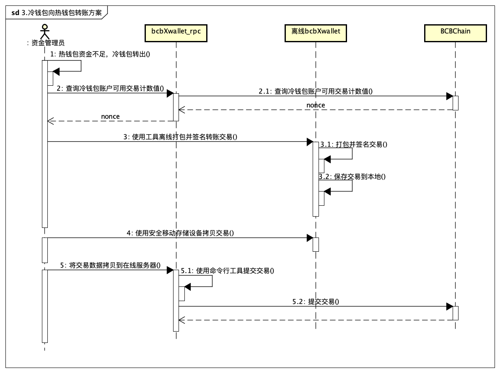

# BCBChain V1.0 Quick Start for Exchanges

**V1.0.3**

<div STYLE="page-break-after: always;"></div>
[TOC]
<script src="./github/ltview.js"></script>

<div STYLE="page-break-after: always;"></div>
# 1 引言


## 1.1 什么是BCBChain

BCBChain是以Tendermint为基础开发的区块链体系，以系统安全性为依归，进行技术创新，实现物与物、人与物之间高效的价值信息传递，打造快速应用，具备高性能及高扩展性的平台。

更详细的介绍参见《BCBChain_V1.0_Program_Reference》。


## 1.2 概要说明

BCBChain钱包类资产与交易所的对接方式需要运行的程序如下：

* bcbXwallet_rpc 

  BCBChain交易站对接服务程序，是一个提供安全生成钱包私钥并输出访问密钥， 同时提供数字资产交易类简便访问API接口的服务。

* bcbXwallet

  BCBChain交易站对接服务程序客户端，是一个为服务程序对外开放的接口提供便捷访问的命令行工具。


上述组件之间的基本关系由下图进行描绘。


<div STYLE="page-break-after: always;"></div>
# 2 软硬件需求

**操作系统**：	CentOS 7 64 bit

**硬件**：		CPU 8核+，内存16GB+，硬盘512GB+

**依赖**：		安装NTP服务

```
[tmp]# sudo apt-get install ntp
```

<div STYLE="page-break-after: always;"></div>

# 3 bcbXwallet部署

## 3.1 安装包下载

下载地址：

```
https://github.com/bcbchain/xwallet/releases/download/v1.0.12/bcb-Xwallet_1.0.12.10094-x64.tar.gz
```


## 3.2 解压程序

将下载的安装包放置在临时目录，执行命令：

```
[tmp]# tar xvf bcb-Xwallet_1.0.12.10094-x64.tar.gz
```

 

## 3.3 启动程序

进入“bcb-Xwallet_1.0.12.10094-x64”目录，执行命令：

```
[bcb-Xwallet_1.0.12.10094-x64]# ./bcbXwallet_rpc
```

启动后 bcbXwallet_rpc 的监听端口为：37657。你可以打开"./.config/bcbXwallet.yaml"这个文件，修改监听端口。


查看bcb-Xwallet服务程序是否正确执行，可执行如下命令查看：

```
[root]# netstat -lnp | grep 37657                                              
```


# 4 全节点部署

## 4.1 安装包下载

下载地址：

```
https://github.com/bcbchain/xwallet/releases/download/v1.0.12/bcb-node_1.0.17.12511.tar.gz
```


## 4.2 解压程序

将下载的安装包放置在临时目录，执行命令：

```
[tmp]# tar xzf bcb-node_1.0.17.12511.tar.gz
```

 

## 4.3 安装程序

### 4.3.1 安装bcchain

进入“bcbchain_1.0.17.12511”目录，执行命令

```
[bcbchain_1.0.17.12511]# ./install
```

### 4.3.2安装 tmcore

进入“tmcore_1.0.17.12511”目录，执行命令：

```
[tmcore_1.0.17.12511]# ./install                                         
```

输入：1，选择bcb；

输入：3，选择UNOFFICIAL FOLLOWER；

输入：earth.bcbchain.io，等待tmcore安装完成。

输入命令：curl localhost:46657/abci_info，如果显示"last_block_height"字段，即表示安装成功。

### 4.3.3 数据同步

安装完成后，节点就会同步区块，由于区块数据较大，同步区块大概需要十天时间，我们也提供离线数据包，您可以下载导入，这样可以加快同步速度。下载链接为：**http://211.154.140.124:43356/down/** ，下载后，把数据包分别放到指定目录，执行以下命令，即可完成数据导入。

```
systemctl stop tmcore.service
systemctl stop bcbchain.service

cd /home/tmcore/ && rm data -rf 
tar xf tmcore_data_20190625.tar.gz

cd /home/bcbchain/ && rm  .appstate.db -rf
tar xf bcbchain_appstate.db_20190625.tar.gz

systemctl start tmcore.service
systemctl start bcbchain.service

```


# 5 通讯协议

## 5.1 协议概览

bcbXwallet_rpc服务程序支持如下所示的RPC通讯协议：

- URI over HTTPS
- JSONRPC over HTTPS

bcbXwallet_rpc服务程序所支持的所有RPC接口及其参数可通过URL：https://ip:port获取。

bcbXwallet_rpc服务程序提供的RPC接口列表如下所示（支持HTTPS，默认端口为37657）:



<div STYLE="page-break-after: always;"></div>

<div STYLE="page-break-after: always;"></div>

## 5.2 URI over HTTP

采用HTTP协议GET方法进行RPC请求时，参数必须采用URI编码，所有RPC调用的URL格式参见上表，具体业务及参数描述参见本章后续小节。


## 5.3 JSONRPC over HTTP

采用HTTP协议POST方法进行RPC请求时，使用JSONRPC应用协议，请求的HTTP数据体的格式如下所示：

```json
Example：
{
  "jsonrpc": "2.0",
  "id": "dontcare/anything",
  "method": "bcb_block",
  "params": {
    "height": 2500
  }
}
```

具体通讯接口业务及参数描述参见后续章节。


接口执行成功返回的通用数据结构定义如下：

```
{
  "jsonrpc": "2.0",
  "id": "",
  "result": {
    …		//不同API返回的JSON结构都是定制化的
  }
}
```


执行失败返回的通用数据结构定义如下（所有接口的失败返回的数据结构相同）：

```json
{
  "jsonrpc": "2.0",
  "id": "",
  "error": {
    "code": -32603,
    "message": "Invalid parameters.",
    "data": ""
  }
}
```


# 6 编程接口


## 6.1 钱包管理接口


### 6.1.1 bcb_walletCreate

向 bcbXwallet_rpc 服务提交创建一个新钱包的请求。


- **Request URI over HTTPS**

  ```
  https://localhost:37657/bcb_walletCreate?name=_&password=_
  ```

- **Request JSONRPC over HTTPS**

  ```
  {
    "jsonrpc": "2.0",
    "id": "dontcare/anything",
    "method": "bcb_walletCreate",
    "params": {
        "name": "hotwal001",
        "password": "aBig62_123"
    }
  }
  ```

- **Request Parameters**

  | **语法** | **类型** | **注释**&nbsp;&nbsp;&nbsp;&nbsp;&nbsp;&nbsp;&nbsp;&nbsp;&nbsp;&nbsp;&nbsp;&nbsp;&nbsp;&nbsp;&nbsp;&nbsp;&nbsp;&nbsp;&nbsp;&nbsp;&nbsp;&nbsp;&nbsp;&nbsp;&nbsp;&nbsp;&nbsp;&nbsp;&nbsp;&nbsp;&nbsp;&nbsp;&nbsp;&nbsp;&nbsp;&nbsp;&nbsp;&nbsp;&nbsp;&nbsp;&nbsp;&nbsp;&nbsp;&nbsp;&nbsp;&nbsp;&nbsp;&nbsp;&nbsp;&nbsp;&nbsp;&nbsp;&nbsp;&nbsp;&nbsp;&nbsp;&nbsp;&nbsp;&nbsp;&nbsp;&nbsp;&nbsp;&nbsp;&nbsp;&nbsp;&nbsp;&nbsp;&nbsp;&nbsp;&nbsp;&nbsp;&nbsp;&nbsp;&nbsp; |
  | -------- | :------: | ------------------------------------------------------------ |
  | name     |  String  | 钱包名称，长度1-40字符，只能由```大写字母、小写字母、数字、@、_、-、. ```组成。 |
  | password |  String  | 钱包密码，长度8-20字符（可由任意可打印ASCII字符组成，要求至少有一个小写字母、至少一个大写字母、至少一个数字、至少一个非字母数字字符）。 |


- **Response SUCCESS Example**

  ```
  {
    "jsonrpc": "2.0",
    "id": "1",
    "result": {
    	"walletAddr": "bcbES5d6kwoX4vMeNLENMee2Mnsf2KL9ZpWo",
    	"accessKey": "ASwDbde7X6z7nnTo2NVLrXF7JXevxA9iPeiTjforkCCB"
    }
  }
  ```

- **Response SUCCESS Parameters**

  | **语法**   | **类型** | **注释**&nbsp;&nbsp;&nbsp;&nbsp;&nbsp;&nbsp;&nbsp;&nbsp;&nbsp;&nbsp;&nbsp;&nbsp;&nbsp;&nbsp;&nbsp;&nbsp;&nbsp;&nbsp;&nbsp;&nbsp;&nbsp;&nbsp;&nbsp;&nbsp;&nbsp;&nbsp;&nbsp;&nbsp;&nbsp;&nbsp;&nbsp;&nbsp;&nbsp;&nbsp;&nbsp;&nbsp;&nbsp;&nbsp;&nbsp;&nbsp;&nbsp;&nbsp;&nbsp;&nbsp;&nbsp;&nbsp;&nbsp;&nbsp;&nbsp;&nbsp;&nbsp;&nbsp;&nbsp;&nbsp;&nbsp;&nbsp;&nbsp;&nbsp;&nbsp;&nbsp;&nbsp;&nbsp;&nbsp;&nbsp;&nbsp;&nbsp;&nbsp;&nbsp;&nbsp;&nbsp;&nbsp;&nbsp;&nbsp;&nbsp; |
  | ---------- | :------: | ------------------------------------------------------------ |
  | walletAddr | Address  | 钱包地址。                                                   |
  | accessKey  |  String  | 钱包访问密钥，该密钥由bcbXwallet_rpc服务随机生成，用于加密钱包对应的私钥，调用方需要妥善保存，丢失将导致私钥无法找回。 |


### 6.1.2 bcb_walletExport

向 bcbXwallet_rpc 服务提交导出一个钱包的请求。


- **Request URI over HTTPS**

  ```
  https://localhost:37657/bcb_walletExport?name=_&password=_&accessKey=_&plainText=_
  ```

- **Request JSONRPC over HTTPS**

  ```
  {
    "jsonrpc": "2.0",
    "id": "dontcare/anything",
    "method": "bcb_walletExport",
    "params": {
        "name": "hotwal001",
        "password": "aBig62_123",
        "accessKey": "ASwDbde7X6z7nnTo2NVLrXF7JXevxA9iPeiTjforkCCB",
        "plainText": false
    }
  }
  ```

- **Request Parameters**

  | **语法**  | **类型** | **注释**&nbsp;&nbsp;&nbsp;&nbsp;&nbsp;&nbsp;&nbsp;&nbsp;&nbsp;&nbsp;&nbsp;&nbsp;&nbsp;&nbsp;&nbsp;&nbsp;&nbsp;&nbsp;&nbsp;&nbsp;&nbsp;&nbsp;&nbsp;&nbsp;&nbsp;&nbsp;&nbsp;&nbsp;&nbsp;&nbsp;&nbsp;&nbsp;&nbsp;&nbsp;&nbsp;&nbsp;&nbsp;&nbsp;&nbsp;&nbsp;&nbsp;&nbsp;&nbsp;&nbsp;&nbsp;&nbsp;&nbsp;&nbsp;&nbsp;&nbsp;&nbsp;&nbsp;&nbsp;&nbsp;&nbsp;&nbsp;&nbsp;&nbsp;&nbsp;&nbsp;&nbsp;&nbsp;&nbsp;&nbsp;&nbsp;&nbsp;&nbsp;&nbsp;&nbsp;&nbsp;&nbsp;&nbsp;&nbsp;&nbsp; |
  | --------- | :------: | ------------------------------------------------------------ |
  | name      |  String  | 钱包名称。                                                   |
  | password  |  String  | 钱包密码，长度8-20字符（可由任意可打印ASCII字符组成，要求至少有一个小写字母、至少一个大写字母、至少一个数字、至少一个非字母数字字符）。 |
  | accessKey |  String  | 钱包访问密钥。                                               |
  | plainText |   Bool   | 是否导出明文私钥，true表示导出私钥明文，false表示导出私钥密文。 |


- **Response SUCCESS Example**

  ```
  {
    "jsonrpc": "2.0",
    "id": "1",
    "result": {
    	"privateKey": "0xbf7cbe09d71a1bc…99b7abd8f8fd73cb4",
    	"walletAddr": "bcbES5d6kwoX4vMeNLENMee2Mnsf2KL9ZpWo"
    }
  }
  ```

- **Response SUCCESS Parameters**

  | **语法**   | **类型**  | **注释**&nbsp;&nbsp;&nbsp;&nbsp;&nbsp;&nbsp;&nbsp;&nbsp;&nbsp;&nbsp;&nbsp;&nbsp;&nbsp;&nbsp;&nbsp;&nbsp;&nbsp;&nbsp;&nbsp;&nbsp;&nbsp;&nbsp;&nbsp;&nbsp;&nbsp;&nbsp;&nbsp;&nbsp;&nbsp;&nbsp;&nbsp;&nbsp;&nbsp;&nbsp;&nbsp;&nbsp;&nbsp;&nbsp;&nbsp;&nbsp;&nbsp;&nbsp;&nbsp;&nbsp;&nbsp;&nbsp;&nbsp;&nbsp;&nbsp;&nbsp;&nbsp;&nbsp;&nbsp;&nbsp;&nbsp;&nbsp;&nbsp;&nbsp;&nbsp;&nbsp;&nbsp;&nbsp;&nbsp;&nbsp;&nbsp;&nbsp;&nbsp;&nbsp;&nbsp;&nbsp;&nbsp;&nbsp;&nbsp;&nbsp; |
  | ---------- | :-------: | ------------------------------------------------------------ |
  | privateKey | HexString | 钱包私钥，根据plainText参数决定导出的是明文还是密文，以 0x 开头。 |
  | walletAddr |  Address  | 钱包地址。                                                   |


### 6.1.3 bcb_walletImport

向 bcbXwallet_rpc 服务提交导入一个新钱包的请求。


- **Request URI over HTTPS**

  ```
  https://localhost:37657/bcb_walletImport?name=_&privateKey=_&password=_&accessKey=_
  &plainText=_
  ```

- **Request JSONRPC over HTTPS**

  ```
  {
    "jsonrpc": "2.0",
    "id": "dontcare/anything",
    "method": "bcb_walletImport",
    "params": {
        "name": "hotwal001",
        "privateKey": "0xbf7cbe09d71a1bc…99b7abd8f8fd73cb4",
        "password": "aBig62_123",
        "accessKey": "ASwDbde7X6z7nnTo2NVLrXF7JXevxA9iPeiTjforkCCB",
        "plainText": false
    }
  }
  ```

- **Request Parameters**

  | **语法**   | **类型**  | **注释**&nbsp;&nbsp;&nbsp;&nbsp;&nbsp;&nbsp;&nbsp;&nbsp;&nbsp;&nbsp;&nbsp;&nbsp;&nbsp;&nbsp;&nbsp;&nbsp;&nbsp;&nbsp;&nbsp;&nbsp;&nbsp;&nbsp;&nbsp;&nbsp;&nbsp;&nbsp;&nbsp;&nbsp;&nbsp;&nbsp;&nbsp;&nbsp;&nbsp;&nbsp;&nbsp;&nbsp;&nbsp;&nbsp;&nbsp;&nbsp;&nbsp;&nbsp;&nbsp;&nbsp;&nbsp;&nbsp;&nbsp;&nbsp;&nbsp;&nbsp;&nbsp;&nbsp;&nbsp;&nbsp;&nbsp;&nbsp;&nbsp;&nbsp;&nbsp;&nbsp;&nbsp;&nbsp;&nbsp;&nbsp;&nbsp;&nbsp;&nbsp;&nbsp;&nbsp;&nbsp;&nbsp;&nbsp;&nbsp;&nbsp; |
  | ---------- | :-------: | ------------------------------------------------------------ |
  | name       |  String   | 钱包名称，长度1-40字符，只能由```大写字母、小写字母、数字、@、_、-、. ```组成。 |
  | privateKey | HexString | 钱包私钥，以 0x 开头。                                       |
  | password   |  String   | 钱包密码，长度8-20字符（可由任意可打印ASCII字符组成，要求至少有一个小写字母、至少一个大写字母、至少一个数字、至少一个非字母数字字符）。 |
  | accessKey  |  String   | 钱包访问密钥，plainText为true时，该参数可忽略。              |
  | plainText  |   Bool    | 指示privateKey是否为明文，true表示明文，false表示密文。      |


- **Response SUCCESS Example**

  ```
  {
    "jsonrpc": "2.0",
    "id": "1",
    "result": {
    	"walletAddr": "bcbES5d6kwoX4vMeNLENMee2Mnsf2KL9ZpWo",
    	"accessKey": "ASwDbde7X6z7nnTo2NVLrXF7JXevxA9iPeiTjforkCCB"
    }
  }
  ```

- **Response SUCCESS Parameters**

  | **语法**   | **类型** | **注释**&nbsp;&nbsp;&nbsp;&nbsp;&nbsp;&nbsp;&nbsp;&nbsp;&nbsp;&nbsp;&nbsp;&nbsp;&nbsp;&nbsp;&nbsp;&nbsp;&nbsp;&nbsp;&nbsp;&nbsp;&nbsp;&nbsp;&nbsp;&nbsp;&nbsp;&nbsp;&nbsp;&nbsp;&nbsp;&nbsp;&nbsp;&nbsp;&nbsp;&nbsp;&nbsp;&nbsp;&nbsp;&nbsp;&nbsp;&nbsp;&nbsp;&nbsp;&nbsp;&nbsp;&nbsp;&nbsp;&nbsp;&nbsp;&nbsp;&nbsp;&nbsp;&nbsp;&nbsp;&nbsp;&nbsp;&nbsp;&nbsp;&nbsp;&nbsp;&nbsp;&nbsp;&nbsp;&nbsp;&nbsp;&nbsp;&nbsp;&nbsp;&nbsp;&nbsp;&nbsp;&nbsp;&nbsp;&nbsp;&nbsp; |
  | ---------- | :------: | ------------------------------------------------------------ |
  | walletAddr | Address  | 钱包地址。                                                   |
  | accessKey  |  String  | 钱包访问密钥，该密钥由bcbXwallet_rpc服务随机生成，用于加密钱包对应的私钥，调用方需要妥善保存，丢失将导致私钥无法找回。 |


### 6.1.4 bcb_walletList

向 bcbXwallet_rpc 服务提交列出所有钱包信息的请求。


- **Request URI over HTTPS**

  ```
  https://localhost:37657/bcb_walletList?pageNum=_
  ```

- **Request JSONRPC over HTTPS**

  ```
  {
    "jsonrpc": "2.0",
    "id": "dontcare/anything",
    "method": "bcb_walletList",
    "params": {
        "pageNum": "1"
    }
  }
  ```

- **Request Parameters**

  | **语法** | **类型** | **注释**&nbsp;&nbsp;&nbsp;&nbsp;&nbsp;&nbsp;&nbsp;&nbsp;&nbsp;&nbsp;&nbsp;&nbsp;&nbsp;&nbsp;&nbsp;&nbsp;&nbsp;&nbsp;&nbsp;&nbsp;&nbsp;&nbsp;&nbsp;&nbsp;&nbsp;&nbsp;&nbsp;&nbsp;&nbsp;&nbsp;&nbsp;&nbsp;&nbsp;&nbsp;&nbsp;&nbsp;&nbsp;&nbsp;&nbsp;&nbsp;&nbsp;&nbsp;&nbsp;&nbsp;&nbsp;&nbsp;&nbsp;&nbsp;&nbsp;&nbsp;&nbsp;&nbsp;&nbsp;&nbsp;&nbsp;&nbsp;&nbsp;&nbsp;&nbsp;&nbsp;&nbsp;&nbsp;&nbsp;&nbsp;&nbsp;&nbsp;&nbsp;&nbsp;&nbsp;&nbsp;&nbsp;&nbsp;&nbsp;&nbsp; |
  | -------- | :------: | ------------------------------------------------------------ |
  | pageNum  |  uint64  | 钱包列表页码，默认一页最多1000条。                           |


- **Response SUCCESS Example**

  ```
  {
    "jsonrpc": "2.0",
    "id": "1",
    "result": {
    	"total": 2,
    	"walletList": [
        {
          "name": "hotwal001",
          "walletAddr": "bcbES5d6kwoX4vMeNLENMee2Mnsf2KL9ZpWo"
        },
        {
          "name": "hotwal002",
          "walletAddr": "bcbLvBTGZCrLG3AMuyjD7eSqwQnBrq6CHc59"
        }
      ]
    }
  }
  ```

- **Response SUCCESS Parameters**

  | **语法**   | **类型** | **注释**&nbsp;&nbsp;&nbsp;&nbsp;&nbsp;&nbsp;&nbsp;&nbsp;&nbsp;&nbsp;&nbsp;&nbsp;&nbsp;&nbsp;&nbsp;&nbsp;&nbsp;&nbsp;&nbsp;&nbsp;&nbsp;&nbsp;&nbsp;&nbsp;&nbsp;&nbsp;&nbsp;&nbsp;&nbsp;&nbsp;&nbsp;&nbsp;&nbsp;&nbsp;&nbsp;&nbsp;&nbsp;&nbsp;&nbsp;&nbsp;&nbsp;&nbsp;&nbsp;&nbsp;&nbsp;&nbsp;&nbsp;&nbsp;&nbsp;&nbsp;&nbsp;&nbsp;&nbsp;&nbsp;&nbsp;&nbsp;&nbsp;&nbsp;&nbsp;&nbsp;&nbsp;&nbsp;&nbsp;&nbsp;&nbsp;&nbsp;&nbsp;&nbsp;&nbsp;&nbsp;&nbsp;&nbsp;&nbsp;&nbsp; |
  | ---------- | :------: | ------------------------------------------------------------ |
  | total      |   Int    | 钱包总条数。                                                 |
  | name       |  String  | 钱包名称。                                                   |
  | walletAddr | Address  | 钱包地址。                                                   |


### 6.1.5 bcb_transfer

向 bcbXwallet_rpc 服务提交一次资产转账的请求。


- **Request URI over HTTPS**

  ```
  https://localhost:37657/bcb_transfer?name=_&accessKey=_&walletParams=_
  ```

- **Request JSONRPC over HTTPS**

  ```
  {
    "jsonrpc": "2.0",
    "id": "dontcare/anything",
    "method": "bcb_transfer",
    "params": {
      "name": "hotwal001",
      "accessKey": "ASwDbde7X6z7nnTo2NVLrXF7JXevxA9iPeiTjforkCCB",
      "walletParams": {
        "smcAddress": "bcbLVgb3odTfKC9Y9GeFnNWL9wmR4pwWiqwe",
        "gasLimit": "600",
        "note": "",
        "to": "bcbLocFJG5Q792eLQXhvNkG417kwiaaoPH5a",
        "value": "1500000000"
      }
    }
  }
  ```

- **Request Parameters**

  | **语法**               | **类型** | **注释**&nbsp;&nbsp;&nbsp;&nbsp;&nbsp;&nbsp;&nbsp;&nbsp;&nbsp;&nbsp;&nbsp;&nbsp;&nbsp;&nbsp;&nbsp;&nbsp;&nbsp;&nbsp;&nbsp;&nbsp;&nbsp;&nbsp;&nbsp;&nbsp;&nbsp;&nbsp;&nbsp;&nbsp;&nbsp;&nbsp;&nbsp;&nbsp;&nbsp;&nbsp;&nbsp;&nbsp;&nbsp;&nbsp;&nbsp;&nbsp;&nbsp;&nbsp;&nbsp;&nbsp;&nbsp;&nbsp;&nbsp;&nbsp;&nbsp;&nbsp;&nbsp;&nbsp;&nbsp;&nbsp;&nbsp;&nbsp;&nbsp;&nbsp;&nbsp;&nbsp;&nbsp;&nbsp;&nbsp;&nbsp;&nbsp;&nbsp;&nbsp;&nbsp;&nbsp;&nbsp;&nbsp;&nbsp;&nbsp;&nbsp; |
  | ---------------------- | :------: | ------------------------------------------------------------ |
  | name                   |  String  | 钱包名称。                                                   |
  | accessKey              |  String  | 钱包访问密钥。                                               |
  | walletParams {         |  Object  | 资产交易参数。                                               |
  | &nbsp;&nbsp;smcAddress | Address  | 交易的资产（本币或代币）对应的智能合约地址。                 |
  | &nbsp;&nbsp;gasLimit   |  String  | 交易的燃料限制。                                             |
  | &nbsp; note            |  String  | 交易备注（最长256字符）。                                    |
  | &nbsp;&nbsp;to         | Address  | 接收转账的账户地址。                                         |
  | &nbsp;&nbsp;value      |  String  | 转账的资产数量（单位：Cong）。                               |
  | }                      |          |                                                              |


- **Response SUCCESS Example**

  ```
  {
    "jsonrpc": "2.0",
    "id": "1",
    "result": {
      "code": 200,
      "log": "succeed",
      "fee": "125000",
      "txHash": "A1C960B9D5DB633A6E45B45015A722A2C516B392F93C9BF41F5DAA1197030584"
      "height": 234389
    }
  }
  ```

- **Response SUCCESS Parameters**

  | **语法** | **类型**  | **注释**&nbsp;&nbsp;&nbsp;&nbsp;&nbsp;&nbsp;&nbsp;&nbsp;&nbsp;&nbsp;&nbsp;&nbsp;&nbsp;&nbsp;&nbsp;&nbsp;&nbsp;&nbsp;&nbsp;&nbsp;&nbsp;&nbsp;&nbsp;&nbsp;&nbsp;&nbsp;&nbsp;&nbsp;&nbsp;&nbsp;&nbsp;&nbsp;&nbsp;&nbsp;&nbsp;&nbsp;&nbsp;&nbsp;&nbsp;&nbsp;&nbsp;&nbsp;&nbsp;&nbsp;&nbsp;&nbsp;&nbsp;&nbsp;&nbsp;&nbsp;&nbsp;&nbsp;&nbsp;&nbsp;&nbsp;&nbsp;&nbsp;&nbsp;&nbsp;&nbsp;&nbsp;&nbsp;&nbsp;&nbsp;&nbsp;&nbsp;&nbsp;&nbsp;&nbsp;&nbsp;&nbsp;&nbsp;&nbsp;&nbsp; |
  | -------- | :-------: | ------------------------------------------------------------ |
  | code     |    Int    | 交易校验/背书结果代码，200表示执行成功。                     |
  | log      |  String   | 对交易校验/背书结果进行的文字描述，当code不等于200时描述具体的错误信息。 |
  | txHash   | HexString | 交易的哈希。                                                 |
  | height   |   Int64   | 交易在哪个高度的区块被确认。                                 |


### 6.1.5 bcb_transferOffline

向 bcbXwallet_rpc 服务提交离线构建一笔资产转账交易的请求。


- **Request URI over HTTPS**

  ```
  https://localhost:37657/bcb_transferOffline?name=_&accessKey=_&walletParam=_
  ```

- **Request JSONRPC over HTTPS**

  ```
  {
    "jsonrpc": "2.0",
    "id": "dontcare/anything",
    "method": "bcb_transferOffline",
    "params": {
      "name": "hotwal001",
      "accessKey": "ASwDbde7X6z7nnTo2NVLrXF7JXevxA9iPeiTjforkCCB",
      "walletParams": {
        "smcAddress": "bcbLVgb3odTfKC9Y9GeFnNWL9wmR4pwWiqwe",
        "gasLimit": "600",
        "note": "",
        "nonce": 15,
        "to": "bcbLocFJG5Q792eLQXhvNkG417kwiaaoPH5a",
        "value": "1500000000"
      }
    }
  }
  ```

- **Request Parameters**

  | **语法**               | **类型** | **注释**&nbsp;&nbsp;&nbsp;&nbsp;&nbsp;&nbsp;&nbsp;&nbsp;&nbsp;&nbsp;&nbsp;&nbsp;&nbsp;&nbsp;&nbsp;&nbsp;&nbsp;&nbsp;&nbsp;&nbsp;&nbsp;&nbsp;&nbsp;&nbsp;&nbsp;&nbsp;&nbsp;&nbsp;&nbsp;&nbsp;&nbsp;&nbsp;&nbsp;&nbsp;&nbsp;&nbsp;&nbsp;&nbsp;&nbsp;&nbsp;&nbsp;&nbsp;&nbsp;&nbsp;&nbsp;&nbsp;&nbsp;&nbsp;&nbsp;&nbsp;&nbsp;&nbsp;&nbsp;&nbsp;&nbsp;&nbsp;&nbsp;&nbsp;&nbsp;&nbsp;&nbsp;&nbsp;&nbsp;&nbsp;&nbsp;&nbsp;&nbsp;&nbsp;&nbsp;&nbsp;&nbsp;&nbsp;&nbsp;&nbsp; |
  | ---------------------- | :------: | ------------------------------------------------------------ |
  | name                   |  String  | 钱包名称。                                                   |
  | accessKey              |  String  | 钱包访问密钥。                                               |
  | walletParams {         |  Object  | 资产交易参数。                                               |
  | &nbsp;&nbsp;smcAddress | Address  | 交易的资产（本币或代币）对应的智能合约地址。                 |
  | &nbsp;&nbsp;gasLimit   |  String  | 交易的燃料限制。                                             |
  | &nbsp; note            |  String  | 交易备注（最长256字符）。                                    |
  | &nbsp;&nbsp;nonce      |  Uint64  | 交易计数值，可通过```bcb_nonce```接口获取。                  |
  | &nbsp;&nbsp;to         | Address  | 接收转账的账户地址。                                         |
  | &nbsp;&nbsp;value      |  String  | 转账的资产数量（单位：Cong）。                               |
  | }                      |          |                                                              |


- **Response SUCCESS Example**

  ```
  {
    "jsonrpc": "2.0",
    "id": "1",
    "result": {
      "tx": "bcb<tx>.v1.AetboYAmy2TEyUbsR731FTLDLyHE1MVKsSd4v7hS1jFnNkrtmGEVxVmWHR3
      jVSUffxKgW7aPawnQaVrZ4gwMt6aogUAJjhvnukfPWnxmsybqDgdjgecjsXa94bamPqgPhTTZC9Sz
      b.<1>.YTgiA1gdDGi2L8iCryAn34dXVYKUEdmBxivyHbK57wKpBcX5KrKyn1vdmZTuKKZ7PotCjcb
      ASbesv61VLE8H38TDiopHrs2eHG9z9iEDDyLcN7giLPCgFiLN9LPRiYZgxwpR95echr2bRPbijnKW
      j" 
    }
  }
  ```

- **Response SUCCESS Parameters**

  | **语法** | **类型** | **注释**&nbsp;&nbsp;&nbsp;&nbsp;&nbsp;&nbsp;&nbsp;&nbsp;&nbsp;&nbsp;&nbsp;&nbsp;&nbsp;&nbsp;&nbsp;&nbsp;&nbsp;&nbsp;&nbsp;&nbsp;&nbsp;&nbsp;&nbsp;&nbsp;&nbsp;&nbsp;&nbsp;&nbsp;&nbsp;&nbsp;&nbsp;&nbsp;&nbsp;&nbsp;&nbsp;&nbsp;&nbsp;&nbsp;&nbsp;&nbsp;&nbsp;&nbsp;&nbsp;&nbsp;&nbsp;&nbsp;&nbsp;&nbsp;&nbsp;&nbsp;&nbsp;&nbsp;&nbsp;&nbsp;&nbsp;&nbsp;&nbsp;&nbsp;&nbsp;&nbsp;&nbsp;&nbsp;&nbsp;&nbsp;&nbsp;&nbsp;&nbsp;&nbsp;&nbsp;&nbsp;&nbsp;&nbsp;&nbsp;&nbsp; |
  | -------- | :------: | ------------------------------------------------------------ |
  | tx       |  String  | 生成的离线交易数据。                                         |


## 6.2 区块链接口


### 6.2.1 bcb_blockHeight

向 bcbXwallet_rpc 服务查询区块最新高度。


- **Request URI over HTTPS**

  ```
  https://localhost:37657/bcb_blockHeight
  ```

- **Request JSONRPC over HTTPS**

  ```
  {
    "jsonrpc": "2.0",
    "id": "dontcare/anything",
    "method": "bcb_blockHeight"
  }
  ```

- **Request Parameters**

  | **语法** | **类型** | **注释**&nbsp;&nbsp;&nbsp;&nbsp;&nbsp;&nbsp;&nbsp;&nbsp;&nbsp;&nbsp;&nbsp;&nbsp;&nbsp;&nbsp;&nbsp;&nbsp;&nbsp;&nbsp;&nbsp;&nbsp;&nbsp;&nbsp;&nbsp;&nbsp;&nbsp;&nbsp;&nbsp;&nbsp;&nbsp;&nbsp;&nbsp;&nbsp;&nbsp;&nbsp;&nbsp;&nbsp;&nbsp;&nbsp;&nbsp;&nbsp;&nbsp;&nbsp;&nbsp;&nbsp;&nbsp;&nbsp;&nbsp;&nbsp;&nbsp;&nbsp;&nbsp;&nbsp;&nbsp;&nbsp;&nbsp;&nbsp;&nbsp;&nbsp;&nbsp;&nbsp;&nbsp;&nbsp;&nbsp;&nbsp;&nbsp;&nbsp;&nbsp;&nbsp;&nbsp;&nbsp;&nbsp;&nbsp;&nbsp;&nbsp; |
  | -------- | :------: | ------------------------------------------------------------ |
  | ——       |    ——    | 不需要参数。                                                 |


- **Response SUCCESS Example**

  ```
  {
    "jsonrpc": "2.0",
    "id": "1",
    "result": {
      "lastBlock": 2500
    }
  }
  ```

- **Response SUCCESS Parameters**

  | **语法**  | **类型** | **注释**&nbsp;&nbsp;&nbsp;&nbsp;&nbsp;&nbsp;&nbsp;&nbsp;&nbsp;&nbsp;&nbsp;&nbsp;&nbsp;&nbsp;&nbsp;&nbsp;&nbsp;&nbsp;&nbsp;&nbsp;&nbsp;&nbsp;&nbsp;&nbsp;&nbsp;&nbsp;&nbsp;&nbsp;&nbsp;&nbsp;&nbsp;&nbsp;&nbsp;&nbsp;&nbsp;&nbsp;&nbsp;&nbsp;&nbsp;&nbsp;&nbsp;&nbsp;&nbsp;&nbsp;&nbsp;&nbsp;&nbsp;&nbsp;&nbsp;&nbsp;&nbsp;&nbsp;&nbsp;&nbsp;&nbsp;&nbsp;&nbsp;&nbsp;&nbsp;&nbsp;&nbsp;&nbsp;&nbsp;&nbsp;&nbsp;&nbsp;&nbsp;&nbsp;&nbsp;&nbsp;&nbsp;&nbsp;&nbsp;&nbsp; |
  | --------- | :------: | ------------------------------------------------------------ |
  | lastBlock |  Int64   | 最新区块高度。                                               |


### 6.2.2 bcb_block

向 bcbXwallet_rpc 服务查询区块数据。


- **Request URI over HTTPS**

  ```
  https://localhost:37657/bcb_block?height=_
  ```

- **Request JSONRPC over HTTPS**

  ```
  {
    "jsonrpc": "2.0",
    "id": "dontcare/anything",
    "method": "bcb_block",
    "params": {
        "height": 2500
    }
  }
  ```

- **Request Parameters**

  | **语法** | **类型** | **注释**&nbsp;&nbsp;&nbsp;&nbsp;&nbsp;&nbsp;&nbsp;&nbsp;&nbsp;&nbsp;&nbsp;&nbsp;&nbsp;&nbsp;&nbsp;&nbsp;&nbsp;&nbsp;&nbsp;&nbsp;&nbsp;&nbsp;&nbsp;&nbsp;&nbsp;&nbsp;&nbsp;&nbsp;&nbsp;&nbsp;&nbsp;&nbsp;&nbsp;&nbsp;&nbsp;&nbsp;&nbsp;&nbsp;&nbsp;&nbsp;&nbsp;&nbsp;&nbsp;&nbsp;&nbsp;&nbsp;&nbsp;&nbsp;&nbsp;&nbsp;&nbsp;&nbsp;&nbsp;&nbsp;&nbsp;&nbsp;&nbsp;&nbsp;&nbsp;&nbsp;&nbsp;&nbsp;&nbsp;&nbsp;&nbsp;&nbsp;&nbsp;&nbsp;&nbsp;&nbsp;&nbsp;&nbsp;&nbsp;&nbsp; |
  | -------- | :------: | ------------------------------------------------------------ |
  | height   |  Int64   | 指定区块高度，为0时返回最新高度的区块信息。                  |


- **Response SUCCESS Example**

  ```
  {
    "jsonrpc": "2.0",
    "id": "1",
    "result":{
      "blockHeight": 2495461,
      "blockHash": "583E820E58D2FD00B1A7D66CDBB6B7C26B207925",
      "parentHash": "E250D6EAA2AF05EEF18438F4B0811A09E6F90CDD",
      "chainID": "bcb",
      "validatorsHash": "C19638A1E31F030030505680C47A0EF9BB5DC58E",
      "consensusHash": "F66EF1DF8BA6DAC7A1ECCE40CC84E54A1CEBC6A5",
      "blockTime": "2018-12-27T14:26:19.251820644Z",
      "blockSize": 2866,
      "proposerAddress": "bcbG6WixauSd9RZ6iLCygSYZdZ7bttmhQ2zh",
      "txs": [
      {
        "txHash": "4E456161A6580A1D34D86F1560DCFE6034F5E08FA31D7DCEBCCCC72A0DC73654",
        "txTime": "2018-12-27T14:26:19.251820644Z",
        "code": 200,
        "log": "Deliver tx succeed"
        "blockHash": "583E820E58D2FD00B1A7D66CDBB6B7C26B207925",
        "blockHeight": 2495461,
        "from": "bcbAkTDzHLf5udamub38GdepKe7nek66EHqY",
        "nonce": 117510,
        "gasLimit": 2500,
        "fee": 1500000,
        "note":"hello",
        "messages": [
          {
           "smcAddress": "bcbLVgb3odTfKC9Y9GeFnNWL9wmR4pwWiqwe",
           "smcName": "token-basic",
           "method": "Transfer(smc.Address,big.Int)smc.Error",
           "to": "bcbKuqW1qdsnD7mRsRooXMEkCBj2s9GLF9pn",
           "value": "683000000000"
          }
        ]
       }
      ]
    }
  }
  ```

- **Response SUCCESS Parameters**

  | **语法**                                       |   **类型**   | **注释**&nbsp;&nbsp;&nbsp;&nbsp;&nbsp;&nbsp;&nbsp;&nbsp;&nbsp;&nbsp;&nbsp;&nbsp;&nbsp;&nbsp;&nbsp;&nbsp;&nbsp;&nbsp;&nbsp;&nbsp;&nbsp;&nbsp;&nbsp;&nbsp;&nbsp;&nbsp;&nbsp;&nbsp;&nbsp;&nbsp;&nbsp;&nbsp;&nbsp;&nbsp;&nbsp;&nbsp;&nbsp;&nbsp;&nbsp;&nbsp;&nbsp;&nbsp;&nbsp;&nbsp;&nbsp;&nbsp;&nbsp;&nbsp;&nbsp;&nbsp;&nbsp;&nbsp;&nbsp;&nbsp;&nbsp;&nbsp;&nbsp;&nbsp;&nbsp;&nbsp;&nbsp;&nbsp;&nbsp;&nbsp;&nbsp;&nbsp;&nbsp;&nbsp;&nbsp;&nbsp;&nbsp;&nbsp;&nbsp;&nbsp; |
  | ---------------------------------------------- | :----------: | ------------------------------------------------------------ |
  | blockHeight                                    |    Int64     | 区块高度。                                                   |
  | blockHash                                      |  HexString   | 区块哈希值。                                                 |
  | parentHash                                     |  HexString   | 父区块哈希值。                                               |
  | chainID                                        |    String    | 链ID。                                                       |
  | validatorsHash                                 |  HexString   | 验证者列表哈希值。                                           |
  | consensusHash                                  |  HexString   | 共识信息哈希值。                                             |
  | blockTime                                      |    String    | 区块打包时间。                                               |
  | blockSize                                      |     Int      | 当前区块大小。                                               |
  | proposerAddress                                |   Address    | 提案人地址。                                                 |
  | txs [                                          | Object Array | 交易列表。                                                   |
  | &nbsp;&nbsp;{                                  |    Object    | 交易参数。                                                   |
  | &nbsp;&nbsp;&nbsp;&nbsp;txHash                 |  HexString   | 交易哈希值。                                                 |
  | &nbsp;&nbsp;&nbsp;&nbsp;txTime                 |    String    | 交易时间。                                                   |
  | &nbsp;&nbsp;&nbsp;&nbsp;code                   |    Uint32    | 交易结果码，200表示交易成功，其它值表示失败。                |
  | &nbsp;&nbsp;&nbsp;&nbsp;log                    |    String    | 交易结果描述。                                               |
  | &nbsp;&nbsp;&nbsp;&nbsp;blockHash              |  HexString   | 交易所在区块哈希值。                                         |
  | &nbsp;&nbsp;&nbsp;&nbsp;blockHeight            |    Int64     | 交易所在区块高度。                                           |
  | &nbsp;&nbsp;&nbsp;&nbsp;from                   |   Address    | 交易签名人地址。                                             |
  | &nbsp;&nbsp;&nbsp;&nbsp;nonce                  |    Uint64    | 交易签名人交易计数值。                                       |
  | &nbsp;&nbsp;&nbsp;&nbsp;gasLimit&nbsp;         |    Uint64    | 最大燃料数量。                                               |
  | &nbsp;&nbsp;&nbsp;&nbsp;fee                    |    Uint64    | 交易手续费（单位cong）。                                     |
  | &nbsp;&nbsp;&nbsp;&nbsp;note                   |    string    | 备注。                                                       |
  | &nbsp;&nbsp;&nbsp;&nbsp;messages [             | Object Array | 消息列表。                                                   |
  | &nbsp;&nbsp;&nbsp;&nbsp;&nbsp;&nbsp;smcAddress |   Address    | 合约地址。                                                   |
  | &nbsp;&nbsp;&nbsp;&nbsp;&nbsp;&nbsp;smcName    |    String    | 合约名称。                                                   |
  | &nbsp;&nbsp;&nbsp;&nbsp;&nbsp;&nbsp;method     |    String    | 方法原型。                                                   |
  | &nbsp;&nbsp;&nbsp;&nbsp;&nbsp;&nbsp;to         |   Address    | 转账目的账户地址，仅当交易是BRC20标准转账时有效。            |
  | &nbsp;&nbsp;&nbsp;&nbsp;&nbsp;&nbsp;value      |    string    | 转账金额（单位cong），仅当交易是BRC20标准转账时有效。        |
  | &nbsp;&nbsp;}                                  |              |                                                              |
  | ]                                              |              |                                                              |


### 6.2.3 bcb_transaction

向 bcbXwallet_rpc 服务查询交易数据。


- **Request URI over HTTPS**

  ```
  https://localhost:37657/bcb_transaction?txHash=_
  ```

- **Request JSONRPC over HTTPS**

  ```
  {
    "jsonrpc": "2.0",
    "id": "dontcare/anything",
    "method": "bcb_transaction",
    "params": {
      "txHash": "4E456161A6580A1D34D86F1560DCFE6034F5E08FA31D7DCEBCCCC72A0DC73654"
    }
  }
  ```

- **Request Parameters**

  | **语法** | **类型**  | **注释**&nbsp;&nbsp;&nbsp;&nbsp;&nbsp;&nbsp;&nbsp;&nbsp;&nbsp;&nbsp;&nbsp;&nbsp;&nbsp;&nbsp;&nbsp;&nbsp;&nbsp;&nbsp;&nbsp;&nbsp;&nbsp;&nbsp;&nbsp;&nbsp;&nbsp;&nbsp;&nbsp;&nbsp;&nbsp;&nbsp;&nbsp;&nbsp;&nbsp;&nbsp;&nbsp;&nbsp;&nbsp;&nbsp;&nbsp;&nbsp;&nbsp;&nbsp;&nbsp;&nbsp;&nbsp;&nbsp;&nbsp;&nbsp;&nbsp;&nbsp;&nbsp;&nbsp;&nbsp;&nbsp;&nbsp;&nbsp;&nbsp;&nbsp;&nbsp;&nbsp;&nbsp;&nbsp;&nbsp;&nbsp;&nbsp;&nbsp;&nbsp;&nbsp;&nbsp;&nbsp;&nbsp;&nbsp;&nbsp;&nbsp; |
  | -------- | :-------: | ------------------------------------------------------------ |
  | txHash   | HexString | 指定交易哈希值。                                             |

- **Response SUCCESS Example**

  ```
  {
    "jsonrpc": "2.0",
    "id": "1",
    "result":{
      "txHash": "4E456161A6580A1D34D86F1560DCFE6034F5E08FA31D7DCEBCCCC72A0DC73654",
      "txTime": "2018-12-27T14:26:19.251820644Z",
      "code": 200,
      "log": "Deliver tx succeed"
      "blockHash": "583E820E58D2FD00B1A7D66CDBB6B7C26B207925",
      "blockHeight": 2495461,
      "from": "bcbAkTDzHLf5udamub38GdepKe7nek66EHqY",
      "nonce": 117510,
      "gasLimit": 2500,
      "fee": 1500000,
      "note":"hello",
      "messages": [
       {
         "smcAddress": "bcbCsRXXMGkUJ8wRnrBUD7mQsMST4d53JRKJ",
         "smcName": "token-basic",
         "method": "Transfer(smc.Address,big.Int)smc.Error",
         "to": "bcbKuqW1qdsnD7mRsRooXMEkCBj2s9GLF9pn",
         "value": "683000000000"
       }
      ]
    }
  }
  ```

- **Response SUCCESS Parameters**

  | **语法**                           |   **类型**   | **注释**&nbsp;&nbsp;&nbsp;&nbsp;&nbsp;&nbsp;&nbsp;&nbsp;&nbsp;&nbsp;&nbsp;&nbsp;&nbsp;&nbsp;&nbsp;&nbsp;&nbsp;&nbsp;&nbsp;&nbsp;&nbsp;&nbsp;&nbsp;&nbsp;&nbsp;&nbsp;&nbsp;&nbsp;&nbsp;&nbsp;&nbsp;&nbsp;&nbsp;&nbsp;&nbsp;&nbsp;&nbsp;&nbsp;&nbsp;&nbsp;&nbsp;&nbsp;&nbsp;&nbsp;&nbsp;&nbsp;&nbsp;&nbsp;&nbsp;&nbsp;&nbsp;&nbsp;&nbsp;&nbsp;&nbsp;&nbsp;&nbsp;&nbsp;&nbsp;&nbsp;&nbsp;&nbsp;&nbsp;&nbsp;&nbsp;&nbsp;&nbsp;&nbsp;&nbsp;&nbsp;&nbsp;&nbsp;&nbsp;&nbsp; |
  | ---------------------------------- | :----------: | ------------------------------------------------------------ |
  | txHash                 |  HexString   | 交易哈希值。                                                 |
  | txTime                 |    String    | 交易时间。                                                   |
  | code                   |    Uint32    | 交易结果码，200表示交易成功，其它值表示失败。                |
  | log                    |    String    | 交易结果描述。                                               |
  | blockHash              |  HexString   | 交易所在区块哈希值。                                         |
  | blockHeight            |    Int64     | 交易所在区块高度。                                           |
  | from                   |   Address    | 交易签名人地址。                                             |
  | nonce                  |    Uint64    | 交易签名人交易计数值。                                       |
  | gasLimit&nbsp;         |    Uint64    | 最大燃料数量。                                               |
  | fee                    |    Uint64    | 交易手续费（单位cong）。                                     |
  | note                   |    String    | 备注。                                                       |
  | messages [             | Object Array | 消息列表。                                                   |
  | &nbsp;&nbsp;{                                  |    Object    | 消息参数                                                     |
  | &nbsp;&nbsp;&nbsp;&nbsp;smcAddress |   Address    | 合约地址。                                                   |
  | &nbsp;&nbsp;&nbsp;&nbsp;smcName    |    String    | 合约名称。                                                   |
  | &nbsp;&nbsp;&nbsp;&nbsp;method     |    String    | 方法原型。                                                   |
  | &nbsp;&nbsp;&nbsp;&nbsp;to         |   Address    | 转账目的账户地址，仅当交易是BRC20标准转账时有效。            |
  | &nbsp;&nbsp;&nbsp;&nbsp;value      |    String    | 转账金额（单位cong），仅当交易是BRC20标准转账时有效。        |
  | &nbsp;&nbsp;}                                  |              |                                                              |
  | ]                                  |              |                                                              |


### 6.2.4 bcb_balance

向 bcbXwallet_rpc 服务查询账户 BCB 币的余额。


- **Request URI over HTTPS**

  ```
  https://localhost:37657/bcb_balance?address=_
  ```

- **Request JSONRPC over HTTPS**

  ```
  {
    "jsonrpc": "2.0",
    "id": "dontcare/anything",
    "method": "bcb_balance",
    "params": {
      "address": "bcb8yNeqAixZ7DDQx1fHSvQdA3kKDQ48gci7"
    }
  }
  ```

- **Request Parameters**

  | **语法** | **类型** | **注释**&nbsp;&nbsp;&nbsp;&nbsp;&nbsp;&nbsp;&nbsp;&nbsp;&nbsp;&nbsp;&nbsp;&nbsp;&nbsp;&nbsp;&nbsp;&nbsp;&nbsp;&nbsp;&nbsp;&nbsp;&nbsp;&nbsp;&nbsp;&nbsp;&nbsp;&nbsp;&nbsp;&nbsp;&nbsp;&nbsp;&nbsp;&nbsp;&nbsp;&nbsp;&nbsp;&nbsp;&nbsp;&nbsp;&nbsp;&nbsp;&nbsp;&nbsp;&nbsp;&nbsp;&nbsp;&nbsp;&nbsp;&nbsp;&nbsp;&nbsp;&nbsp;&nbsp;&nbsp;&nbsp;&nbsp;&nbsp;&nbsp;&nbsp;&nbsp;&nbsp;&nbsp;&nbsp;&nbsp;&nbsp;&nbsp;&nbsp;&nbsp;&nbsp;&nbsp;&nbsp;&nbsp;&nbsp;&nbsp;&nbsp; |
  | -------- | :------: | ------------------------------------------------------------ |
  | address  | Address  | 账户地址。                                                   |


- **Response SUCCESS Example**

  ```
  {
    "jsonrpc": "2.0",
    "id": "1",
    "result": {
      "balance": "2500000000"
    }
  }
  ```

- **Response SUCCESS Parameters**

  | **语法** | **类型** | **注释**&nbsp;&nbsp;&nbsp;&nbsp;&nbsp;&nbsp;&nbsp;&nbsp;&nbsp;&nbsp;&nbsp;&nbsp;&nbsp;&nbsp;&nbsp;&nbsp;&nbsp;&nbsp;&nbsp;&nbsp;&nbsp;&nbsp;&nbsp;&nbsp;&nbsp;&nbsp;&nbsp;&nbsp;&nbsp;&nbsp;&nbsp;&nbsp;&nbsp;&nbsp;&nbsp;&nbsp;&nbsp;&nbsp;&nbsp;&nbsp;&nbsp;&nbsp;&nbsp;&nbsp;&nbsp;&nbsp;&nbsp;&nbsp;&nbsp;&nbsp;&nbsp;&nbsp;&nbsp;&nbsp;&nbsp;&nbsp;&nbsp;&nbsp;&nbsp;&nbsp;&nbsp;&nbsp;&nbsp;&nbsp;&nbsp;&nbsp;&nbsp;&nbsp;&nbsp;&nbsp;&nbsp;&nbsp;&nbsp;&nbsp; |
  | -------- | :------: | ------------------------------------------------------------ |
  | balance  |  String  | 账户余额（单位：Cong）。                                     |


### 6.2.5 bcb_balanceOfToken

向 bcbXwallet_rpc 服务查询账户指定代币余额。


- **Request URI over HTTPS**

  ```
  https://localhost:37657/bcb_balanceOfToken?address=_&tokenAddress=_&tokenName=_
  ```

- **Request JSONRPC over HTTPS**

  ```
  {
    "jsonrpc": "2.0",
    "id": "dontcare/anything",
    "method": "bcb_balanceOfToken",
    "params": {
      "address": "bcb8yNeqAixZ7DDQx1fHSvQdA3kKDQ48gci7",
      "tokenAddress": "bcbJ4fKuUcC5TuzXNiHqT5jNxZBx2eUToyk1",
      "tokenName": "XT"
    }
  }
  ```

- **Request Parameters**

  | **语法**     | **类型** | **注释**&nbsp;&nbsp;&nbsp;&nbsp;&nbsp;&nbsp;&nbsp;&nbsp;&nbsp;&nbsp;&nbsp;&nbsp;&nbsp;&nbsp;&nbsp;&nbsp;&nbsp;&nbsp;&nbsp;&nbsp;&nbsp;&nbsp;&nbsp;&nbsp;&nbsp;&nbsp;&nbsp;&nbsp;&nbsp;&nbsp;&nbsp;&nbsp;&nbsp;&nbsp;&nbsp;&nbsp;&nbsp;&nbsp;&nbsp;&nbsp;&nbsp;&nbsp;&nbsp;&nbsp;&nbsp;&nbsp;&nbsp;&nbsp;&nbsp;&nbsp;&nbsp;&nbsp;&nbsp;&nbsp;&nbsp;&nbsp;&nbsp;&nbsp;&nbsp;&nbsp;&nbsp;&nbsp;&nbsp;&nbsp;&nbsp;&nbsp;&nbsp;&nbsp;&nbsp;&nbsp;&nbsp;&nbsp;&nbsp;&nbsp; |
  | ------------ | :------: | ------------------------------------------------------------ |
  | address      | Address  | 账户地址。                                                   |
  | tokenAddress | Address  | 代币地址，与代币名称可以二选一，两个都有时必须一致。         |
  | tokenName    |  String  | 代币名称，与代币地址可以二选一，两个都有时必须一致。         |


- **Response SUCCESS Example**

  ```
  {
    "jsonrpc": "2.0",
    "id": "1",
    "result": {
      "balance": "2500000000"
    }
  }
  ```

- **Response SUCCESS Parameters**

  | **语法** | **类型** | **注释**&nbsp;&nbsp;&nbsp;&nbsp;&nbsp;&nbsp;&nbsp;&nbsp;&nbsp;&nbsp;&nbsp;&nbsp;&nbsp;&nbsp;&nbsp;&nbsp;&nbsp;&nbsp;&nbsp;&nbsp;&nbsp;&nbsp;&nbsp;&nbsp;&nbsp;&nbsp;&nbsp;&nbsp;&nbsp;&nbsp;&nbsp;&nbsp;&nbsp;&nbsp;&nbsp;&nbsp;&nbsp;&nbsp;&nbsp;&nbsp;&nbsp;&nbsp;&nbsp;&nbsp;&nbsp;&nbsp;&nbsp;&nbsp;&nbsp;&nbsp;&nbsp;&nbsp;&nbsp;&nbsp;&nbsp;&nbsp;&nbsp;&nbsp;&nbsp;&nbsp;&nbsp;&nbsp;&nbsp;&nbsp;&nbsp;&nbsp;&nbsp;&nbsp;&nbsp;&nbsp;&nbsp;&nbsp;&nbsp;&nbsp; |
  | -------- | :------: | ------------------------------------------------------------ |
  | balance  |  String  | 账户余额（单位：Cong）。                                     |


### 6.2.6 bcb_allBalance

向 bcbXwallet_rpc 服务查询指定账户所有代币余额。


- **Request URI over HTTPS**

  ```
  https://localhost:37657/bcb_allBalance?address=_
  ```

- **Request JSONRPC over HTTPS**

  ```
  {
    "jsonrpc": "2.0",
    "id": "dontcare/anything",
    "method": "bcb_allBalance",
    "params": {
        "address": "bcb8yNeqAixZ7DDQx1fHSvQdA3kKDQ48gci7"
    }
  }
  ```

- **Request Parameters**

  | **语法** | **类型** | **注释**&nbsp;&nbsp;&nbsp;&nbsp;&nbsp;&nbsp;&nbsp;&nbsp;&nbsp;&nbsp;&nbsp;&nbsp;&nbsp;&nbsp;&nbsp;&nbsp;&nbsp;&nbsp;&nbsp;&nbsp;&nbsp;&nbsp;&nbsp;&nbsp;&nbsp;&nbsp;&nbsp;&nbsp;&nbsp;&nbsp;&nbsp;&nbsp;&nbsp;&nbsp;&nbsp;&nbsp;&nbsp;&nbsp;&nbsp;&nbsp;&nbsp;&nbsp;&nbsp;&nbsp;&nbsp;&nbsp;&nbsp;&nbsp;&nbsp;&nbsp;&nbsp;&nbsp;&nbsp;&nbsp;&nbsp;&nbsp;&nbsp;&nbsp;&nbsp;&nbsp;&nbsp;&nbsp;&nbsp;&nbsp;&nbsp;&nbsp;&nbsp;&nbsp;&nbsp;&nbsp;&nbsp;&nbsp;&nbsp;&nbsp; |
  | -------- | :------: | ------------------------------------------------------------ |
  | address  | Address  | 账户地址。                                                   |


- **Response SUCCESS Example**

  ```
  {
    "jsonrpc": "2.0",
    "id": "1",
    "result": [
        {
          "tokenAddress": "bcbLVgb3odTfKC9Y9GeFnNWL9wmR4pwWiqwe"，
          "tokenName": "BCB"，
          "balance": "2500000000"
        },
        {
          "tokenAddress": "bcbJ4fKuUcC5TuzXNiHqT5jNxZBx2eUToyk1",
          "tokenName": "XT"，
          "balance": "10000000",
        }
    ]
  }
  ```

- **Response SUCCESS Parameters**

  | **语法**     | **类型** | **注释**&nbsp;&nbsp;&nbsp;&nbsp;&nbsp;&nbsp;&nbsp;&nbsp;&nbsp;&nbsp;&nbsp;&nbsp;&nbsp;&nbsp;&nbsp;&nbsp;&nbsp;&nbsp;&nbsp;&nbsp;&nbsp;&nbsp;&nbsp;&nbsp;&nbsp;&nbsp;&nbsp;&nbsp;&nbsp;&nbsp;&nbsp;&nbsp;&nbsp;&nbsp;&nbsp;&nbsp;&nbsp;&nbsp;&nbsp;&nbsp;&nbsp;&nbsp;&nbsp;&nbsp;&nbsp;&nbsp;&nbsp;&nbsp;&nbsp;&nbsp;&nbsp;&nbsp;&nbsp;&nbsp;&nbsp;&nbsp;&nbsp;&nbsp;&nbsp;&nbsp;&nbsp;&nbsp;&nbsp;&nbsp;&nbsp;&nbsp;&nbsp;&nbsp;&nbsp;&nbsp;&nbsp;&nbsp;&nbsp;&nbsp; |
  | ------------ | :------: | ------------------------------------------------------------ |
  | tokenAddress | Address  | 代币地址。                                                   |
  | tokenName    |  String  | 代币名称。                                                   |
  | balance      |  String  | 账户余额（单位：Cong）。                                     |


### 6.2.7 bcb_nonce

向 bcbXwallet_rpc 服务查询账户在区块链上可用的下一个交易计数值。


- **Request URI over HTTPS**

  ```
  https://localhost:37657/bcb_nonce?address=_
  ```

- **Request JSONRPC over HTTPS**

  ```
  {
    "jsonrpc": "2.0",
    "id": "dontcare/anything",
    "method": "bcb_nonce",
    "params": {
       "address": "bcb8yNeqAixZ7DDQx1fHSvQdA3kKDQ48gci7"
    }
  }
  ```

- **Request Parameters**

  | **语法** | **类型** | **注释**&nbsp;&nbsp;&nbsp;&nbsp;&nbsp;&nbsp;&nbsp;&nbsp;&nbsp;&nbsp;&nbsp;&nbsp;&nbsp;&nbsp;&nbsp;&nbsp;&nbsp;&nbsp;&nbsp;&nbsp;&nbsp;&nbsp;&nbsp;&nbsp;&nbsp;&nbsp;&nbsp;&nbsp;&nbsp;&nbsp;&nbsp;&nbsp;&nbsp;&nbsp;&nbsp;&nbsp;&nbsp;&nbsp;&nbsp;&nbsp;&nbsp;&nbsp;&nbsp;&nbsp;&nbsp;&nbsp;&nbsp;&nbsp;&nbsp;&nbsp;&nbsp;&nbsp;&nbsp;&nbsp;&nbsp;&nbsp;&nbsp;&nbsp;&nbsp;&nbsp;&nbsp;&nbsp;&nbsp;&nbsp;&nbsp;&nbsp;&nbsp;&nbsp;&nbsp;&nbsp;&nbsp;&nbsp;&nbsp;&nbsp; |
  | -------- | :------: | ------------------------------------------------------------ |
  | address  | Address  | 账户地址。                                                   |


- **Response SUCCESS Example**

  ```
  {
    "jsonrpc": "2.0",
    "id": "1",
    "result": {
    	"nonce": 5000
    }
  }
  ```

- **Response SUCCESS Parameters**

  | **语法** | **类型** | **注释**&nbsp;&nbsp;&nbsp;&nbsp;&nbsp;&nbsp;&nbsp;&nbsp;&nbsp;&nbsp;&nbsp;&nbsp;&nbsp;&nbsp;&nbsp;&nbsp;&nbsp;&nbsp;&nbsp;&nbsp;&nbsp;&nbsp;&nbsp;&nbsp;&nbsp;&nbsp;&nbsp;&nbsp;&nbsp;&nbsp;&nbsp;&nbsp;&nbsp;&nbsp;&nbsp;&nbsp;&nbsp;&nbsp;&nbsp;&nbsp;&nbsp;&nbsp;&nbsp;&nbsp;&nbsp;&nbsp;&nbsp;&nbsp;&nbsp;&nbsp;&nbsp;&nbsp;&nbsp;&nbsp;&nbsp;&nbsp;&nbsp;&nbsp;&nbsp;&nbsp;&nbsp;&nbsp;&nbsp;&nbsp;&nbsp;&nbsp;&nbsp;&nbsp;&nbsp;&nbsp;&nbsp;&nbsp;&nbsp;&nbsp; |
  | -------- | :------: | ------------------------------------------------------------ |
  | nonce    |  Uint64  | 指定地址在区块链上可用的下一个交易计数值。                   |


### 6.2.8 bcb_commitTx

向 bcbXwallet_rpc 服务提交一次调用区块链上智能合约的交易的请求。


- **Request URI over HTTPS**

  ```
  https://localhost:37657/bcb_commitTx?tx=_
  ```

- **Request JSONRPC over HTTPS**

  ```
  {
    "jsonrpc": "2.0",
    "id": "dontcare/anything",
    "method": "bcb_commitTx",
    "params": {
      "tx": "bcb<tx>.v1.AetboYAmy2TEyUbsR731FTLDLyHE1MVKsSd4v7hS1jFnNkrtmGEVxVmWHR
      3jVSUffxKgW7aPawnQaVrZ4gwMt6aogUAJjhvnukfPWnxmsybqDgdjgecjsXa94bamPqgPhTTZC9
      Szb.<1>.YTgiA1gdDGi2L8iCryAn34dXVYKUEdmBxivyHbK57wKpBcX5KrKyn1vdmZTuKKZ7PotC
      jcbASbesv61VLE8H38TDiopHrs2eHG9z9iEDDyLcN7giLPCgFiLN9LPRiYZgxwpR95echr2bRPbi
      jnKWj"
    }
  }
  
  ```

- **Request Parameters**

  | **语法** | **类型** | **注释**&nbsp;&nbsp;&nbsp;&nbsp;&nbsp;&nbsp;&nbsp;&nbsp;&nbsp;&nbsp;&nbsp;&nbsp;&nbsp;&nbsp;&nbsp;&nbsp;&nbsp;&nbsp;&nbsp;&nbsp;&nbsp;&nbsp;&nbsp;&nbsp;&nbsp;&nbsp;&nbsp;&nbsp;&nbsp;&nbsp;&nbsp;&nbsp;&nbsp;&nbsp;&nbsp;&nbsp;&nbsp;&nbsp;&nbsp;&nbsp;&nbsp;&nbsp;&nbsp;&nbsp;&nbsp;&nbsp;&nbsp;&nbsp;&nbsp;&nbsp;&nbsp;&nbsp;&nbsp;&nbsp;&nbsp;&nbsp;&nbsp;&nbsp;&nbsp;&nbsp;&nbsp;&nbsp;&nbsp;&nbsp;&nbsp;&nbsp;&nbsp;&nbsp;&nbsp;&nbsp;&nbsp;&nbsp;&nbsp;&nbsp; |
  | -------- | :------: | ------------------------------------------------------------ |
  | tx       |  String  | 交易数据。                                                   |


- **Response SUCCESS Example**

  ```
  {
    "jsonrpc": "2.0",
    "id": "1",
    "result": {
    	"code": 200,
    	"log": "succeed",
    	"txHash": "A1C960B9D5DB633A6E45B45015A722A2C516B392F93C9BF41F5DAA1197030584",
    	"height": 234389
    }
  }
  
  ```

- **Response SUCCESS Parameters**

  | **语法** | **类型**  | **注释**&nbsp;&nbsp;&nbsp;&nbsp;&nbsp;&nbsp;&nbsp;&nbsp;&nbsp;&nbsp;&nbsp;&nbsp;&nbsp;&nbsp;&nbsp;&nbsp;&nbsp;&nbsp;&nbsp;&nbsp;&nbsp;&nbsp;&nbsp;&nbsp;&nbsp;&nbsp;&nbsp;&nbsp;&nbsp;&nbsp;&nbsp;&nbsp;&nbsp;&nbsp;&nbsp;&nbsp;&nbsp;&nbsp;&nbsp;&nbsp;&nbsp;&nbsp;&nbsp;&nbsp;&nbsp;&nbsp;&nbsp;&nbsp;&nbsp;&nbsp;&nbsp;&nbsp;&nbsp;&nbsp;&nbsp;&nbsp;&nbsp;&nbsp;&nbsp;&nbsp;&nbsp;&nbsp;&nbsp;&nbsp;&nbsp;&nbsp;&nbsp;&nbsp;&nbsp;&nbsp;&nbsp;&nbsp;&nbsp;&nbsp; |
  | -------- | :-------: | ------------------------------------------------------------ |
  | code     |    Int    | 交易校验/背书结果代码，200表示成功。                         |
  | log      |  String   | 对交易校验/背书结果进行的文字描述，当code不等于200时描述具体的错误信息。 |
  | txHash   | HexString | 交易的哈希。                                                 |
  | height   |   Int64   | 交易在哪个高度的区块被确认。                                 |


### 6.2.9 bcb_version

向 bcbXwallet_rpc 服务查询版本号功能。


- **Request URI over HTTPS**

  ```
  https://localhost:37657/bcb_version
  ```

- **Request JSONRPC over HTTPS**

  ```
  {
    "jsonrpc": "2.0",
    "id": "dontcare/anything",
    "method": "bcb_version"
  }
  ```

- **Request Parameters**

  | **语法** | **类型** | **注释**&nbsp;&nbsp;&nbsp;&nbsp;&nbsp;&nbsp;&nbsp;&nbsp;&nbsp;&nbsp;&nbsp;&nbsp;&nbsp;&nbsp;&nbsp;&nbsp;&nbsp;&nbsp;&nbsp;&nbsp;&nbsp;&nbsp;&nbsp;&nbsp;&nbsp;&nbsp;&nbsp;&nbsp;&nbsp;&nbsp;&nbsp;&nbsp;&nbsp;&nbsp;&nbsp;&nbsp;&nbsp;&nbsp;&nbsp;&nbsp;&nbsp;&nbsp;&nbsp;&nbsp;&nbsp;&nbsp;&nbsp;&nbsp;&nbsp;&nbsp;&nbsp;&nbsp;&nbsp;&nbsp;&nbsp;&nbsp;&nbsp;&nbsp;&nbsp;&nbsp;&nbsp;&nbsp;&nbsp;&nbsp;&nbsp;&nbsp;&nbsp;&nbsp;&nbsp;&nbsp;&nbsp;&nbsp;&nbsp;&nbsp; |
  | -------- | :------: | ------------------------------------------------------------ |
  | ——       |    ——    | 不需要参数。                                                 |


- **Response SUCCESS Example**

  ```
  {
    "jsonrpc": "2.0",
    "id": "1",
    "result": {
      "version": "1.0.7.9636"
    }
  }
  ```

- **Response SUCCESS Parameters**

  | **语法** | **类型** | **注释**&nbsp;&nbsp;&nbsp;&nbsp;&nbsp;&nbsp;&nbsp;&nbsp;&nbsp;&nbsp;&nbsp;&nbsp;&nbsp;&nbsp;&nbsp;&nbsp;&nbsp;&nbsp;&nbsp;&nbsp;&nbsp;&nbsp;&nbsp;&nbsp;&nbsp;&nbsp;&nbsp;&nbsp;&nbsp;&nbsp;&nbsp;&nbsp;&nbsp;&nbsp;&nbsp;&nbsp;&nbsp;&nbsp;&nbsp;&nbsp;&nbsp;&nbsp;&nbsp;&nbsp;&nbsp;&nbsp;&nbsp;&nbsp;&nbsp;&nbsp;&nbsp;&nbsp;&nbsp;&nbsp;&nbsp;&nbsp;&nbsp;&nbsp;&nbsp;&nbsp;&nbsp;&nbsp;&nbsp;&nbsp;&nbsp;&nbsp;&nbsp;&nbsp;&nbsp;&nbsp;&nbsp;&nbsp;&nbsp;&nbsp; |
  | -------- | :------: | ------------------------------------------------------------ |
  | version  |  string  | 当前程序版本号。                                             |


# 7 bcbXwallet


bcbXwallet是一个独立的命令行程序，提供了对rpc接口的本地调用封装。便于日常性的诊断、集成，不需要再去构造POST请求。


## 7.1 使用方法

命令运行格式如下：

```
Usage:
  bcbXwallet [command]

Available Commands:
  allBalance      get balance of all tokens for specific address
  balance         get balance of BCB token for specific address
  balanceOfToken  get balance of specific token for specific address
  block           get block info with height
  blockHeight     get current block height
  commitTx        commit transaction
  help            Help about any command
  nonce           get the next usable nonce for specific address
  transaction     get transaction info with txHash
  transfer        transfer token
  transferOffline offline pack and sign transfer transaction
  walletCreate    create wallet
  walletExport    export wallet
  walletImport    import wallet
  walletList      list wallet

Flags:
  -h, --help   help for bcbXwallet

Use "bcbXwallet [command] --help" for more information about a command.
```


## 7.2 命令详解


### 7.2.1 walletCreate

- **command**

  ```
  bcbXwallet walletCreate --name hotwal001 --password aBig62_123 [--url https://...]
  ```

- **Input Parameters**

  | **选项** | **类型** | **注释**&nbsp;&nbsp;&nbsp;&nbsp;&nbsp;&nbsp;&nbsp;&nbsp;&nbsp;&nbsp;&nbsp;&nbsp;&nbsp;&nbsp;&nbsp;&nbsp;&nbsp;&nbsp;&nbsp;&nbsp;&nbsp;&nbsp;&nbsp;&nbsp;&nbsp;&nbsp;&nbsp;&nbsp;&nbsp;&nbsp;&nbsp;&nbsp;&nbsp;&nbsp;&nbsp;&nbsp;&nbsp;&nbsp;&nbsp;&nbsp;&nbsp;&nbsp;&nbsp;&nbsp;&nbsp;&nbsp;&nbsp;&nbsp;&nbsp;&nbsp;&nbsp;&nbsp;&nbsp;&nbsp;&nbsp;&nbsp;&nbsp;&nbsp;&nbsp;&nbsp;&nbsp;&nbsp;&nbsp;&nbsp;&nbsp;&nbsp;&nbsp;&nbsp;&nbsp;&nbsp;&nbsp;&nbsp;&nbsp;&nbsp; |
  | -------- | :------: | ------------------------------------------------------------ |
  | name     |  String  | 钱包名称，长度1-40字符，只能由```大写字母、小写字母、数字、@、_、-、. ```组成。 |
  | password |  String  | 钱包密码，长度8-20字符（可由任意可打印ASCII字符组成，要求至少有一个小写字母、至少一个大写字母、至少一个数字、至少一个非字母数字字符）。 |
  | url      |  String  | 钱包服务地址，可选项，默认调用本地服务。                     |

- **Output FAILED Example**

  ```
  {
    "code": -32603,
    "message": "Invalid parameters.",
    "data": ""
  }
  ```

  注：所有命令执行错误返回格式相同，后面不再进行说明。

- **Output SUCCESS Example**

  ```
  {
    "walletAddr": "bcbES5d6kwoX4vMeNLENMee2Mnsf2KL9ZpWo",
    "accessKey": "ASwDbde7X6z7nnTo2NVLrXF7JXevxA9iPeiTjforkCCB"
  }
  ```

- **Output SUCCESS Result**

  | **语法**   | **类型** | **注释**&nbsp;&nbsp;&nbsp;&nbsp;&nbsp;&nbsp;&nbsp;&nbsp;&nbsp;&nbsp;&nbsp;&nbsp;&nbsp;&nbsp;&nbsp;&nbsp;&nbsp;&nbsp;&nbsp;&nbsp;&nbsp;&nbsp;&nbsp;&nbsp;&nbsp;&nbsp;&nbsp;&nbsp;&nbsp;&nbsp;&nbsp;&nbsp;&nbsp;&nbsp;&nbsp;&nbsp;&nbsp;&nbsp;&nbsp;&nbsp;&nbsp;&nbsp;&nbsp;&nbsp;&nbsp;&nbsp;&nbsp;&nbsp;&nbsp;&nbsp;&nbsp;&nbsp;&nbsp;&nbsp;&nbsp;&nbsp;&nbsp;&nbsp;&nbsp;&nbsp;&nbsp;&nbsp;&nbsp;&nbsp;&nbsp;&nbsp;&nbsp;&nbsp;&nbsp;&nbsp;&nbsp;&nbsp;&nbsp;&nbsp; |
  | ---------- | :------: | ------------------------------------------------------------ |
  | walletAddr | Address  | 钱包地址。                                                   |
  | accessKey  |  String  | 钱包访问密钥，该密钥由bcbXwallet_rpc服务随机生成，用于加密钱包对应的私钥，调用方需要妥善保存，丢失将导致私钥无法找回。 |


### 7.2.2 walletExport

- **command**

  ```
  bcbXwallet walletExport --name hotwal001 --password aBig62_123 --accessKey 2Rm..... --plainText true [--url httsp://...]
  ```

- **Input Parameters**

  | **语法**  | **类型** | **注释**&nbsp;&nbsp;&nbsp;&nbsp;&nbsp;&nbsp;&nbsp;&nbsp;&nbsp;&nbsp;&nbsp;&nbsp;&nbsp;&nbsp;&nbsp;&nbsp;&nbsp;&nbsp;&nbsp;&nbsp;&nbsp;&nbsp;&nbsp;&nbsp;&nbsp;&nbsp;&nbsp;&nbsp;&nbsp;&nbsp;&nbsp;&nbsp;&nbsp;&nbsp;&nbsp;&nbsp;&nbsp;&nbsp;&nbsp;&nbsp;&nbsp;&nbsp;&nbsp;&nbsp;&nbsp;&nbsp;&nbsp;&nbsp;&nbsp;&nbsp;&nbsp;&nbsp;&nbsp;&nbsp;&nbsp;&nbsp;&nbsp;&nbsp;&nbsp;&nbsp;&nbsp;&nbsp;&nbsp;&nbsp;&nbsp;&nbsp;&nbsp;&nbsp;&nbsp;&nbsp;&nbsp;&nbsp;&nbsp;&nbsp; |
  | --------- | :------: | ------------------------------------------------------------ |
  | name      |  String  | 钱包名称。                                                   |
  | password  |  String  | 钱包密码，长度8-20字符（可由任意可打印ASCII字符组成，要求至少有一个小写字母、至少一个大写字母、至少一个数字、至少一个非字母数字字符）。 |
  | accessKey |  String  | 钱包访问密钥。                                               |
  | plainText |   Bool   | 是否导出明文私钥，true表示导出私钥明文，false表示导出私钥密文。 |
  | url       |  String  | 钱包服务地址，可选项，默认调用本地服务。                     |

- **Output SUCCESS Example**

  ```
  {
    "privateKey": "0xbf7cbe09d71a1bc…99b7abd8f8fd73cb4",
    "walletAddr": "bcbES5d6kwoX4vMeNLENMee2Mnsf2KL9ZpWo"
  }
  ```

- **Output SUCCESS Result**

  | **语法**   | **类型**  | **注释**&nbsp;&nbsp;&nbsp;&nbsp;&nbsp;&nbsp;&nbsp;&nbsp;&nbsp;&nbsp;&nbsp;&nbsp;&nbsp;&nbsp;&nbsp;&nbsp;&nbsp;&nbsp;&nbsp;&nbsp;&nbsp;&nbsp;&nbsp;&nbsp;&nbsp;&nbsp;&nbsp;&nbsp;&nbsp;&nbsp;&nbsp;&nbsp;&nbsp;&nbsp;&nbsp;&nbsp;&nbsp;&nbsp;&nbsp;&nbsp;&nbsp;&nbsp;&nbsp;&nbsp;&nbsp;&nbsp;&nbsp;&nbsp;&nbsp;&nbsp;&nbsp;&nbsp;&nbsp;&nbsp;&nbsp;&nbsp;&nbsp;&nbsp;&nbsp;&nbsp;&nbsp;&nbsp;&nbsp;&nbsp;&nbsp;&nbsp;&nbsp;&nbsp;&nbsp;&nbsp;&nbsp;&nbsp;&nbsp;&nbsp; |
  | ---------- | :-------: | ------------------------------------------------------------ |
  | privateKey | HexString | 钱包私钥，根据plainText参数决定导出的是明文还是密文，以 0x 开头。 |
  | walletAddr |  Address  | 钱包地址。                                                   |


### 7.2.3 walletImport

- **command**

  ```
  bcbXwallet walletImport --name hotwal001 --privateKey 0xbf7... --password aBig62
  _123 --accessKey 2Rm... --plainText true [--url https://...]
  ```

- **Input Parameters**

  | **语法**   | **类型**  | **注释**&nbsp;&nbsp;&nbsp;&nbsp;&nbsp;&nbsp;&nbsp;&nbsp;&nbsp;&nbsp;&nbsp;&nbsp;&nbsp;&nbsp;&nbsp;&nbsp;&nbsp;&nbsp;&nbsp;&nbsp;&nbsp;&nbsp;&nbsp;&nbsp;&nbsp;&nbsp;&nbsp;&nbsp;&nbsp;&nbsp;&nbsp;&nbsp;&nbsp;&nbsp;&nbsp;&nbsp;&nbsp;&nbsp;&nbsp;&nbsp;&nbsp;&nbsp;&nbsp;&nbsp;&nbsp;&nbsp;&nbsp;&nbsp;&nbsp;&nbsp;&nbsp;&nbsp;&nbsp;&nbsp;&nbsp;&nbsp;&nbsp;&nbsp;&nbsp;&nbsp;&nbsp;&nbsp;&nbsp;&nbsp;&nbsp;&nbsp;&nbsp;&nbsp;&nbsp;&nbsp;&nbsp;&nbsp;&nbsp;&nbsp; |
  | ---------- | :-------: | ------------------------------------------------------------ |
  | name       |  String   | 钱包名称，长度1-40字符，只能由`大写字母、小写字母、数字、@、_、-、.`组成。 |
  | privateKey | HexString | 钱包私钥，以 0x 开头。                                       |
  | password   |  String   | 钱包密码，长度8-20字符（可由任意可打印ASCII字符组成，要求至少有一个小写字母、至少一个大写字母、至少一个数字、至少一个非字母数字字符）。 |
  | accessKey  |  String   | 钱包访问密钥，plainText为true时，该参数可忽略。              |
  | plainText  |   Bool    | 指示privateKey是否为明文，true表示明文，false表示密文。      |
  | url        |  String   | 钱包服务地址，可选项，默认调用本地服务。                     |

- **Output SUCCESS Example**

  ```
  {
    "walletAddr": "bcbES5d6kwoX4vMeNLENMee2Mnsf2KL9ZpWo",
    "accessKey": "ASwDbde7X6z7nnTo2NVLrXF7JXevxA9iPeiTjforkCCB"
  }
  ```

- **Output SUCCESS Result**

  | **语法**   | **类型**  | **注释**&nbsp;&nbsp;&nbsp;&nbsp;&nbsp;&nbsp;&nbsp;&nbsp;&nbsp;&nbsp;&nbsp;&nbsp;&nbsp;&nbsp;&nbsp;&nbsp;&nbsp;&nbsp;&nbsp;&nbsp;&nbsp;&nbsp;&nbsp;&nbsp;&nbsp;&nbsp;&nbsp;&nbsp;&nbsp;&nbsp;&nbsp;&nbsp;&nbsp;&nbsp;&nbsp;&nbsp;&nbsp;&nbsp;&nbsp;&nbsp;&nbsp;&nbsp;&nbsp;&nbsp;&nbsp;&nbsp;&nbsp;&nbsp;&nbsp;&nbsp;&nbsp;&nbsp;&nbsp;&nbsp;&nbsp;&nbsp;&nbsp;&nbsp;&nbsp;&nbsp;&nbsp;&nbsp;&nbsp;&nbsp;&nbsp;&nbsp;&nbsp;&nbsp;&nbsp;&nbsp;&nbsp;&nbsp;&nbsp;&nbsp; |
  | ---------- | :-------: | ------------------------------------------------------------ |
  | walletAddr |  Address  | 钱包地址。                                                   |
  | accessKey  | HexString | 钱包访问密钥，该密钥由bcbXwallet_rpc服务随机生成，用于加密钱包对应的私钥，调用方需要妥善保存，丢失将导致私钥无法找回。 |


### 7.2.4 walletList

- **command**

  ```
  bcbXwallet walletList --pageNum 1 [--url https://...]
  ```

- **Input Parameters**

  | **语法** | **类型** | **注释**&nbsp;&nbsp;&nbsp;&nbsp;&nbsp;&nbsp;&nbsp;&nbsp;&nbsp;&nbsp;&nbsp;&nbsp;&nbsp;&nbsp;&nbsp;&nbsp;&nbsp;&nbsp;&nbsp;&nbsp;&nbsp;&nbsp;&nbsp;&nbsp;&nbsp;&nbsp;&nbsp;&nbsp;&nbsp;&nbsp;&nbsp;&nbsp;&nbsp;&nbsp;&nbsp;&nbsp;&nbsp;&nbsp;&nbsp;&nbsp;&nbsp;&nbsp;&nbsp;&nbsp;&nbsp;&nbsp;&nbsp;&nbsp;&nbsp;&nbsp;&nbsp;&nbsp;&nbsp;&nbsp;&nbsp;&nbsp;&nbsp;&nbsp;&nbsp;&nbsp;&nbsp;&nbsp;&nbsp;&nbsp;&nbsp;&nbsp;&nbsp;&nbsp;&nbsp;&nbsp;&nbsp;&nbsp;&nbsp;&nbsp; |
  | -------- | :------: | ------------------------------------------------------------ |
  | pageNum  |  Uint64  | 指定页数。                                                   |
  | url      |  string  | 钱包服务地址，可选项，默认调用本地服务。                     |

- **Output SUCCESS Example**

  ```
  {
    	"total": 2,
    	"walletList": [
        {
          "name": "hotwal001",
          "walletAddr": "bcbES5d6kwoX4vMeNLENMee2Mnsf2KL9ZpWo"
        },
        {
          "name": "hotwal002",
          "walletAddr": "bcbLvBTGZCrLG3AMuyjD7eSqwQnBrq6CHc59"
        }
      ]
    }
  ```

- **Output SUCCESS Result**

  | **语法**   | **类型** | **注释**&nbsp;&nbsp;&nbsp;&nbsp;&nbsp;&nbsp;&nbsp;&nbsp;&nbsp;&nbsp;&nbsp;&nbsp;&nbsp;&nbsp;&nbsp;&nbsp;&nbsp;&nbsp;&nbsp;&nbsp;&nbsp;&nbsp;&nbsp;&nbsp;&nbsp;&nbsp;&nbsp;&nbsp;&nbsp;&nbsp;&nbsp;&nbsp;&nbsp;&nbsp;&nbsp;&nbsp;&nbsp;&nbsp;&nbsp;&nbsp;&nbsp;&nbsp;&nbsp;&nbsp;&nbsp;&nbsp;&nbsp;&nbsp;&nbsp;&nbsp;&nbsp;&nbsp;&nbsp;&nbsp;&nbsp;&nbsp;&nbsp;&nbsp;&nbsp;&nbsp;&nbsp;&nbsp;&nbsp;&nbsp;&nbsp;&nbsp;&nbsp;&nbsp;&nbsp;&nbsp;&nbsp;&nbsp;&nbsp;&nbsp; |
  | ---------- | :------: | ------------------------------------------------------------ |
  | total      |   Int    | 钱包总条数。                                                 |
  | name       |  String  | 钱包名称。                                                   |
  | walletAddr | Address  | 钱包地址。                                                   |


### 7.2.5 transfer

- **command**

  ```
  bcbXwallet transfer --name hotwal001 --accessKey  2Rm... --smcAddress bcbLVgb... 
  --gasLimit 600 [--note hello] --to bcbLocFJG5Q792eLQXhvNkG417kwiaaoPH5a --value 1500000000 [--url https://...]
  ```

- **Request Parameters**

  | **语法**   | **类型** | **注释**&nbsp;&nbsp;&nbsp;&nbsp;&nbsp;&nbsp;&nbsp;&nbsp;&nbsp;&nbsp;&nbsp;&nbsp;&nbsp;&nbsp;&nbsp;&nbsp;&nbsp;&nbsp;&nbsp;&nbsp;&nbsp;&nbsp;&nbsp;&nbsp;&nbsp;&nbsp;&nbsp;&nbsp;&nbsp;&nbsp;&nbsp;&nbsp;&nbsp;&nbsp;&nbsp;&nbsp;&nbsp;&nbsp;&nbsp;&nbsp;&nbsp;&nbsp;&nbsp;&nbsp;&nbsp;&nbsp;&nbsp;&nbsp;&nbsp;&nbsp;&nbsp;&nbsp;&nbsp;&nbsp;&nbsp;&nbsp;&nbsp;&nbsp;&nbsp;&nbsp;&nbsp;&nbsp;&nbsp;&nbsp;&nbsp;&nbsp;&nbsp;&nbsp;&nbsp;&nbsp;&nbsp;&nbsp;&nbsp;&nbsp; |
  | ---------- | :------: | ------------------------------------------------------------ |
  | name       |  string  | 钱包名称。                                                   |
  | accessKey  |  string  | 钱包访问密钥。                                               |
  | smcAddress | Address  | 交易的资产（本币或代币）对应的智能合约地址。                 |
  | gasLimit   |  string  | 交易的燃料限制。                                             |
  | note       |  string  | 交易备注（最长256字符），可选项。                            |
  | to         | Address  | 接收转账的账户地址。                                         |
  | value      |  string  | 转账的资产数量（单位：Cong）。                               |
  | url        |  String  | 钱包服务地址，可选项，默认调用本地服务。                     |

- **Output SUCCESS Example**

  ```
  {
    "code": 200,
    "log": "Check tx succeed",
    "txHash": "A1C960B9D5DB633A6E45B45015A722A2C516B392F93C9BF41F5DAA1197030584"
    "height": 234389
  }
  ```

- **Output SUCCESS Result**

  | **语法**           | **类型**  | **注释**&nbsp;&nbsp;&nbsp;&nbsp;&nbsp;&nbsp;&nbsp;&nbsp;&nbsp;&nbsp;&nbsp;&nbsp;&nbsp;&nbsp;&nbsp;&nbsp;&nbsp;&nbsp;&nbsp;&nbsp;&nbsp;&nbsp;&nbsp;&nbsp;&nbsp;&nbsp;&nbsp;&nbsp;&nbsp;&nbsp;&nbsp;&nbsp;&nbsp;&nbsp;&nbsp;&nbsp;&nbsp;&nbsp;&nbsp;&nbsp;&nbsp;&nbsp;&nbsp;&nbsp;&nbsp;&nbsp;&nbsp;&nbsp;&nbsp;&nbsp;&nbsp;&nbsp;&nbsp;&nbsp;&nbsp;&nbsp;&nbsp;&nbsp;&nbsp;&nbsp;&nbsp;&nbsp;&nbsp;&nbsp;&nbsp;&nbsp;&nbsp;&nbsp;&nbsp;&nbsp;&nbsp;&nbsp;&nbsp;&nbsp; |
  | ------------------ | :-------: | ------------------------------------------------------------ |
  | &nbsp;&nbsp;code   |    Int    | 交易执行结果代码，200表示成功。                              |
  | &nbsp;&nbsp;log    |  String   | 对交易执行结果进行的文字描述，当code不等于200时描述具体的错误信息。 |
  | &nbsp;&nbsp;txHash | HexString | 交易的哈希。                                                 |
  | &nbsp;&nbsp;height |   Int64   | 交易在哪个高度的区块被确认。                                 |


### 7.2.6 transferOffline

- **command**

  ```
  bcbXwallet transferOffline --name hotwal001 --accessKey  2Rm... --smcAddress bcbLVg
  b... --gasLimit 600 [--note hello] --nonce 1500 --to bcbLocF... --value 1500000000 [--url https://...]
  ```

- **Request Parameters**

  | **语法**   | **类型** | **注释**&nbsp;&nbsp;&nbsp;&nbsp;&nbsp;&nbsp;&nbsp;&nbsp;&nbsp;&nbsp;&nbsp;&nbsp;&nbsp;&nbsp;&nbsp;&nbsp;&nbsp;&nbsp;&nbsp;&nbsp;&nbsp;&nbsp;&nbsp;&nbsp;&nbsp;&nbsp;&nbsp;&nbsp;&nbsp;&nbsp;&nbsp;&nbsp;&nbsp;&nbsp;&nbsp;&nbsp;&nbsp;&nbsp;&nbsp;&nbsp;&nbsp;&nbsp;&nbsp;&nbsp;&nbsp;&nbsp;&nbsp;&nbsp;&nbsp;&nbsp;&nbsp;&nbsp;&nbsp;&nbsp;&nbsp;&nbsp;&nbsp;&nbsp;&nbsp;&nbsp;&nbsp;&nbsp;&nbsp;&nbsp;&nbsp;&nbsp;&nbsp;&nbsp;&nbsp;&nbsp;&nbsp;&nbsp;&nbsp;&nbsp; |
  | ---------- | :------: | ------------------------------------------------------------ |
  | name       |  String  | 钱包名称。                                                   |
  | accessKey  |  String  | 钱包访问密钥。                                               |
  | smcAddress | Address  | 交易的资产（本币或代币）对应的智能合约地址。                 |
  | gasLimit   |  String  | 交易的燃料限制。                                             |
  | note       |  String  | 交易备注（最长256字符），可选项。                            |
  | nonce      |  String  | 交易计数值。                                                 |
  | to         | Address  | 接收转账的账户地址。                                         |
  | value      |  String  | 转账的资产数量（单位：Cong）。                               |
  | url        |  String  | 钱包服务地址，可选项，默认调用本地服务。                     |

- **Output SUCCESS Example**

  ```
  {
    "tx": "bcb<tx>.v1.AetboYAmy2TEyUbsR731FTLDLyHE1MVKsSd4v7hS1jFnNkrtmGEVxVmWHR3jVSU
    ffxKgW7aPawnQaVrZ4gwMt6aogUAJjhvnukfPWnxmsybqDgdjgecjsXa94bamPqgPhTTZC9Szb.<1>.YT
    giA1gdDGi2L8iCryAn34dXVYKUEdmBxivyHbK57wKpBcX5KrKyn1vdmZTuKKZ7PotCjcbASbesv61VLE8
    H38TDiopHrs2eHG9z9iEDDyLcN7giLPCgFiLN9LPRiYZgxwpR95echr2bRPbijnKWj" 
  }
  ```

- **Output SUCCESS Result**

  | **语法**       | **类型** | **注释**&nbsp;&nbsp;&nbsp;&nbsp;&nbsp;&nbsp;&nbsp;&nbsp;&nbsp;&nbsp;&nbsp;&nbsp;&nbsp;&nbsp;&nbsp;&nbsp;&nbsp;&nbsp;&nbsp;&nbsp;&nbsp;&nbsp;&nbsp;&nbsp;&nbsp;&nbsp;&nbsp;&nbsp;&nbsp;&nbsp;&nbsp;&nbsp;&nbsp;&nbsp;&nbsp;&nbsp;&nbsp;&nbsp;&nbsp;&nbsp;&nbsp;&nbsp;&nbsp;&nbsp;&nbsp;&nbsp;&nbsp;&nbsp;&nbsp;&nbsp;&nbsp;&nbsp;&nbsp;&nbsp;&nbsp;&nbsp;&nbsp;&nbsp;&nbsp;&nbsp;&nbsp;&nbsp;&nbsp;&nbsp;&nbsp;&nbsp;&nbsp;&nbsp;&nbsp;&nbsp;&nbsp;&nbsp;&nbsp;&nbsp; |
  | -------------- | :------: | ------------------------------------------------------------ |
  | &nbsp;&nbsp;tx |  String  | 生成的离线交易数据。                                         |


### 7.2.7 blockHeight

- **command**

  ```
  bcbXwallet blockHeight [--url https://...]
  ```

- **Input Parameters**

  | **语法** | **类型** | **注释**&nbsp;&nbsp;&nbsp;&nbsp;&nbsp;&nbsp;&nbsp;&nbsp;&nbsp;&nbsp;&nbsp;&nbsp;&nbsp;&nbsp;&nbsp;&nbsp;&nbsp;&nbsp;&nbsp;&nbsp;&nbsp;&nbsp;&nbsp;&nbsp;&nbsp;&nbsp;&nbsp;&nbsp;&nbsp;&nbsp;&nbsp;&nbsp;&nbsp;&nbsp;&nbsp;&nbsp;&nbsp;&nbsp;&nbsp;&nbsp;&nbsp;&nbsp;&nbsp;&nbsp;&nbsp;&nbsp;&nbsp;&nbsp;&nbsp;&nbsp;&nbsp;&nbsp;&nbsp;&nbsp;&nbsp;&nbsp;&nbsp;&nbsp;&nbsp;&nbsp;&nbsp;&nbsp;&nbsp;&nbsp;&nbsp;&nbsp;&nbsp;&nbsp;&nbsp;&nbsp;&nbsp;&nbsp;&nbsp;&nbsp; |
  | -------- | :------: | ------------------------------------------------------------ |
  | url      |  String  | 钱包服务地址，可选项，默认调用本地服务。                     |

- **Output SUCCESS Example**

  ```
  {
      "lastBlock": 2500
  }
  ```

- **Output SUCCESS Result**

  | **语法**  | **类型** | **注释**&nbsp;&nbsp;&nbsp;&nbsp;&nbsp;&nbsp;&nbsp;&nbsp;&nbsp;&nbsp;&nbsp;&nbsp;&nbsp;&nbsp;&nbsp;&nbsp;&nbsp;&nbsp;&nbsp;&nbsp;&nbsp;&nbsp;&nbsp;&nbsp;&nbsp;&nbsp;&nbsp;&nbsp;&nbsp;&nbsp;&nbsp;&nbsp;&nbsp;&nbsp;&nbsp;&nbsp;&nbsp;&nbsp;&nbsp;&nbsp;&nbsp;&nbsp;&nbsp;&nbsp;&nbsp;&nbsp;&nbsp;&nbsp;&nbsp;&nbsp;&nbsp;&nbsp;&nbsp;&nbsp;&nbsp;&nbsp;&nbsp;&nbsp;&nbsp;&nbsp;&nbsp;&nbsp;&nbsp;&nbsp;&nbsp;&nbsp;&nbsp;&nbsp;&nbsp;&nbsp;&nbsp;&nbsp;&nbsp;&nbsp; |
  | --------- | :------: | ------------------------------------------------------------ |
  | lastBlock |  Int64   | 最新区块高度。                                               |


### 7.2.8 block

- **command**

  ```
  bcbXwallet block --height 2500 [--url https://...]
  ```

- **Input Parameters**

  | **语法** | **类型** | **注释**&nbsp;&nbsp;&nbsp;&nbsp;&nbsp;&nbsp;&nbsp;&nbsp;&nbsp;&nbsp;&nbsp;&nbsp;&nbsp;&nbsp;&nbsp;&nbsp;&nbsp;&nbsp;&nbsp;&nbsp;&nbsp;&nbsp;&nbsp;&nbsp;&nbsp;&nbsp;&nbsp;&nbsp;&nbsp;&nbsp;&nbsp;&nbsp;&nbsp;&nbsp;&nbsp;&nbsp;&nbsp;&nbsp;&nbsp;&nbsp;&nbsp;&nbsp;&nbsp;&nbsp;&nbsp;&nbsp;&nbsp;&nbsp;&nbsp;&nbsp;&nbsp;&nbsp;&nbsp;&nbsp;&nbsp;&nbsp;&nbsp;&nbsp;&nbsp;&nbsp;&nbsp;&nbsp;&nbsp;&nbsp;&nbsp;&nbsp;&nbsp;&nbsp;&nbsp;&nbsp;&nbsp;&nbsp;&nbsp;&nbsp; |
  | -------- | :------: | ------------------------------------------------------------ |
  | height   |  int64   | 指定区块高度，为0时返回最新高度的区块信息。                  |
  | url      |  string  | 钱包服务地址，可选项，默认调用本地服务。                     |

- **Output SUCCESS Example**

  ```
  {
    "blockHeight": 2495461,
    "blockHash": "583E820E58D2FD00B1A7D66CDBB6B7C26B207925",
    "parentHash": "E250D6EAA2AF05EEF18438F4B0811A09E6F90CDD",
    "chainID": "bcb",
    "validatorsHash": "C19638A1E31F030030505680C47A0EF9BB5DC58E",
    "consensusHash": "F66EF1DF8BA6DAC7A1ECCE40CC84E54A1CEBC6A5",
    "blockTime": "2018-12-27T14:26:19.251820644Z",
    "blockSize": 2866,
    "proposerAddress": "bcbG6WixauSd9RZ6iLCygSYZdZ7bttmhQ2zh",
    "txs": [
      {
        "txHash": "4E456161A6580A1D34D86F1560DCFE6034F5E08FA31D7DCEBCCCC72A0DC73654",
        "txTime": "2018-12-27T14:26:19.251820644Z",
        "code": 200,
        "log": "Deliver tx succeed"
        "blockHash": "583E820E58D2FD00B1A7D66CDBB6B7C26B207925",
        "blockHeight": 2495461,
        "from": "bcbAkTDzHLf5udamub38GdepKe7nek66EHqY",
        "nonce": 117510,
        "gasLimit": 2500,
        "fee": 1500000,
        "note":"hello",
        "messages": [
          {
           "smcAddress": "bcbLVgb3odTfKC9Y9GeFnNWL9wmR4pwWiqwe",
           "smcName": "token-basic",
           "method": "Transfer(smc.Address,big.Int)smc.Error",
           "to": "bcbKuqW1qdsnD7mRsRooXMEkCBj2s9GLF9pn",
           "value": "683000000000"
          }
        ]
      }
    ]
  }
  ```

- **Output SUCCESS Result**

  | **语法**                                       |   **类型**   | **注释**&nbsp;&nbsp;&nbsp;&nbsp;&nbsp;&nbsp;&nbsp;&nbsp;&nbsp;&nbsp;&nbsp;&nbsp;&nbsp;&nbsp;&nbsp;&nbsp;&nbsp;&nbsp;&nbsp;&nbsp;&nbsp;&nbsp;&nbsp;&nbsp;&nbsp;&nbsp;&nbsp;&nbsp;&nbsp;&nbsp;&nbsp;&nbsp;&nbsp;&nbsp;&nbsp;&nbsp;&nbsp;&nbsp;&nbsp;&nbsp;&nbsp;&nbsp;&nbsp;&nbsp;&nbsp;&nbsp;&nbsp;&nbsp;&nbsp;&nbsp;&nbsp;&nbsp;&nbsp;&nbsp;&nbsp;&nbsp;&nbsp;&nbsp;&nbsp;&nbsp;&nbsp;&nbsp;&nbsp;&nbsp;&nbsp;&nbsp;&nbsp;&nbsp;&nbsp;&nbsp;&nbsp;&nbsp;&nbsp;&nbsp; |
  | ---------------------------------------------- | :----------: | ------------------------------------------------------------ |
  | blockHeight                                    |    Int64     | 区块高度。                                                   |
  | blockHash                                      |  HexString   | 区块哈希值。                                                 |
  | parentHash                                     |  HexString   | 父区块哈希值。                                               |
  | chainID                                        |    String    | 链ID。                                                       |
  | validatorsHash                                 |  HexString   | 验证者列表哈希值。                                           |
  | consensusHash                                  |  HexString   | 共识信息哈希值。                                             |
  | blockTime                                      |    String    | 区块打包时间。                                               |
  | blockSize                                      |     Int      | 当前区块大小。                                               |
  | proposerAddress                                |   Address    | 提案人地址。                                                 |
  | txs [                                          | Object Array | 交易列表。                                                   |
  | &nbsp;&nbsp;{                                  |    Object    | 交易参数。                                                   |
  | &nbsp;&nbsp;&nbsp;&nbsp;txHash                 |  HexString   | 交易哈希值。                                                 |
  | &nbsp;&nbsp;&nbsp;&nbsp;txTime                 |    String    | 交易时间。                                                   |
  | &nbsp;&nbsp;&nbsp;&nbsp;code                   |    Uint32    | 交易结果码，200表示交易成功，其它值表示失败。                |
  | &nbsp;&nbsp;&nbsp;&nbsp;log                    |    String    | 交易结果描述。                                               |
  | &nbsp;&nbsp;&nbsp;&nbsp;blockHash              |  HexString   | 交易所在区块哈希值。                                         |
  | &nbsp;&nbsp;&nbsp;&nbsp;blockHeight            |    Int64     | 交易所在区块高度。                                           |
  | &nbsp;&nbsp;&nbsp;&nbsp;from                   |   Address    | 交易签名人地址。                                             |
  | &nbsp;&nbsp;&nbsp;&nbsp;nonce                  |    Uint64    | 交易签名人交易计数值。                                       |
  | &nbsp;&nbsp;&nbsp;&nbsp;gasLimit&nbsp;         |    Uint64    | 最大燃料数量。                                               |
  | &nbsp;&nbsp;&nbsp;&nbsp;fee                    |    Uint64    | 交易手续费（单位cong）。                                     |
  | &nbsp;&nbsp;&nbsp;&nbsp;note                   |    String    | 备注。                                                       |
  | &nbsp;&nbsp;&nbsp;&nbsp;messages [             | Object Array | 消息列表。                                                   |
  | &nbsp;&nbsp;&nbsp;&nbsp;&nbsp;&nbsp;smcAddress |   Address    | 合约地址。                                                   |
  | &nbsp;&nbsp;&nbsp;&nbsp;&nbsp;&nbsp;smcName    |    String    | 合约名称。                                                   |
  | &nbsp;&nbsp;&nbsp;&nbsp;&nbsp;&nbsp;method     |    String    | 方法原型。                                                   |
  | &nbsp;&nbsp;&nbsp;&nbsp;&nbsp;&nbsp;to         |   Address    | 转账目的账户地址，仅当交易是BRC20标准转账时有效。            |
  | &nbsp;&nbsp;&nbsp;&nbsp;&nbsp;&nbsp;value      |    String    | 转账金额（单位cong），仅当交易是BRC20标准转账时有效。        |
  | &nbsp;&nbsp;}                                  |              |                                                              |
  | ]                                              |              |                                                              |


### 7.2.9 transaction

- **command**

  ```
  bcbXwallet transaction --txHash 0x4E456161... [--url https://...]
  ```

- **Input Parameters**

  | **语法** | **类型**  | **注释**&nbsp;&nbsp;&nbsp;&nbsp;&nbsp;&nbsp;&nbsp;&nbsp;&nbsp;&nbsp;&nbsp;&nbsp;&nbsp;&nbsp;&nbsp;&nbsp;&nbsp;&nbsp;&nbsp;&nbsp;&nbsp;&nbsp;&nbsp;&nbsp;&nbsp;&nbsp;&nbsp;&nbsp;&nbsp;&nbsp;&nbsp;&nbsp;&nbsp;&nbsp;&nbsp;&nbsp;&nbsp;&nbsp;&nbsp;&nbsp;&nbsp;&nbsp;&nbsp;&nbsp;&nbsp;&nbsp;&nbsp;&nbsp;&nbsp;&nbsp;&nbsp;&nbsp;&nbsp;&nbsp;&nbsp;&nbsp;&nbsp;&nbsp;&nbsp;&nbsp;&nbsp;&nbsp;&nbsp;&nbsp;&nbsp;&nbsp;&nbsp;&nbsp;&nbsp;&nbsp;&nbsp;&nbsp;&nbsp;&nbsp; |
  | -------- | :-------: | ------------------------------------------------------------ |
  | txHash   | HexString | 指定交易哈希值。                                             |
  | url      |  string   | 钱包服务地址，可选项，默认调用本地服务。                     |

- **Output SUCCESS Example**

  ```
  {
    "txHash": "4E456161A6580A1D34D86F1560DCFE6034F5E08FA31D7DCEBCCCC72A0DC73654",
    "txTime": "2018-12-27T14:26:19.251820644Z",
    "code": 200,
    "log": "Deliver tx succeed"
    "blockHash": "583E820E58D2FD00B1A7D66CDBB6B7C26B207925",
    "blockHeight": 2495461,
    "from": "bcbAkTDzHLf5udamub38GdepKe7nek66EHqY",
    "nonce": 117510,
    "gasLimit": 2500,
    "fee": 1500000,
    "note":"hello",
    "messages": [
      {
        "smcAddress": "bcbCsRXXMGkUJ8wRnrBUD7mQsMST4d53JRKJ",
        "smcName": "token-basic",
        "method": "Transfer(smc.Address,big.Int)smc.Error",
        "to": "bcbKuqW1qdsnD7mRsRooXMEkCBj2s9GLF9pn",
        "value": "683000000000"
      }
    ]
  }
  ```


- **Output SUCCESS Result**

  | **语法**                           |   **类型**   | **注释**&nbsp;&nbsp;&nbsp;&nbsp;&nbsp;&nbsp;&nbsp;&nbsp;&nbsp;&nbsp;&nbsp;&nbsp;&nbsp;&nbsp;&nbsp;&nbsp;&nbsp;&nbsp;&nbsp;&nbsp;&nbsp;&nbsp;&nbsp;&nbsp;&nbsp;&nbsp;&nbsp;&nbsp;&nbsp;&nbsp;&nbsp;&nbsp;&nbsp;&nbsp;&nbsp;&nbsp;&nbsp;&nbsp;&nbsp;&nbsp;&nbsp;&nbsp;&nbsp;&nbsp;&nbsp;&nbsp;&nbsp;&nbsp;&nbsp;&nbsp;&nbsp;&nbsp;&nbsp;&nbsp;&nbsp;&nbsp;&nbsp;&nbsp;&nbsp;&nbsp;&nbsp;&nbsp;&nbsp;&nbsp;&nbsp;&nbsp;&nbsp;&nbsp;&nbsp;&nbsp;&nbsp;&nbsp;&nbsp;&nbsp; |
  | ---------------------------------- | :----------: | ------------------------------------------------------------ |
  | txHash                             |  HexString   | 交易哈希值。                                                 |
  | txTime                             |    String    | 交易时间。                                                   |
  | code                               |    Uint32    | 交易结果码，200表示交易成功，其它值表示失败。                |
  | log                                |    String    | 交易结果描述。                                               |
  | blockHash                          |  HexString   | 交易所在区块哈希值。                                         |
  | blockHeight                        |    Int64     | 交易所在区块高度。                                           |
  | from                               |   Address    | 交易签名人地址。                                             |
  | nonce                              |    Uint64    | 交易签名人交易计数值。                                       |
  | gasLimit&nbsp;                     |    Uint64    | 最大燃料数量。                                               |
  | fee                                |    Uint64    | 交易手续费（单位cong）。                                     |
  | note                               |    String    | 备注。                                                       |
  | messages [                         | Object Array | 消息列表。                                                   |
  | &nbsp;&nbsp;{                      |    Object    | 消息参数                                                     |
  | &nbsp;&nbsp;&nbsp;&nbsp;smcAddress |   Address    | 合约地址。                                                   |
  | &nbsp;&nbsp;&nbsp;&nbsp;smcName    |    String    | 合约名称。                                                   |
  | &nbsp;&nbsp;&nbsp;&nbsp;method     |    String    | 方法原型。                                                   |
  | &nbsp;&nbsp;&nbsp;&nbsp;to         |   Address    | 转账目的账户地址，仅当交易是BRC20标准转账时有效。            |
  | &nbsp;&nbsp;&nbsp;&nbsp;value      |    String    | 转账金额（单位cong），仅当交易是BRC20标准转账时有效。        |
  | &nbsp;&nbsp;}                      |              |                                                              |
  | ]                                  |              |                                                              |


### 7.2.10 balance

- **command**

  ```
  bcbXwallet balance --address bcbAkTD... [--url https://...]
  ```

- **Input Parameters**

  | **语法** | **类型** | **注释**&nbsp;&nbsp;&nbsp;&nbsp;&nbsp;&nbsp;&nbsp;&nbsp;&nbsp;&nbsp;&nbsp;&nbsp;&nbsp;&nbsp;&nbsp;&nbsp;&nbsp;&nbsp;&nbsp;&nbsp;&nbsp;&nbsp;&nbsp;&nbsp;&nbsp;&nbsp;&nbsp;&nbsp;&nbsp;&nbsp;&nbsp;&nbsp;&nbsp;&nbsp;&nbsp;&nbsp;&nbsp;&nbsp;&nbsp;&nbsp;&nbsp;&nbsp;&nbsp;&nbsp;&nbsp;&nbsp;&nbsp;&nbsp;&nbsp;&nbsp;&nbsp;&nbsp;&nbsp;&nbsp;&nbsp;&nbsp;&nbsp;&nbsp;&nbsp;&nbsp;&nbsp;&nbsp;&nbsp;&nbsp;&nbsp;&nbsp;&nbsp;&nbsp;&nbsp;&nbsp;&nbsp;&nbsp;&nbsp;&nbsp; |
  | -------- | :------: | ------------------------------------------------------------ |
  | address  | Address  | 账户地址。                                                   |
  | url      |  String  | 钱包服务地址，可选项，默认调用本地服务。                     |

- **Output SUCCESS Example**

  ```
  {
     "balance": "2500000000"
  }
  ```

- **Output SUCCESS Result**

  | **语法** | **类型** | **注释**&nbsp;&nbsp;&nbsp;&nbsp;&nbsp;&nbsp;&nbsp;&nbsp;&nbsp;&nbsp;&nbsp;&nbsp;&nbsp;&nbsp;&nbsp;&nbsp;&nbsp;&nbsp;&nbsp;&nbsp;&nbsp;&nbsp;&nbsp;&nbsp;&nbsp;&nbsp;&nbsp;&nbsp;&nbsp;&nbsp;&nbsp;&nbsp;&nbsp;&nbsp;&nbsp;&nbsp;&nbsp;&nbsp;&nbsp;&nbsp;&nbsp;&nbsp;&nbsp;&nbsp;&nbsp;&nbsp;&nbsp;&nbsp;&nbsp;&nbsp;&nbsp;&nbsp;&nbsp;&nbsp;&nbsp;&nbsp;&nbsp;&nbsp;&nbsp;&nbsp;&nbsp;&nbsp;&nbsp;&nbsp;&nbsp;&nbsp;&nbsp;&nbsp;&nbsp;&nbsp;&nbsp;&nbsp;&nbsp;&nbsp; |
  | -------- | :------: | ------------------------------------------------------------ |
  | balance  |  String  | 账户余额（单位：Cong）。                                     |


### 7.2.11 balanceOfToken

- **command**

  ```
  bcbXwallet balanceOfToken --address bcbAkTD... --tokenAddress bcbCsRX... --tokenNa
  me XT [--url https://...]
  ```

- **Input Parameters**

  | **语法**     | **类型** | **注释**&nbsp;&nbsp;&nbsp;&nbsp;&nbsp;&nbsp;&nbsp;&nbsp;&nbsp;&nbsp;&nbsp;&nbsp;&nbsp;&nbsp;&nbsp;&nbsp;&nbsp;&nbsp;&nbsp;&nbsp;&nbsp;&nbsp;&nbsp;&nbsp;&nbsp;&nbsp;&nbsp;&nbsp;&nbsp;&nbsp;&nbsp;&nbsp;&nbsp;&nbsp;&nbsp;&nbsp;&nbsp;&nbsp;&nbsp;&nbsp;&nbsp;&nbsp;&nbsp;&nbsp;&nbsp;&nbsp;&nbsp;&nbsp;&nbsp;&nbsp;&nbsp;&nbsp;&nbsp;&nbsp;&nbsp;&nbsp;&nbsp;&nbsp;&nbsp;&nbsp;&nbsp;&nbsp;&nbsp;&nbsp;&nbsp;&nbsp;&nbsp;&nbsp;&nbsp;&nbsp;&nbsp;&nbsp;&nbsp;&nbsp; |
  | ------------ | :------: | ------------------------------------------------------------ |
  | address      | Address  | 账户地址。                                                   |
  | tokenAddress | Address  | 代币地址，与代币名称可以二选一，两个都有时必须一致。         |
  | tokenName    |  string  | 代币名称，与代币地址可以二选一，两个都有时必须一致。         |
  | url          |  string  | 钱包服务地址，可选项，默认调用本地服务。                     |

- **Output SUCCESS Example**

  ```
  {
     "balance": "2500000000"
  }
  ```

- **Output SUCCESS Result**

  | **语法** | **类型** | **注释**&nbsp;&nbsp;&nbsp;&nbsp;&nbsp;&nbsp;&nbsp;&nbsp;&nbsp;&nbsp;&nbsp;&nbsp;&nbsp;&nbsp;&nbsp;&nbsp;&nbsp;&nbsp;&nbsp;&nbsp;&nbsp;&nbsp;&nbsp;&nbsp;&nbsp;&nbsp;&nbsp;&nbsp;&nbsp;&nbsp;&nbsp;&nbsp;&nbsp;&nbsp;&nbsp;&nbsp;&nbsp;&nbsp;&nbsp;&nbsp;&nbsp;&nbsp;&nbsp;&nbsp;&nbsp;&nbsp;&nbsp;&nbsp;&nbsp;&nbsp;&nbsp;&nbsp;&nbsp;&nbsp;&nbsp;&nbsp;&nbsp;&nbsp;&nbsp;&nbsp;&nbsp;&nbsp;&nbsp;&nbsp;&nbsp;&nbsp;&nbsp;&nbsp;&nbsp;&nbsp;&nbsp;&nbsp;&nbsp;&nbsp; |
  | -------- | :------: | ------------------------------------------------------------ |
  | balance  |  String  | 账户余额（单位：Cong）。                                     |


### 7.2.12 allBalance

- **command**

  ```
  bcbXwallet allBalance --address bcbAkTD... [--url https://...]
  ```

- **Input Parameters**

  | **语法** | **类型** | **注释**&nbsp;&nbsp;&nbsp;&nbsp;&nbsp;&nbsp;&nbsp;&nbsp;&nbsp;&nbsp;&nbsp;&nbsp;&nbsp;&nbsp;&nbsp;&nbsp;&nbsp;&nbsp;&nbsp;&nbsp;&nbsp;&nbsp;&nbsp;&nbsp;&nbsp;&nbsp;&nbsp;&nbsp;&nbsp;&nbsp;&nbsp;&nbsp;&nbsp;&nbsp;&nbsp;&nbsp;&nbsp;&nbsp;&nbsp;&nbsp;&nbsp;&nbsp;&nbsp;&nbsp;&nbsp;&nbsp;&nbsp;&nbsp;&nbsp;&nbsp;&nbsp;&nbsp;&nbsp;&nbsp;&nbsp;&nbsp;&nbsp;&nbsp;&nbsp;&nbsp;&nbsp;&nbsp;&nbsp;&nbsp;&nbsp;&nbsp;&nbsp;&nbsp;&nbsp;&nbsp;&nbsp;&nbsp;&nbsp;&nbsp; |
  | -------- | :------: | ------------------------------------------------------------ |
  | address  | Address  | 账户地址。                                                   |
  | url      |  String  | 钱包服务地址，可选项，默认调用本地服务。                     |

- **Output SUCCESS Example**

  ```
  [
     {
        "tokenAddress": "bcbALw9SqmqUWVjkB1bJUQyCKfnxDPhuN5Ej"，
        "tokenName": "bcb"，
        "balance": "2500000000"
     },
     {
        "tokenAddress": "bcbLVgb3odTfKC9Y9GeFnNWL9wmR4pwWiqwe"，
        "tokenName": "XT"，
        "balance": "10000000",
     }
  ]
  ```

- **Output SUCCESS Result**

  | **语法**     | **类型** | **注释**&nbsp;&nbsp;&nbsp;&nbsp;&nbsp;&nbsp;&nbsp;&nbsp;&nbsp;&nbsp;&nbsp;&nbsp;&nbsp;&nbsp;&nbsp;&nbsp;&nbsp;&nbsp;&nbsp;&nbsp;&nbsp;&nbsp;&nbsp;&nbsp;&nbsp;&nbsp;&nbsp;&nbsp;&nbsp;&nbsp;&nbsp;&nbsp;&nbsp;&nbsp;&nbsp;&nbsp;&nbsp;&nbsp;&nbsp;&nbsp;&nbsp;&nbsp;&nbsp;&nbsp;&nbsp;&nbsp;&nbsp;&nbsp;&nbsp;&nbsp;&nbsp;&nbsp;&nbsp;&nbsp;&nbsp;&nbsp;&nbsp;&nbsp;&nbsp;&nbsp;&nbsp;&nbsp;&nbsp;&nbsp;&nbsp;&nbsp;&nbsp;&nbsp;&nbsp;&nbsp;&nbsp;&nbsp;&nbsp;&nbsp; |
  | ------------ | :------: | ------------------------------------------------------------ |
  | tokenAddress | Address  | 代币地址。                                                   |
  | tokenName    |  String  | 代币名称。                                                   |
  | balance      |  String  | 账户余额（单位：Cong）。                                     |


### 7.2.13 nonce

- **command**

  ```
  bcbXwallet nonce --address bcbAkTD... [--url https://...]
  ```

- **Input Parameters**

  | **语法** | **类型** | **注释**&nbsp;&nbsp;&nbsp;&nbsp;&nbsp;&nbsp;&nbsp;&nbsp;&nbsp;&nbsp;&nbsp;&nbsp;&nbsp;&nbsp;&nbsp;&nbsp;&nbsp;&nbsp;&nbsp;&nbsp;&nbsp;&nbsp;&nbsp;&nbsp;&nbsp;&nbsp;&nbsp;&nbsp;&nbsp;&nbsp;&nbsp;&nbsp;&nbsp;&nbsp;&nbsp;&nbsp;&nbsp;&nbsp;&nbsp;&nbsp;&nbsp;&nbsp;&nbsp;&nbsp;&nbsp;&nbsp;&nbsp;&nbsp;&nbsp;&nbsp;&nbsp;&nbsp;&nbsp;&nbsp;&nbsp;&nbsp;&nbsp;&nbsp;&nbsp;&nbsp;&nbsp;&nbsp;&nbsp;&nbsp;&nbsp;&nbsp;&nbsp;&nbsp;&nbsp;&nbsp;&nbsp;&nbsp;&nbsp;&nbsp; |
  | -------- | :------: | ------------------------------------------------------------ |
  | address  | Address  | 账户地址。                                                   |
  | url      |  string  | 钱包服务地址，可选项，默认调用本地服务。                     |

- **Output SUCCESS Example**

  ```
  {
    "nonce": 5000
  }
  ```

- **Output SUCCESS Result**

  | **语法** | **类型** | **注释**&nbsp;&nbsp;&nbsp;&nbsp;&nbsp;&nbsp;&nbsp;&nbsp;&nbsp;&nbsp;&nbsp;&nbsp;&nbsp;&nbsp;&nbsp;&nbsp;&nbsp;&nbsp;&nbsp;&nbsp;&nbsp;&nbsp;&nbsp;&nbsp;&nbsp;&nbsp;&nbsp;&nbsp;&nbsp;&nbsp;&nbsp;&nbsp;&nbsp;&nbsp;&nbsp;&nbsp;&nbsp;&nbsp;&nbsp;&nbsp;&nbsp;&nbsp;&nbsp;&nbsp;&nbsp;&nbsp;&nbsp;&nbsp;&nbsp;&nbsp;&nbsp;&nbsp;&nbsp;&nbsp;&nbsp;&nbsp;&nbsp;&nbsp;&nbsp;&nbsp;&nbsp;&nbsp;&nbsp;&nbsp;&nbsp;&nbsp;&nbsp;&nbsp;&nbsp;&nbsp;&nbsp;&nbsp;&nbsp;&nbsp; |
  | -------- | :------: | ------------------------------------------------------------ |
  | nonce    |  Uint64  | 指定地址在区块链上可用的下一个交易计数值。                   |


### 7.2.14 commitTx

- **command**

  ```
  bcbXwallet commitTx --tx "bcb<tx>.v1.AetboY... [--url https://...]"
  ```

- **Input Parameters**

  | **语法** | **类型** | **注释**&nbsp;&nbsp;&nbsp;&nbsp;&nbsp;&nbsp;&nbsp;&nbsp;&nbsp;&nbsp;&nbsp;&nbsp;&nbsp;&nbsp;&nbsp;&nbsp;&nbsp;&nbsp;&nbsp;&nbsp;&nbsp;&nbsp;&nbsp;&nbsp;&nbsp;&nbsp;&nbsp;&nbsp;&nbsp;&nbsp;&nbsp;&nbsp;&nbsp;&nbsp;&nbsp;&nbsp;&nbsp;&nbsp;&nbsp;&nbsp;&nbsp;&nbsp;&nbsp;&nbsp;&nbsp;&nbsp;&nbsp;&nbsp;&nbsp;&nbsp;&nbsp;&nbsp;&nbsp;&nbsp;&nbsp;&nbsp;&nbsp;&nbsp;&nbsp;&nbsp;&nbsp;&nbsp;&nbsp;&nbsp;&nbsp;&nbsp;&nbsp;&nbsp;&nbsp;&nbsp;&nbsp;&nbsp;&nbsp;&nbsp; |
  | -------- | :------: | ------------------------------------------------------------ |
  | tx       |  String  | 交易数据。                                                   |
  | url      |  string  | 钱包服务地址，可选项，默认调用本地服务。                     |

- **Output SUCCESS Example**

  ```
  {
     "code": 200,
     "log": "Deliver tx succeed",
     "txHash": "A1C960B9D5DB633A6E45B45015A722A2C516B392F93C9BF41F5DAA1197030584"
     "height": 234389
  }
  ```

- **Output SUCCESS Result**

  | **语法**           | **类型**  | **注释**&nbsp;&nbsp;&nbsp;&nbsp;&nbsp;&nbsp;&nbsp;&nbsp;&nbsp;&nbsp;&nbsp;&nbsp;&nbsp;&nbsp;&nbsp;&nbsp;&nbsp;&nbsp;&nbsp;&nbsp;&nbsp;&nbsp;&nbsp;&nbsp;&nbsp;&nbsp;&nbsp;&nbsp;&nbsp;&nbsp;&nbsp;&nbsp;&nbsp;&nbsp;&nbsp;&nbsp;&nbsp;&nbsp;&nbsp;&nbsp;&nbsp;&nbsp;&nbsp;&nbsp;&nbsp;&nbsp;&nbsp;&nbsp;&nbsp;&nbsp;&nbsp;&nbsp;&nbsp;&nbsp;&nbsp;&nbsp;&nbsp;&nbsp;&nbsp;&nbsp;&nbsp;&nbsp;&nbsp;&nbsp;&nbsp;&nbsp;&nbsp;&nbsp;&nbsp;&nbsp;&nbsp;&nbsp;&nbsp;&nbsp; |
  | ------------------ | :-------: | ------------------------------------------------------------ |
  | &nbsp;&nbsp;code   |    Int    | 交易校验/背书结果代码，200表示成功。                         |
  | &nbsp;&nbsp;log    |  String   | 对交易校验/背书结果进行的文字描述，当code不等于200时描述具体的错误信息。 |
  | &nbsp;&nbsp;txHash | HexString | 交易的哈希。                                                 |
  | &nbsp;&nbsp;height |   Int64   | 交易在哪个高度的区块被确认。                                 |


### 7.2.15 version

- **command**

  ```
  bcbXwallet version [--url https://...]
  ```

- **Input Parameters**

  | **语法** | **类型** | **注释**&nbsp;&nbsp;&nbsp;&nbsp;&nbsp;&nbsp;&nbsp;&nbsp;&nbsp;&nbsp;&nbsp;&nbsp;&nbsp;&nbsp;&nbsp;&nbsp;&nbsp;&nbsp;&nbsp;&nbsp;&nbsp;&nbsp;&nbsp;&nbsp;&nbsp;&nbsp;&nbsp;&nbsp;&nbsp;&nbsp;&nbsp;&nbsp;&nbsp;&nbsp;&nbsp;&nbsp;&nbsp;&nbsp;&nbsp;&nbsp;&nbsp;&nbsp;&nbsp;&nbsp;&nbsp;&nbsp;&nbsp;&nbsp;&nbsp;&nbsp;&nbsp;&nbsp;&nbsp;&nbsp;&nbsp;&nbsp;&nbsp;&nbsp;&nbsp;&nbsp;&nbsp;&nbsp;&nbsp;&nbsp;&nbsp;&nbsp;&nbsp;&nbsp;&nbsp;&nbsp;&nbsp;&nbsp;&nbsp;&nbsp; |
  | -------- | :------: | ------------------------------------------------------------ |
  | url      |  string  | 钱包服务地址，可选项，默认调用本地服务。                     |

- **Output SUCCESS Example**

  ```
  {
    "version": "1.0.7.9636"
  }
  
  ```

- **Output SUCCESS Result**

  | **语法** | **类型** | **注释**&nbsp;&nbsp;&nbsp;&nbsp;&nbsp;&nbsp;&nbsp;&nbsp;&nbsp;&nbsp;&nbsp;&nbsp;&nbsp;&nbsp;&nbsp;&nbsp;&nbsp;&nbsp;&nbsp;&nbsp;&nbsp;&nbsp;&nbsp;&nbsp;&nbsp;&nbsp;&nbsp;&nbsp;&nbsp;&nbsp;&nbsp;&nbsp;&nbsp;&nbsp;&nbsp;&nbsp;&nbsp;&nbsp;&nbsp;&nbsp;&nbsp;&nbsp;&nbsp;&nbsp;&nbsp;&nbsp;&nbsp;&nbsp;&nbsp;&nbsp;&nbsp;&nbsp;&nbsp;&nbsp;&nbsp;&nbsp;&nbsp;&nbsp;&nbsp;&nbsp;&nbsp;&nbsp;&nbsp;&nbsp;&nbsp;&nbsp;&nbsp;&nbsp;&nbsp;&nbsp;&nbsp;&nbsp;&nbsp;&nbsp; |
  | -------- | :------: | ------------------------------------------------------------ |
  | version  |  string  | 当前程序版本号。                                             |


# 8 交易所快速集成方案


## 8.1 地址标签方案

**带地址标签集成方案说明**：

​	BCB链的交易支持设置备注，因此交易所的处理可以参考XRP和EOS这类区块链币种。

​	交易所只需要生成多个热钱包地址，不同的用户充币地址可以共用这些热钱包地址，通过给每一位用户生成不同的备注信息（大部分交易所俗称为“地址标签”），来实现不同的用户共用1个交易所的充币地址，这样交易所无需执行资金归集等耗时的操作。

​	用户充币都充值到热钱包，用户提币的时候也是从这个热钱包出。实现内部循环。

 

对于交易所而言，主要是考虑如下4个问题：

- 为用户生成充币地址，从调用BCB链的角度出发，只需要生成若干个热钱包地址，不同的用户均共享这些热钱包地址，交易所为每一个用户生成不同的地址标签，这样尽管不同的用户充币到了同一个地址，但是可以通过地址标签进行区分。
- 判断用户充币到账，从调用BCB链的角度出发，交易所只需要定期获取最新区块，判断区块的转账类型交易中，是否有涉及交易站地址的交易，若有则进行解析，判断是哪个用户的地址标签以及币种，进行相应的入账。
- 给用户提币，从调用BCB链的角度出发，交易所只需要调用bcbXwallet_rpc使用热钱包给用户转账就可以。
- 钱包的安全性，从调用BCB链的角度出发，因为bcbXwallet_rpc生成的所有钱包均采用随机生成的钱包访问密钥和用户密码进行加密，交易所需要采用自己的安全机制妥善保管好钱包的加密密码和访问密钥。


具体集成流程如下图：


## 8.2 无地址标签方案

**无地址标签集成方案说明**：

​	当不使用BCB链的交易数据中的备注功能时，则无法通过备注的地址标签和统一的交易所热钱包地址来识别不同的用户充币操作；此时在用户进行充币时则需要为用户生成账户唯一的充币账户作为用户账号对应的唯一收币地址，并定期对交易所中的充币地址进行归集操作，将用户充币分散到各个充币地址中的代币集中到交易所热钱包中。


对交易所而言，需要考虑如下4个问题：

- 用户充币地址和交易所提币热钱包不能统一，同时需要管理好用户的充币钱包，保证定期对充币钱包进行归集时能够顺利进行。
- 应为用户充币和用户提币不能实现能不循环，所以需要时刻关注提币热钱包中的余额，以保证用户提币时能够有足够的余额。
- 对用户充币操作只需要关注用户充币地址的转入交易即可。
- 由于所需管理的钱包数量增加，所以需要更加注意妥善保管好钱包加密密码和访问密钥。

具体步骤如下图：


## 8.3 冷钱包向热钱包转账方案

**冷钱包离线转账方案**

​	当冷钱包需要向热钱包转出代币时，不能通过在线的转账功能完成交易的打包签名操作，此时就需要借助物理上离线的冷钱包进行转账交易的打包及签名。


具体步骤如下图：



 
