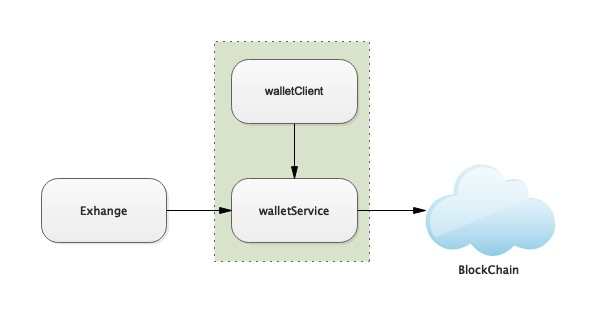
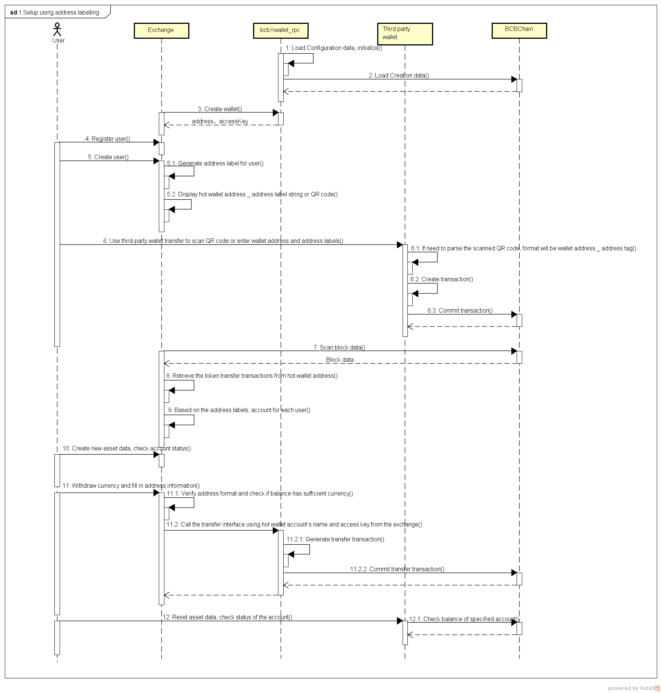
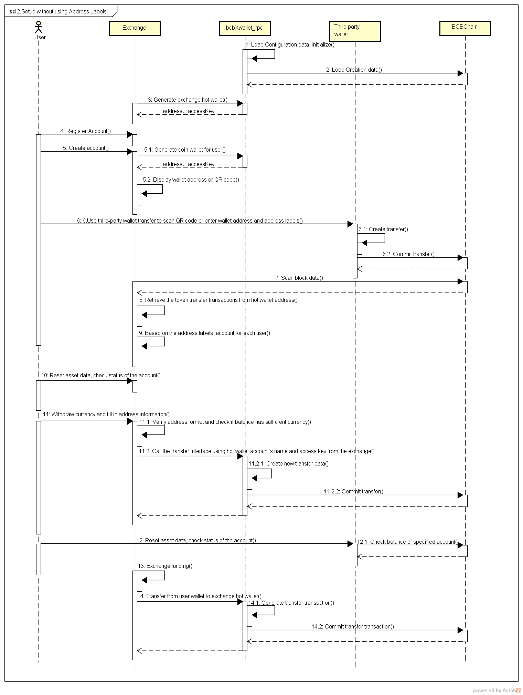
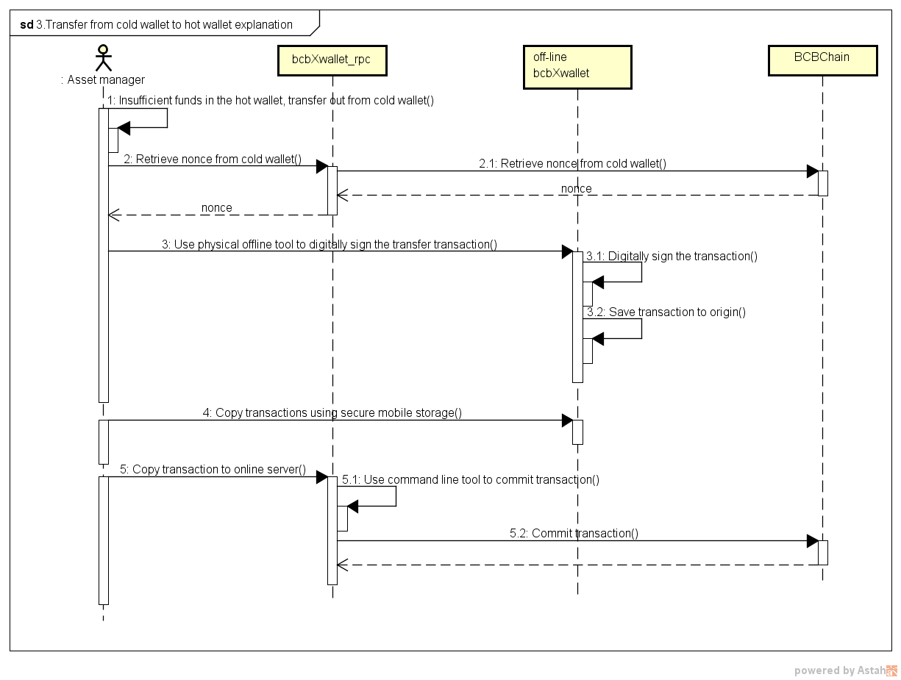

# BCBChain V2.0 Quick Start for Exchanges

**V2.0.1**


<div STYLE="page-break-after: always;"></div>
[TOC]
<script src="./github/ltview.js"></script>

<div STYLE="page-break-after: always;"></div>
# 1 Introduction


## 1.1 What is BCBChain

BCBChain is a blockchain system based on Tendermint. It is a scalable platform with high stability, based on system security, technological innovation, fast and easy to use, and efficient data transmissions between object to object, and human to object.

For more details, please view 《BCBChain_V1.0_Program_Reference》.


## 1.2 Summary

The procedures to connect BCBChain wallet assets to the exchange are as follows:

* bcbXwallet_rpc 

  This BCBChain program can safely generate a wallet private key, output an access key and provide convenient API interface for accessing digital asset.

* bcbXwallet

  The BCBChain Exchange Client is a command-line tool that provides easy access to the interface.

The relationship of the abovementioned components are described as below.




<div STYLE="page-break-after: always;"></div>
# 2 Software and Hardware Requirements

**Operating System**：       CentOS 7 64 bit

**Hardware**：                      CPU 8core+，Memory16GB+，Harddisk512GB+

**Dependencies**：              NTP service installed 

```
[tmp]# sudo apt-get install ntp
```


<div STYLE="page-break-after: always;"></div>

# 3 bcbXwallet Deployment

## 3.1 Installation package download

Download address：

```
https://github.com/bcbchain/xwallet/releases/download/v1.0.12/bcb-Xwallet_1.0.12.10094-x64.tar.gz
```


## 3.2 Decompression Procedures

Place the downloaded package in a temporary folder, then run the following command:

```
[tmp]# tar xvf bcb-Xwallet_1.0.12.10094-x64.tar.gz
```

 

## 3.3 Launch Procedures

Enter “bcb-Xwallet_1.0.7.5443-x64” folder，run the following command：

```
[bcb-Xwallet_1.0.12.10094-x64.tar.gz]# ./bcbXwallet_rpc
```

After it is started, set the bcbXwallet_rpc listening port to：37657。You can change the listening port by modifying the file, "./.config/bcbXwallet.yaml".

Enter the following command to check if bcb-Xwallet service is run correctly:

```
[root]# netstat -lnp | grep 37657                                              
```

<div STYLE="page-break-after: always;"></div>

# 4 BCB Node Deployment

## 4.1 Installation package download

Download address：

```
https://github.com/bcbchain/xwallet/releases/download/v1.0.12/bcb-node_1.0.17.12511.tar.gz
```


## 4.2 Decompression Procedures

Place the downloaded package in a temporary folder, then run the following command:

```
[tmp]# tar xvf bcb-node_1.0.17.12511.tar.gz
```

 

## 4.3 Install

### 4.3.1 Install bcchain

Enter “bcbchain_1.0.17.12511” folder，run the following command：

```
[bcbchain_1.0.17.12511]# ./install
```

### 4.3.2 Install tmcore

Enter “tmcore_1.0.17.12511” folder，run the following command：

```
[tmcore_1.0.17.12511]# ./install                                         
```

Input: 1 (select bcb)；

Input: 3 (select UNOFFICIAL FOLLOWER)；

Input: earth.bcbchain.io, Wait a moment, tmcore will finish installing.

Run the following command, and  if the screen displays the "last_block_height" information, it is successfully installed.

```
curl localhost:46657/abci_info
```

### 4.3.3 Sync block

After bcchain and tmcore are successfully installed,  the node will synchronize the blocks. Since the block data is large, the sync block takes about 10 days. We also provide offline block packets. You can download and import, which can speed up the synchronization. The download link is: **http://211.154.140.124:43356/down/**. After downloading, you need put the data package into the specified directory and execute the following command to complete the data import.

```
systemctl stop tmcore.service
systemctl stop bcbchain.service

cd /home/tmcore/ && rm data -rf 
tar xf tmcore_data_20190625.tar.gz

cd /home/bcbchain/ && rm  .appstate.db -rf
tar xf bcbchain_appstate.db_20190625.tar.gz

systemctl start tmcore.service
systemctl start bcbchain.service

```


# 5 Protocol

## 5.1 Protocol Overview

bcbXwallet_rpc server supports the the following PRC communication protocols:

- URI over HTTPS
- JSONRPC over HTTPS

All RPC interfaces supported by the bcbXwallet_rpc server and their parameters can be obtained at: https://ip:port.

The list of RPC interfaces provided by the bcbXwallet_rpc server is as follows (supports HTTPS, default port 37657):


<div STYLE="page-break-after: always;"></div>

<div STYLE="page-break-after: always;"></div>

## 5.2 URI over HTTP

When using the HTTP GET method for RPC requests, the parameters must be URI-encoded. For the URL format of all RPC calls, see the list above. For details about each service and its parameters, refer to the following parts of this section.

## 5.3 JSONRPC over HTTP

When using HTTP POST and JSONRPC application protocol for requests,  data body format is as follows:

```json
Example：
{
  "jsonrpc": "2.0",
  "id": "dontcare/anything",
  "method": "bcb_block",
  "params": {
    "height": 2500
  }
}
```

Refer to the following parts of the section for in-depth information on the services and their parameters.

General format of the return data of a successful request is as below:

```
{
  "jsonrpc": "2.0",
  "id": "",
  "result": {
    …		//JSON format varies depending on the api called
    …		
  }
}
```


General format of the return data of a failed request is as below (same for all failed requests):

```json
{
  "jsonrpc": "2.0",
  "id": "",
  "error": {
    "code": -32603,
    "message": "Invalid parameters.",
    "data": ""
  }
}
```


# 6 Programming Interface


## 6.1 Wallet Management Interface


### 6.1.1 bcb_walletCreate

Sends a request to bcbXwallet_rpc service to create a new wallet.

- **Request URI over HTTPS**

  ```
  https://localhost:37657/bcb_walletCreate?name=_&password=_
  ```

- **Request JSONRPC over HTTPS**

  ```
  {
    "jsonrpc": "2.0",
    "id": "dontcare/anything",
    "method": "bcb_walletCreate",
    "params": {
        "name": "hotwal001",
        "password": "aBig62_123"
    }
  }
  ```

- **Request Parameters**

  | **Parameter** | **Type** | Description&nbsp;&nbsp;&nbsp;&nbsp;&nbsp;&nbsp;&nbsp;&nbsp;&nbsp;&nbsp;&nbsp;&nbsp;&nbsp;&nbsp;&nbsp;&nbsp;&nbsp;&nbsp;&nbsp;&nbsp;&nbsp;&nbsp;&nbsp;&nbsp;&nbsp;&nbsp;&nbsp;&nbsp;&nbsp;&nbsp;&nbsp;&nbsp;&nbsp;&nbsp;&nbsp;&nbsp;&nbsp;&nbsp;&nbsp;&nbsp;&nbsp;&nbsp;&nbsp;&nbsp;&nbsp;&nbsp;&nbsp;&nbsp;&nbsp;&nbsp;&nbsp;&nbsp;&nbsp;&nbsp;&nbsp;&nbsp;&nbsp;&nbsp;&nbsp;&nbsp;&nbsp;&nbsp;&nbsp;&nbsp;&nbsp;&nbsp;&nbsp;&nbsp;&nbsp;&nbsp;&nbsp;&nbsp;&nbsp;&nbsp; |
  | ------------- | :------: | ------------------------------------------------------------ |
  | name          |  String  | Wallet name, 1-40 characters long, only upper case, lower case, digits, @, _, - , . allowed |
  | password      |  String  | Password for wallet，8-20 characters long（Any ASCII characters allowed, must contain at least one lower case, one upper case, one number, and one non-alphanumeric character) |


- **Response SUCCESS Example**

  ```
  {
    "jsonrpc": "2.0",
    "id": "1",
    "result": {
    	"walletAddr": "bcbES5d6kwoX4vMeNLENMee2Mnsf2KL9ZpWo",
    	"accessKey": "ASwDbde7X6z7nnTo2NVLrXF7JXevxA9iPeiTjforkCCB"
    }
  }
  ```

- **Response SUCCESS Parameters**

  | **Parameter** | **Type** | Description&nbsp;&nbsp;&nbsp;&nbsp;&nbsp;&nbsp;&nbsp;&nbsp;&nbsp;&nbsp;&nbsp;&nbsp;&nbsp;&nbsp;&nbsp;&nbsp;&nbsp;&nbsp;&nbsp;&nbsp;&nbsp;&nbsp;&nbsp;&nbsp;&nbsp;&nbsp;&nbsp;&nbsp;&nbsp;&nbsp;&nbsp;&nbsp;&nbsp;&nbsp;&nbsp;&nbsp;&nbsp;&nbsp;&nbsp;&nbsp;&nbsp;&nbsp;&nbsp;&nbsp;&nbsp;&nbsp;&nbsp;&nbsp;&nbsp;&nbsp;&nbsp;&nbsp;&nbsp;&nbsp;&nbsp;&nbsp;&nbsp;&nbsp;&nbsp;&nbsp;&nbsp;&nbsp;&nbsp;&nbsp;&nbsp;&nbsp;&nbsp;&nbsp;&nbsp;&nbsp;&nbsp;&nbsp;&nbsp;&nbsp; |
  | ------------- | :------: | ------------------------------------------------------------ |
  | walletAddr    | Address  | Address of the wallet.                                       |
  | accessKey     |  String  | The wallet access key, which is randomly generated by the bcbXwallet_rpc service and used to encrypt the private key corresponding to the wallet. The key needs to be properly stored, as it can no longer be retrieved if lost. |


### 6.1.2 bcb_walletExport

Sends a request to bcbXwallet_rpc to export a wallet.

- **Request URI over HTTPS**

  ```
  https://localhost:37657/bcb_walletExport?name=_&password=_&accessKey=_&plainText=_
  ```

- **Request JSONRPC over HTTPS**

  ```
  {
    "jsonrpc": "2.0",
    "id": "dontcare/anything",
    "method": "bcb_walletExport",
    "params": {
        "name": "hotwal001",
        "password": "aBig62_123",
        "accessKey": "ASwDbde7X6z7nnTo2NVLrXF7JXevxA9iPeiTjforkCCB",
        "plainText": false
    }
  }
  ```

- **Request Parameters**

  | **Parameter**  | **Type** | Description&nbsp;&nbsp;&nbsp;&nbsp;&nbsp;&nbsp;&nbsp;&nbsp;&nbsp;&nbsp;&nbsp;&nbsp;&nbsp;&nbsp;&nbsp;&nbsp;&nbsp;&nbsp;&nbsp;&nbsp;&nbsp;&nbsp;&nbsp;&nbsp;&nbsp;&nbsp;&nbsp;&nbsp;&nbsp;&nbsp;&nbsp;&nbsp;&nbsp;&nbsp;&nbsp;&nbsp;&nbsp;&nbsp;&nbsp;&nbsp;&nbsp;&nbsp;&nbsp;&nbsp;&nbsp;&nbsp;&nbsp;&nbsp;&nbsp;&nbsp;&nbsp;&nbsp;&nbsp;&nbsp;&nbsp;&nbsp;&nbsp;&nbsp;&nbsp;&nbsp;&nbsp;&nbsp;&nbsp;&nbsp;&nbsp;&nbsp;&nbsp;&nbsp;&nbsp;&nbsp;&nbsp;&nbsp;&nbsp;&nbsp; |
  | --------- | :------: | ------------------------------------------------------------ |
  | name      |  String  | Wallet name.                                       |
  | password  |  String  | Password for wallet，8-20 characters long（Any ASCII characters allowed, must contain at least one lower case, one upper case, one number, and one non-alphanumeric character) |
  | accessKey |  String  | Access key of wallet |
  | plainText |   Bool   | Whether to export the wallet’s private key in plaintext. <br>true: plaintext, false:encrypted private key. |
  


- **Response SUCCESS Example**

  ```
  {
    "jsonrpc": "2.0",
    "id": "1",
    "result": {
    	"privateKey": "0xbf7cbe09d71a1bc…99b7abd8f8fd73cb4",
    	"walletAddr": "bcbES5d6kwoX4vMeNLENMee2Mnsf2KL9ZpWo"
    }
  }
  ```

- **Response SUCCESS Parameters**

  | **Parameter** | **Type**  | Description&nbsp;&nbsp;&nbsp;&nbsp;&nbsp;&nbsp;&nbsp;&nbsp;&nbsp;&nbsp;&nbsp;&nbsp;&nbsp;&nbsp;&nbsp;&nbsp;&nbsp;&nbsp;&nbsp;&nbsp;&nbsp;&nbsp;&nbsp;&nbsp;&nbsp;&nbsp;&nbsp;&nbsp;&nbsp;&nbsp;&nbsp;&nbsp;&nbsp;&nbsp;&nbsp;&nbsp;&nbsp;&nbsp;&nbsp;&nbsp;&nbsp;&nbsp;&nbsp;&nbsp;&nbsp;&nbsp;&nbsp;&nbsp;&nbsp;&nbsp;&nbsp;&nbsp;&nbsp;&nbsp;&nbsp;&nbsp;&nbsp;&nbsp;&nbsp;&nbsp;&nbsp;&nbsp;&nbsp;&nbsp;&nbsp;&nbsp;&nbsp;&nbsp;&nbsp;&nbsp;&nbsp;&nbsp;&nbsp;&nbsp; |
  | ---------- | :-------: | ------------------------------------------------------------ |
  | privateKey | HexString | Wallet’s private key, in plaintext or encrypted depending on the plainText parameter in the request, with 0x as the header. |
  | walletAddr |  Address  | Wallet Address                                     |


### 6.1.3 bcb_walletImport

Sends a request to bcbXwallet_rpc  to import a new wallet.

- **Request URI over HTTPS**

  ```
  https://localhost:37657/bcb_walletImport?name=_&privateKey=_&password=_&accessKey=_
  &plainText=_
  ```

- **Request JSONRPC over HTTPS**

  ```
  {
    "jsonrpc": "2.0",
    "id": "dontcare/anything",
    "method": "bcb_walletImport",
    "params": {
        "name": "hotwal001",
        "privateKey": "0xbf7cbe09d71a1bc…99b7abd8f8fd73cb4",
        "password": "aBig62_123",
        "accessKey": "ASwDbde7X6z7nnTo2NVLrXF7JXevxA9iPeiTjforkCCB",
        "plainText": false
    }
  }
  ```

- **Request Parameters**

  | **Parameter**   | **Type**  | Description&nbsp;&nbsp;&nbsp;&nbsp;&nbsp;&nbsp;&nbsp;&nbsp;&nbsp;&nbsp;&nbsp;&nbsp;&nbsp;&nbsp;&nbsp;&nbsp;&nbsp;&nbsp;&nbsp;&nbsp;&nbsp;&nbsp;&nbsp;&nbsp;&nbsp;&nbsp;&nbsp;&nbsp;&nbsp;&nbsp;&nbsp;&nbsp;&nbsp;&nbsp;&nbsp;&nbsp;&nbsp;&nbsp;&nbsp;&nbsp;&nbsp;&nbsp;&nbsp;&nbsp;&nbsp;&nbsp;&nbsp;&nbsp;&nbsp;&nbsp;&nbsp;&nbsp;&nbsp;&nbsp;&nbsp;&nbsp;&nbsp;&nbsp;&nbsp;&nbsp;&nbsp;&nbsp;&nbsp;&nbsp;&nbsp;&nbsp;&nbsp;&nbsp;&nbsp;&nbsp;&nbsp;&nbsp;&nbsp;&nbsp; |
  | ---------- | :-------: | ------------------------------------------------------------ |
  | name       |  String   | Wallet name, 1-40 characters long, only upper case, lower case, digits, @, _, - , . allowed. |
  | privateKey | HexString | Encrypted private key, with 0x as the header. |
  | password   |  String   | password	String	Password for wallet，8-20 characters long（Any ASCII characters allowed, must contain at least one lower case, one upper case, one number, and one non-alphanumeric character). |
  | accessKey  |  String   | Access key, optional if plainText is true. |
  | plainText  |   Bool    | Indicates whether the privateKey is plaintext, true for plaintext, and false for ciphertext. |


- **Response SUCCESS Example**

  ```
  {
    "jsonrpc": "2.0",
    "id": "1",
    "result": {
    	"walletAddr": "bcbES5d6kwoX4vMeNLENMee2Mnsf2KL9ZpWo",
    	"accessKey": "ASwDbde7X6z7nnTo2NVLrXF7JXevxA9iPeiTjforkCCB"
    }
  }
  ```

- **Response SUCCESS Parameters**

  | **Parameter**   | **Type** | Description&nbsp;&nbsp;&nbsp;&nbsp;&nbsp;&nbsp;&nbsp;&nbsp;&nbsp;&nbsp;&nbsp;&nbsp;&nbsp;&nbsp;&nbsp;&nbsp;&nbsp;&nbsp;&nbsp;&nbsp;&nbsp;&nbsp;&nbsp;&nbsp;&nbsp;&nbsp;&nbsp;&nbsp;&nbsp;&nbsp;&nbsp;&nbsp;&nbsp;&nbsp;&nbsp;&nbsp;&nbsp;&nbsp;&nbsp;&nbsp;&nbsp;&nbsp;&nbsp;&nbsp;&nbsp;&nbsp;&nbsp;&nbsp;&nbsp;&nbsp;&nbsp;&nbsp;&nbsp;&nbsp;&nbsp;&nbsp;&nbsp;&nbsp;&nbsp;&nbsp;&nbsp;&nbsp;&nbsp;&nbsp;&nbsp;&nbsp;&nbsp;&nbsp;&nbsp;&nbsp;&nbsp;&nbsp;&nbsp;&nbsp; |
  | ---------- | :------: | ------------------------------------------------------------ |
  | walletAddr | Address  | Address of the wallet                              |
  | accessKey  |  String  | The wallet access key, which is randomly generated by the bcbXwallet_rpc service and used to encrypt the private key corresponding to the wallet. The key needs to be properly stored, as it can no longer be retrieved if lost. |


### 6.1.4 bcb_walletList

Sends a request to bcbXwallet_rpc  to list out all the wallet information


- **Request URI over HTTPS**

  ```
  https://localhost:37657/bcb_walletList?pageNum=_
  ```

- **Request JSONRPC over HTTPS**

  ```
  {
    "jsonrpc": "2.0",
    "id": "dontcare/anything",
    "method": "bcb_walletList",
    "params": {
        "pageNum": "1"
    }
  }
  ```

- **Request Parameters**

  | **Parameter** | **Type** | Description&nbsp;&nbsp;&nbsp;&nbsp;&nbsp;&nbsp;&nbsp;&nbsp;&nbsp;&nbsp;&nbsp;&nbsp;&nbsp;&nbsp;&nbsp;&nbsp;&nbsp;&nbsp;&nbsp;&nbsp;&nbsp;&nbsp;&nbsp;&nbsp;&nbsp;&nbsp;&nbsp;&nbsp;&nbsp;&nbsp;&nbsp;&nbsp;&nbsp;&nbsp;&nbsp;&nbsp;&nbsp;&nbsp;&nbsp;&nbsp;&nbsp;&nbsp;&nbsp;&nbsp;&nbsp;&nbsp;&nbsp;&nbsp;&nbsp;&nbsp;&nbsp;&nbsp;&nbsp;&nbsp;&nbsp;&nbsp;&nbsp;&nbsp;&nbsp;&nbsp;&nbsp;&nbsp;&nbsp;&nbsp;&nbsp;&nbsp;&nbsp;&nbsp;&nbsp;&nbsp;&nbsp;&nbsp;&nbsp;&nbsp; |
  | -------- | :------: | ------------------------------------------------------------ |
  | pageNum  |  uint64  | Paginate the results, default max 1000 per page |


- **Response SUCCESS Example**

  ```
  {
    "jsonrpc": "2.0",
    "id": "1",
    "result": {
    	"total": 2,
    	"walletList": [
        {
          "name": "hotwal001",
          "walletAddr": "bcbES5d6kwoX4vMeNLENMee2Mnsf2KL9ZpWo"
        },
        {
          "name": "hotwal002",
          "walletAddr": "bcbLvBTGZCrLG3AMuyjD7eSqwQnBrq6CHc59"
        }
      ]
    }
  }
  ```

- **Response SUCCESS Parameters**

  | **Parameter**   | **Type** | Description&nbsp;&nbsp;&nbsp;&nbsp;&nbsp;&nbsp;&nbsp;&nbsp;&nbsp;&nbsp;&nbsp;&nbsp;&nbsp;&nbsp;&nbsp;&nbsp;&nbsp;&nbsp;&nbsp;&nbsp;&nbsp;&nbsp;&nbsp;&nbsp;&nbsp;&nbsp;&nbsp;&nbsp;&nbsp;&nbsp;&nbsp;&nbsp;&nbsp;&nbsp;&nbsp;&nbsp;&nbsp;&nbsp;&nbsp;&nbsp;&nbsp;&nbsp;&nbsp;&nbsp;&nbsp;&nbsp;&nbsp;&nbsp;&nbsp;&nbsp;&nbsp;&nbsp;&nbsp;&nbsp;&nbsp;&nbsp;&nbsp;&nbsp;&nbsp;&nbsp;&nbsp;&nbsp;&nbsp;&nbsp;&nbsp;&nbsp;&nbsp;&nbsp;&nbsp;&nbsp;&nbsp;&nbsp;&nbsp;&nbsp; |
  | ---------- | :------: | ------------------------------------------------------------ |
  | total      |   Int    | Total number of wallets                          |
  | name       |  String  | Wallet name                                        |
  | walletAddr | Address  | Address of wallet                                  |


### 6.1.5 bcb_transfer

Sends a request to bcbXwallet_rpc  to request a single transfer


- **Request URI over HTTPS**

  ```
  https://localhost:37657/bcb_transfer?name=_&accessKey=_&walletParams=_
  ```

- **Request JSONRPC over HTTPS**

  ```
  {
    "jsonrpc": "2.0",
    "id": "dontcare/anything",
    "method": "bcb_transfer",
    "params": {
      "name": "hotwal001",
      "accessKey": "ASwDbde7X6z7nnTo2NVLrXF7JXevxA9iPeiTjforkCCB",
      "walletParams": {
        "smcAddress": "bcbLVgb3odTfKC9Y9GeFnNWL9wmR4pwWiqwe",
        "gasLimit": "600",
        "note": "",
        "to": "bcbLocFJG5Q792eLQXhvNkG417kwiaaoPH5a",
        "value": "1500000000"
      }
    }
  }
  ```

- **Request Parameters**

  | **Parameter**               | **Type** | Description&nbsp;&nbsp;&nbsp;&nbsp;&nbsp;&nbsp;&nbsp;&nbsp;&nbsp;&nbsp;&nbsp;&nbsp;&nbsp;&nbsp;&nbsp;&nbsp;&nbsp;&nbsp;&nbsp;&nbsp;&nbsp;&nbsp;&nbsp;&nbsp;&nbsp;&nbsp;&nbsp;&nbsp;&nbsp;&nbsp;&nbsp;&nbsp;&nbsp;&nbsp;&nbsp;&nbsp;&nbsp;&nbsp;&nbsp;&nbsp;&nbsp;&nbsp;&nbsp;&nbsp;&nbsp;&nbsp;&nbsp;&nbsp;&nbsp;&nbsp;&nbsp;&nbsp;&nbsp;&nbsp;&nbsp;&nbsp;&nbsp;&nbsp;&nbsp;&nbsp;&nbsp;&nbsp;&nbsp;&nbsp;&nbsp;&nbsp;&nbsp;&nbsp;&nbsp;&nbsp;&nbsp;&nbsp;&nbsp;&nbsp; |
  | ---------------------- | :------: | ------------------------------------------------------------ |
  | name                   |  String  | Wallet name                                        |
  | accessKey              |  String  | Access key of wallet                           |
  | walletParams {         |  Object  | Parameters for the transfer                    |
  | &nbsp;&nbsp;smcAddress | Address  | The token address corresponding to the traded currency (fiat or crypto) |
  | &nbsp;&nbsp;gasLimit   |  String  | Gas limit for the transaction                |
  | &nbsp; note            |  String  | Transaction note (max 255 characters) |
  | &nbsp;&nbsp;to         | Address  | Address of recipient                     |
  | &nbsp;&nbsp;value      |  String  | Amount of currency transferred（Unit：Cong) |
  | }                      |          |                                                              |


- **Response SUCCESS Example**

  ```
  {
    "jsonrpc": "2.0",
    "id": "1",
    "result": {
      "code": 200,
      "log": "succeed",
      "fee": "125000",
      "txHash": "0xA1C960B9D5DB633A6E45B45015A722A2C516B392F93C9BF41F5DAA1197030584"
      "height": 234389
    }
  }
  ```

- **Response SUCCESS Parameters**

  | **Parameter** | **Type**  | Description&nbsp;&nbsp;&nbsp;&nbsp;&nbsp;&nbsp;&nbsp;&nbsp;&nbsp;&nbsp;&nbsp;&nbsp;&nbsp;&nbsp;&nbsp;&nbsp;&nbsp;&nbsp;&nbsp;&nbsp;&nbsp;&nbsp;&nbsp;&nbsp;&nbsp;&nbsp;&nbsp;&nbsp;&nbsp;&nbsp;&nbsp;&nbsp;&nbsp;&nbsp;&nbsp;&nbsp;&nbsp;&nbsp;&nbsp;&nbsp;&nbsp;&nbsp;&nbsp;&nbsp;&nbsp;&nbsp;&nbsp;&nbsp;&nbsp;&nbsp;&nbsp;&nbsp;&nbsp;&nbsp;&nbsp;&nbsp;&nbsp;&nbsp;&nbsp;&nbsp;&nbsp;&nbsp;&nbsp;&nbsp;&nbsp;&nbsp;&nbsp;&nbsp;&nbsp;&nbsp;&nbsp;&nbsp;&nbsp;&nbsp; |
  | -------- | :-------: | ------------------------------------------------------------ |
  | code     |    Int    | Transaction execution response code, 200 indicates success |
  | log      |  String   | Error message when response code is not 200 |
  | txHash   | HexString | Transaction hash, with 0x as the header          |
  | height   |   Int64   | Height of the block that first confirmed this transfer |


### 6.1.5 bcb_transferOffline

Sends a request to bcbXwallet_rpc  to transfer currency offline

- **Request URI over HTTPS**

  ```
  https://localhost:37657/bcb_transferOffline?name=_&accessKey=_&walletParam=_
  ```

- **Request JSONRPC over HTTPS**

  ```
  {
    "jsonrpc": "2.0",
    "id": "dontcare/anything",
    "method": "bcb_transferOffline",
    "params": {
      "name": "hotwal001",
      "accessKey": "ASwDbde7X6z7nnTo2NVLrXF7JXevxA9iPeiTjforkCCB",
      "walletParams": {
        "smcAddress": "bcbLVgb3odTfKC9Y9GeFnNWL9wmR4pwWiqwe",
        "gasLimit": "600",
        "note": "",
        "nonce": 15,
        "to": "bcbLocFJG5Q792eLQXhvNkG417kwiaaoPH5a",
        "value": "1500000000"
      }
    }
  }
  ```

- **Request Parameters**

  | **Parameter**               | **Type** | Description&nbsp;&nbsp;&nbsp;&nbsp;&nbsp;&nbsp;&nbsp;&nbsp;&nbsp;&nbsp;&nbsp;&nbsp;&nbsp;&nbsp;&nbsp;&nbsp;&nbsp;&nbsp;&nbsp;&nbsp;&nbsp;&nbsp;&nbsp;&nbsp;&nbsp;&nbsp;&nbsp;&nbsp;&nbsp;&nbsp;&nbsp;&nbsp;&nbsp;&nbsp;&nbsp;&nbsp;&nbsp;&nbsp;&nbsp;&nbsp;&nbsp;&nbsp;&nbsp;&nbsp;&nbsp;&nbsp;&nbsp;&nbsp;&nbsp;&nbsp;&nbsp;&nbsp;&nbsp;&nbsp;&nbsp;&nbsp;&nbsp;&nbsp;&nbsp;&nbsp;&nbsp;&nbsp;&nbsp;&nbsp;&nbsp;&nbsp;&nbsp;&nbsp;&nbsp;&nbsp;&nbsp;&nbsp;&nbsp;&nbsp; |
  | ---------------------- | :------: | ------------------------------------------------------------ |
  | name                   |  String  | Wallet name                                        |
  | accessKey              |  String  | Access key of wallet                           |
  | walletParams {         |  Object  | Transfer parameters                            |
  | &nbsp;&nbsp;smcAddress | Address  | The token address corresponding to the traded currency (fiat or crypto) |
  | &nbsp;&nbsp;gasLimit   |  String  | Gas limit for the transaction                |
  | &nbsp; note            |  String  | Transaction note (max 255 characters) |
  | &nbsp;&nbsp;nonce      |  Uint64  | This value can be obtained through the bcb_nonce interface |
  | &nbsp;&nbsp;to         | Address  | Address of recipient                     |
  | &nbsp;&nbsp;value      |  String  | Amount of currency transferred（Unit：Cong） |
  | }                      |          |                                                              |


- **Response SUCCESS Example**

  ```
  {
    "jsonrpc": "2.0",
    "id": "1",
    "result": {
      "tx": "bcb<tx>.v1.AetboYAmy2TEyUbsR731FTLDLyHE1MVKsSd4v7hS1jFnNkrtmGEVxVmWHR3
      jVSUffxKgW7aPawnQaVrZ4gwMt6aogUAJjhvnukfPWnxmsybqDgdjgecjsXa94bamPqgPhTTZC9Sz
      b.<1>.YTgiA1gdDGi2L8iCryAn34dXVYKUEdmBxivyHbK57wKpBcX5KrKyn1vdmZTuKKZ7PotCjcb
      ASbesv61VLE8H38TDiopHrs2eHG9z9iEDDyLcN7giLPCgFiLN9LPRiYZgxwpR95echr2bRPbijnKW
      j" 
    }
  }
  ```

- **Response SUCCESS Parameters**

  | **Parameter** | **Type** | Description&nbsp;&nbsp;&nbsp;&nbsp;&nbsp;&nbsp;&nbsp;&nbsp;&nbsp;&nbsp;&nbsp;&nbsp;&nbsp;&nbsp;&nbsp;&nbsp;&nbsp;&nbsp;&nbsp;&nbsp;&nbsp;&nbsp;&nbsp;&nbsp;&nbsp;&nbsp;&nbsp;&nbsp;&nbsp;&nbsp;&nbsp;&nbsp;&nbsp;&nbsp;&nbsp;&nbsp;&nbsp;&nbsp;&nbsp;&nbsp;&nbsp;&nbsp;&nbsp;&nbsp;&nbsp;&nbsp;&nbsp;&nbsp;&nbsp;&nbsp;&nbsp;&nbsp;&nbsp;&nbsp;&nbsp;&nbsp;&nbsp;&nbsp;&nbsp;&nbsp;&nbsp;&nbsp;&nbsp;&nbsp;&nbsp;&nbsp;&nbsp;&nbsp;&nbsp;&nbsp;&nbsp;&nbsp;&nbsp;&nbsp; |
  | -------- | :------: | ------------------------------------------------------------ |
  | tx       |  String  | Generated offline transaction data       |


## 6.2 Blockchain Interface


### 6.2.1 bcb_blockHeight

Sends a request to bcbXwallet_rpc to query the latest block height.

- **Request URI over HTTPS**

  ```
  https://localhost:37657/bcb_blockHeight
  ```

- **Request JSONRPC over HTTPS**

  ```
  {
    "jsonrpc": "2.0",
    "id": "dontcare/anything",
    "method": "bcb_blockHeight"
  }
  ```

- **Request Parameters**

  | **Parameter** | **Type** | Description&nbsp;&nbsp;&nbsp;&nbsp;&nbsp;&nbsp;&nbsp;&nbsp;&nbsp;&nbsp;&nbsp;&nbsp;&nbsp;&nbsp;&nbsp;&nbsp;&nbsp;&nbsp;&nbsp;&nbsp;&nbsp;&nbsp;&nbsp;&nbsp;&nbsp;&nbsp;&nbsp;&nbsp;&nbsp;&nbsp;&nbsp;&nbsp;&nbsp;&nbsp;&nbsp;&nbsp;&nbsp;&nbsp;&nbsp;&nbsp;&nbsp;&nbsp;&nbsp;&nbsp;&nbsp;&nbsp;&nbsp;&nbsp;&nbsp;&nbsp;&nbsp;&nbsp;&nbsp;&nbsp;&nbsp;&nbsp;&nbsp;&nbsp;&nbsp;&nbsp;&nbsp;&nbsp;&nbsp;&nbsp;&nbsp;&nbsp;&nbsp;&nbsp;&nbsp;&nbsp;&nbsp;&nbsp;&nbsp;&nbsp; |
  | -------- | :------: | ------------------------------------------------------------ |
  | ——       |    ——    | No parameters needed.                            |


- **Response SUCCESS Example**

  ```
  {
    "jsonrpc": "2.0",
    "id": "1",
    "result": {
      "lastBlock": 2500
    }
  }
  ```

- **Response SUCCESS Parameters**

  | **Parameter**  | **Type** | Description&nbsp;&nbsp;&nbsp;&nbsp;&nbsp;&nbsp;&nbsp;&nbsp;&nbsp;&nbsp;&nbsp;&nbsp;&nbsp;&nbsp;&nbsp;&nbsp;&nbsp;&nbsp;&nbsp;&nbsp;&nbsp;&nbsp;&nbsp;&nbsp;&nbsp;&nbsp;&nbsp;&nbsp;&nbsp;&nbsp;&nbsp;&nbsp;&nbsp;&nbsp;&nbsp;&nbsp;&nbsp;&nbsp;&nbsp;&nbsp;&nbsp;&nbsp;&nbsp;&nbsp;&nbsp;&nbsp;&nbsp;&nbsp;&nbsp;&nbsp;&nbsp;&nbsp;&nbsp;&nbsp;&nbsp;&nbsp;&nbsp;&nbsp;&nbsp;&nbsp;&nbsp;&nbsp;&nbsp;&nbsp;&nbsp;&nbsp;&nbsp;&nbsp;&nbsp;&nbsp;&nbsp;&nbsp;&nbsp;&nbsp; |
  | --------- | :------: | ------------------------------------------------------------ |
  | lastBlock |  Int64   | Latest block height                            |


### 6.2.2 bcb_block

Sends a request to bcbXwallet_rpc  to query block data.


- **Request URI over HTTPS**

  ```
  https://localhost:37657/bcb_block?height=_
  ```

- **Request JSONRPC over HTTPS**

  ```
  {
    "jsonrpc": "2.0",
    "id": "dontcare/anything",
    "method": "bcb_block",
    "params": {
        "height": 2500
    }
  }
  ```

- **Request Parameters**

  | **Parameter** | **Type** | Description&nbsp;&nbsp;&nbsp;&nbsp;&nbsp;&nbsp;&nbsp;&nbsp;&nbsp;&nbsp;&nbsp;&nbsp;&nbsp;&nbsp;&nbsp;&nbsp;&nbsp;&nbsp;&nbsp;&nbsp;&nbsp;&nbsp;&nbsp;&nbsp;&nbsp;&nbsp;&nbsp;&nbsp;&nbsp;&nbsp;&nbsp;&nbsp;&nbsp;&nbsp;&nbsp;&nbsp;&nbsp;&nbsp;&nbsp;&nbsp;&nbsp;&nbsp;&nbsp;&nbsp;&nbsp;&nbsp;&nbsp;&nbsp;&nbsp;&nbsp;&nbsp;&nbsp;&nbsp;&nbsp;&nbsp;&nbsp;&nbsp;&nbsp;&nbsp;&nbsp;&nbsp;&nbsp;&nbsp;&nbsp;&nbsp;&nbsp;&nbsp;&nbsp;&nbsp;&nbsp;&nbsp;&nbsp;&nbsp;&nbsp; |
  | -------- | :------: | ------------------------------------------------------------ |
  | height   |  Int64   | Specify the block height. 0 returns the block information of the latest height. |


- **Response SUCCESS Example**

  ```
  {
    "jsonrpc": "2.0",
    "id": "1",
    "result":{
      "blockHeight": 2495461,
      "blockHash": "0x583E820E58D2FD00B1A7D66CDBB6B7C26B207925",
      "parentHash": "0xE250D6EAA2AF05EEF18438F4B0811A09E6F90CDD",
      "chainID": "bcb",
      "validatorsHash": "0xC19638A1E31F030030505680C47A0EF9BB5DC58E",
      "consensusHash": "0xF66EF1DF8BA6DAC7A1ECCE40CC84E54A1CEBC6A5",
      "blockTime": "2018-12-27T14:26:19.251820644Z",
      "blockSize": 2866,
      "proposerAddress": "bcbG6WixauSd9RZ6iLCygSYZdZ7bttmhQ2zh",
      "txs": [
      {
        "txHash": "0x4E456161A6580A1D34D86F1560DCFE6034F5E08FA31D7DCEBCCCC72A0DC73654",
        "txTime": "2018-12-27T14:26:19.251820644Z",
        "code": 200,
        "log": "Deliver tx succeed"
        "blockHash": "0x583E820E58D2FD00B1A7D66CDBB6B7C26B207925",
        "blockHeight": 2495461,
        "from": "bcbAkTDzHLf5udamub38GdepKe7nek66EHqY",
        "nonce": 117510,
        "gasLimit": 2500,
        "fee": 1500000,
        "note":"hello",
        "messages": [
          {
           "smcAddress": "bcbLVgb3odTfKC9Y9GeFnNWL9wmR4pwWiqwe",
           "smcName": "token-basic",
           "method": "Transfer(smc.Address,big.Int)smc.Error",
           "to": "bcbKuqW1qdsnD7mRsRooXMEkCBj2s9GLF9pn",
           "value": "683000000000"
          }
        ]
       }
      ]
    }
  }
  ```

- **Response SUCCESS Parameters**

  | **Parameter**                                  |   **Type**   | Description&nbsp;&nbsp;&nbsp;&nbsp;&nbsp;&nbsp;&nbsp;&nbsp;&nbsp;&nbsp;&nbsp;&nbsp;&nbsp;&nbsp;&nbsp;&nbsp;&nbsp;&nbsp;&nbsp;&nbsp;&nbsp;&nbsp;&nbsp;&nbsp;&nbsp;&nbsp;&nbsp;&nbsp;&nbsp;&nbsp;&nbsp;&nbsp;&nbsp;&nbsp;&nbsp;&nbsp;&nbsp;&nbsp;&nbsp;&nbsp;&nbsp;&nbsp;&nbsp;&nbsp;&nbsp;&nbsp;&nbsp;&nbsp;&nbsp;&nbsp;&nbsp;&nbsp;&nbsp;&nbsp;&nbsp;&nbsp;&nbsp;&nbsp;&nbsp;&nbsp;&nbsp;&nbsp;&nbsp;&nbsp;&nbsp;&nbsp;&nbsp;&nbsp;&nbsp;&nbsp;&nbsp;&nbsp;&nbsp;&nbsp; |
  | ---------------------------------------------- | :----------: | ------------------------------------------------------------ |
  | blockHeight                                    |    Int64     | Block height                                                 |
  | blockHash                                      |  HexString   | Block hash, with 0x as the header                            |
  | parentHash                                     |  HexString   | Parent block hash, with 0x as the header                     |
  | chainID                                        |    String    | Chain ID                                                     |
  | validatorsHash                                 |  HexString   | Validators hash, with 0x as the header                       |
  | consensusHash                                  |  HexString   | Consensus hash, with 0x as the header                        |
  | blockTime                                      |    String    | Block Time                                                   |
  | blockSize                                      |     Int      | Block Size                                                   |
  | proposerAddress                                |   Address    | Proposer Address                                             |
  | txs [                                          | Object Array | List of transactions                                         |
  | &nbsp;&nbsp;{                                  |    Object    | Transaction parameters                                       |
  | &nbsp;&nbsp;&nbsp;&nbsp;txHash                 |  HexString   | Transaction Hash, with 0x as the header                      |
  | &nbsp;&nbsp;&nbsp;&nbsp;txTime                 |    String    | Transaction Time                                             |
  | &nbsp;&nbsp;&nbsp;&nbsp;code                   |    Uint32    | Transaction response code, 200 means success, anything else means failure |
  | &nbsp;&nbsp;&nbsp;&nbsp;log                    |    String    | Description of transaction result                            |
  | &nbsp;&nbsp;&nbsp;&nbsp;blockHash              |  HexString   | Block hash, with 0x as the header                            |
  | &nbsp;&nbsp;&nbsp;&nbsp;blockHeight            |    Int64     | Block height                                                 |
  | &nbsp;&nbsp;&nbsp;&nbsp;from                   |   Address    | Address of the transaction from party                        |
  | &nbsp;&nbsp;&nbsp;&nbsp;nonce                  |    Uint64    | Nonce value of the transaction                               |
  | &nbsp;&nbsp;&nbsp;&nbsp;gasLimit&nbsp;         |    Uint64    | Gas Limit                                                    |
  | &nbsp;&nbsp;&nbsp;&nbsp;fee                    |    Uint64    | Transaction fee（Unit cong)                                  |
  | &nbsp;&nbsp;&nbsp;&nbsp;note                   |    string    | note                                                         |
  | &nbsp;&nbsp;&nbsp;&nbsp;messages [             | Object Array | Message List                                                 |
  | &nbsp;&nbsp;&nbsp;&nbsp;&nbsp;&nbsp;smcAddress |   Address    | Smc Address                                                  |
  | &nbsp;&nbsp;&nbsp;&nbsp;&nbsp;&nbsp;smcName    |    String    | Smc Name                                                     |
  | &nbsp;&nbsp;&nbsp;&nbsp;&nbsp;&nbsp;method     |    String    | method                                                       |
  | &nbsp;&nbsp;&nbsp;&nbsp;&nbsp;&nbsp;to         |   Address    | Destination address, valid only when the transaction is a BRC20 standard transfer |
  | &nbsp;&nbsp;&nbsp;&nbsp;&nbsp;&nbsp;value      |    string    | Transaction total (unit: cong)，valid only when the transaction is a BRC20 standard transfer |
  | &nbsp;&nbsp;}                                  |              |                                                              |
  | ]                                              |              |                                                              |


### 6.2.3 bcb_transaction

Sends a request to bcbXwallet_rpc  to query a transaction details.


- **Request URI over HTTPS**

  ```
  https://localhost:37657/bcb_transaction?txHash=_
  ```

- **Request JSONRPC over HTTPS**

  ```
  {
    "jsonrpc": "2.0",
    "id": "dontcare/anything",
    "method": "bcb_transaction",
    "params": {
      "txHash": "0x4E456161A6580A1D34D86F1560DCFE6034F5E08FA31D7DCEBCCCC72A0DC73654"
    }
  }
  ```

- **Request Parameters**

  | **Parameter** | **Type**  | Description&nbsp;&nbsp;&nbsp;&nbsp;&nbsp;&nbsp;&nbsp;&nbsp;&nbsp;&nbsp;&nbsp;&nbsp;&nbsp;&nbsp;&nbsp;&nbsp;&nbsp;&nbsp;&nbsp;&nbsp;&nbsp;&nbsp;&nbsp;&nbsp;&nbsp;&nbsp;&nbsp;&nbsp;&nbsp;&nbsp;&nbsp;&nbsp;&nbsp;&nbsp;&nbsp;&nbsp;&nbsp;&nbsp;&nbsp;&nbsp;&nbsp;&nbsp;&nbsp;&nbsp;&nbsp;&nbsp;&nbsp;&nbsp;&nbsp;&nbsp;&nbsp;&nbsp;&nbsp;&nbsp;&nbsp;&nbsp;&nbsp;&nbsp;&nbsp;&nbsp;&nbsp;&nbsp;&nbsp;&nbsp;&nbsp;&nbsp;&nbsp;&nbsp;&nbsp;&nbsp;&nbsp;&nbsp;&nbsp;&nbsp; |
  | -------- | :-------: | ------------------------------------------------------------ |
  | txHash   | HexString | Transaction hash, with 0x as the header      |

- **Response SUCCESS Example**

  ```
  {
    "jsonrpc": "2.0",
    "id": "1",
    "result":{
      "txHash": "0x4E456161A6580A1D34D86F1560DCFE6034F5E08FA31D7DCEBCCCC72A0DC73654",
      "txTime": "2018-12-27T14:26:19.251820644Z",
      "code": 200,
      "log": "Deliver tx succeed"
      "blockHash": "0x583E820E58D2FD00B1A7D66CDBB6B7C26B207925",
      "blockHeight": 2495461,
      "from": "bcbAkTDzHLf5udamub38GdepKe7nek66EHqY",
      "nonce": 117510,
      "gasLimit": 2500,
      "fee": 1500000,
      "note":"hello",
      "messages": [
       {
         "smcAddress": "bcbCsRXXMGkUJ8wRnrBUD7mQsMST4d53JRKJ",
         "smcName": "token-basic",
         "method": "Transfer(smc.Address,big.Int)smc.Error",
         "to": "bcbKuqW1qdsnD7mRsRooXMEkCBj2s9GLF9pn",
         "value": "683000000000"
       }
      ]
    }
  }
  ```

- **Response SUCCESS Parameters**

  | **Parameter**                      |   **Type**   | Description&nbsp;&nbsp;&nbsp;&nbsp;&nbsp;&nbsp;&nbsp;&nbsp;&nbsp;&nbsp;&nbsp;&nbsp;&nbsp;&nbsp;&nbsp;&nbsp;&nbsp;&nbsp;&nbsp;&nbsp;&nbsp;&nbsp;&nbsp;&nbsp;&nbsp;&nbsp;&nbsp;&nbsp;&nbsp;&nbsp;&nbsp;&nbsp;&nbsp;&nbsp;&nbsp;&nbsp;&nbsp;&nbsp;&nbsp;&nbsp;&nbsp;&nbsp;&nbsp;&nbsp;&nbsp;&nbsp;&nbsp;&nbsp;&nbsp;&nbsp;&nbsp;&nbsp;&nbsp;&nbsp;&nbsp;&nbsp;&nbsp;&nbsp;&nbsp;&nbsp;&nbsp;&nbsp;&nbsp;&nbsp;&nbsp;&nbsp;&nbsp;&nbsp;&nbsp;&nbsp;&nbsp;&nbsp;&nbsp;&nbsp; |
  | ---------------------------------- | :----------: | ------------------------------------------------------------ |
  | txHash                             |  HexString   | Transaction hash, with 0x as the header                      |
  | txTime                             |    String    | Transaction time                                             |
  | code                               |    Uint32    | Transaction response code, 200 means success, anything else means failure |
  | log                                |    String    | Description of the transaction result                        |
  | blockHash                          |  HexString   | Block hash, with 0x as the header                            |
  | blockHeight                        |    Int64     | Block height                                                 |
  | from                               |   Address    | Address of the transaction from party                        |
  | nonce                              |    Uint64    | Nonce value of the transaction                               |
  | gasLimit&nbsp;                     |    Uint64    | Gas Limit                                                    |
  | fee                                |    Uint64    | Transaction Fees (Unit cong)                                 |
  | note                               |    String    | Note                                                         |
  | messages [                         | Object Array | Message List                                                 |
  | &nbsp;&nbsp;{                      |    Object    | Message Parameter                                            |
  | &nbsp;&nbsp;&nbsp;&nbsp;smcAddress |   Address    | Smc Address                                                  |
  | &nbsp;&nbsp;&nbsp;&nbsp;smcName    |    String    | Smc Name                                                     |
  | &nbsp;&nbsp;&nbsp;&nbsp;method     |    String    | Method                                                       |
  | &nbsp;&nbsp;&nbsp;&nbsp;to         |   Address    | Destination address, valid only when the transaction is a BRC20 standard transfer |
  | &nbsp;&nbsp;&nbsp;&nbsp;value      |    String    | Transaction total (unit cong)，valid only when the transaction is a BRC20 standard transfer |
  | &nbsp;&nbsp;}                      |              |                                                              |
  | ]                                  |              |                                                              |


### 6.2.4 bcb_balance

Sends a request to bcbXwallet_rpc  to check the balance of the account BCB currency.


- **Request URI over HTTPS**

  ```
  https://localhost:37657/bcb_balance?address=_
  ```

- **Request JSONRPC over HTTPS**

  ```
  {
    "jsonrpc": "2.0",
    "id": "dontcare/anything",
    "method": "bcb_balance",
    "params": {
      "address": "bcb8yNeqAixZ7DDQx1fHSvQdA3kKDQ48gci7"
    }
  }
  ```

- **Request Parameters**

  | **Parameter** | **Type** | Description&nbsp;&nbsp;&nbsp;&nbsp;&nbsp;&nbsp;&nbsp;&nbsp;&nbsp;&nbsp;&nbsp;&nbsp;&nbsp;&nbsp;&nbsp;&nbsp;&nbsp;&nbsp;&nbsp;&nbsp;&nbsp;&nbsp;&nbsp;&nbsp;&nbsp;&nbsp;&nbsp;&nbsp;&nbsp;&nbsp;&nbsp;&nbsp;&nbsp;&nbsp;&nbsp;&nbsp;&nbsp;&nbsp;&nbsp;&nbsp;&nbsp;&nbsp;&nbsp;&nbsp;&nbsp;&nbsp;&nbsp;&nbsp;&nbsp;&nbsp;&nbsp;&nbsp;&nbsp;&nbsp;&nbsp;&nbsp;&nbsp;&nbsp;&nbsp;&nbsp;&nbsp;&nbsp;&nbsp;&nbsp;&nbsp;&nbsp;&nbsp;&nbsp;&nbsp;&nbsp;&nbsp;&nbsp;&nbsp;&nbsp; |
  | -------- | :------: | ------------------------------------------------------------ |
  | address  | Address  | Address of account                                 |


- **Response SUCCESS Example**

  ```
  {
    "jsonrpc": "2.0",
    "id": "1",
    "result": {
      "balance": "2500000000"
    }
  }
  ```

- **Response SUCCESS Parameters**

  | **Parameter** | **Type** | Description&nbsp;&nbsp;&nbsp;&nbsp;&nbsp;&nbsp;&nbsp;&nbsp;&nbsp;&nbsp;&nbsp;&nbsp;&nbsp;&nbsp;&nbsp;&nbsp;&nbsp;&nbsp;&nbsp;&nbsp;&nbsp;&nbsp;&nbsp;&nbsp;&nbsp;&nbsp;&nbsp;&nbsp;&nbsp;&nbsp;&nbsp;&nbsp;&nbsp;&nbsp;&nbsp;&nbsp;&nbsp;&nbsp;&nbsp;&nbsp;&nbsp;&nbsp;&nbsp;&nbsp;&nbsp;&nbsp;&nbsp;&nbsp;&nbsp;&nbsp;&nbsp;&nbsp;&nbsp;&nbsp;&nbsp;&nbsp;&nbsp;&nbsp;&nbsp;&nbsp;&nbsp;&nbsp;&nbsp;&nbsp;&nbsp;&nbsp;&nbsp;&nbsp;&nbsp;&nbsp;&nbsp;&nbsp;&nbsp;&nbsp; |
  | -------- | :------: | ------------------------------------------------------------ |
  | balance  |  String  | Account balance (Unit: Cong)         |


### 6.2.5 bcb_balanceOfToken

Sends a request to bcbXwallet_rpc  to check the balance of a token.


- **Request URI over HTTPS**

  ```
  https://localhost:37657/bcb_balanceOfToken?address=_&tokenAddress=_&tokenName=_
  ```

- **Request JSONRPC over HTTPS**

  ```
  {
    "jsonrpc": "2.0",
    "id": "dontcare/anything",
    "method": "bcb_balanceOfToken",
    "params": {
      "address": "bcb8yNeqAixZ7DDQx1fHSvQdA3kKDQ48gci7",
      "tokenAddress": "bcbJ4fKuUcC5TuzXNiHqT5jNxZBx2eUToyk1",
      "tokenName": "XT"
    }
  }
  ```

- **Request Parameters**

  | **Parameter**     | **Type** | Description&nbsp;&nbsp;&nbsp;&nbsp;&nbsp;&nbsp;&nbsp;&nbsp;&nbsp;&nbsp;&nbsp;&nbsp;&nbsp;&nbsp;&nbsp;&nbsp;&nbsp;&nbsp;&nbsp;&nbsp;&nbsp;&nbsp;&nbsp;&nbsp;&nbsp;&nbsp;&nbsp;&nbsp;&nbsp;&nbsp;&nbsp;&nbsp;&nbsp;&nbsp;&nbsp;&nbsp;&nbsp;&nbsp;&nbsp;&nbsp;&nbsp;&nbsp;&nbsp;&nbsp;&nbsp;&nbsp;&nbsp;&nbsp;&nbsp;&nbsp;&nbsp;&nbsp;&nbsp;&nbsp;&nbsp;&nbsp;&nbsp;&nbsp;&nbsp;&nbsp;&nbsp;&nbsp;&nbsp;&nbsp;&nbsp;&nbsp;&nbsp;&nbsp;&nbsp;&nbsp;&nbsp;&nbsp;&nbsp;&nbsp; |
  | ------------ | :------: | ------------------------------------------------------------ |
  | address      | Address  | Account address                                    |
  | tokenAddress | Address  | Token address, can choose between this or token name, sometimes both need to be the same |
  | tokenName    |  String  | Token name, can choose between this or token address, sometimes both need to be the same |


- **Response SUCCESS Example**

  ```
  {
    "jsonrpc": "2.0",
    "id": "1",
    "result": {
      "balance": "2500000000"
    }
  }
  ```

- **Response SUCCESS Parameters**

  | **Parameter** | **Type** | Description&nbsp;&nbsp;&nbsp;&nbsp;&nbsp;&nbsp;&nbsp;&nbsp;&nbsp;&nbsp;&nbsp;&nbsp;&nbsp;&nbsp;&nbsp;&nbsp;&nbsp;&nbsp;&nbsp;&nbsp;&nbsp;&nbsp;&nbsp;&nbsp;&nbsp;&nbsp;&nbsp;&nbsp;&nbsp;&nbsp;&nbsp;&nbsp;&nbsp;&nbsp;&nbsp;&nbsp;&nbsp;&nbsp;&nbsp;&nbsp;&nbsp;&nbsp;&nbsp;&nbsp;&nbsp;&nbsp;&nbsp;&nbsp;&nbsp;&nbsp;&nbsp;&nbsp;&nbsp;&nbsp;&nbsp;&nbsp;&nbsp;&nbsp;&nbsp;&nbsp;&nbsp;&nbsp;&nbsp;&nbsp;&nbsp;&nbsp;&nbsp;&nbsp;&nbsp;&nbsp;&nbsp;&nbsp;&nbsp;&nbsp; |
  | -------- | :------: | ------------------------------------------------------------ |
  | balance  |  String  | Balance total (Unit: Cong)           |


### 6.2.6 bcb_allBalance

Sends a request to bcbXwallet_rpc  to query all the tokens in an account.


- **Request URI over HTTPS**

  ```
  https://localhost:37657/bcb_allBalance?address=_
  ```

- **Request JSONRPC over HTTPS**

  ```
  {
    "jsonrpc": "2.0",
    "id": "dontcare/anything",
    "method": "bcb_allBalance",
    "params": {
        "address": "bcb8yNeqAixZ7DDQx1fHSvQdA3kKDQ48gci7"
    }
  }
  ```

- **Request Parameters**

  | **Parameter** | **Type** | Description&nbsp;&nbsp;&nbsp;&nbsp;&nbsp;&nbsp;&nbsp;&nbsp;&nbsp;&nbsp;&nbsp;&nbsp;&nbsp;&nbsp;&nbsp;&nbsp;&nbsp;&nbsp;&nbsp;&nbsp;&nbsp;&nbsp;&nbsp;&nbsp;&nbsp;&nbsp;&nbsp;&nbsp;&nbsp;&nbsp;&nbsp;&nbsp;&nbsp;&nbsp;&nbsp;&nbsp;&nbsp;&nbsp;&nbsp;&nbsp;&nbsp;&nbsp;&nbsp;&nbsp;&nbsp;&nbsp;&nbsp;&nbsp;&nbsp;&nbsp;&nbsp;&nbsp;&nbsp;&nbsp;&nbsp;&nbsp;&nbsp;&nbsp;&nbsp;&nbsp;&nbsp;&nbsp;&nbsp;&nbsp;&nbsp;&nbsp;&nbsp;&nbsp;&nbsp;&nbsp;&nbsp;&nbsp;&nbsp;&nbsp; |
  | -------- | :------: | ------------------------------------------------------------ |
  | address  | Address  | Account address                                    |


- **Response SUCCESS Example**

  ```
  {
    "jsonrpc": "2.0",
    "id": "1",
    "result": [
        {
          "tokenAddress": "bcbLVgb3odTfKC9Y9GeFnNWL9wmR4pwWiqwe"，
          "tokenName": "BCB"，
          "balance": "2500000000"
        },
        {
          "tokenAddress": "bcbJ4fKuUcC5TuzXNiHqT5jNxZBx2eUToyk1",
          "tokenName": "XT"，
          "balance": "10000000",
        }
    ]
  }
  ```

- **Response SUCCESS Parameters**

  | **Parameter**     | **Type** | Description&nbsp;&nbsp;&nbsp;&nbsp;&nbsp;&nbsp;&nbsp;&nbsp;&nbsp;&nbsp;&nbsp;&nbsp;&nbsp;&nbsp;&nbsp;&nbsp;&nbsp;&nbsp;&nbsp;&nbsp;&nbsp;&nbsp;&nbsp;&nbsp;&nbsp;&nbsp;&nbsp;&nbsp;&nbsp;&nbsp;&nbsp;&nbsp;&nbsp;&nbsp;&nbsp;&nbsp;&nbsp;&nbsp;&nbsp;&nbsp;&nbsp;&nbsp;&nbsp;&nbsp;&nbsp;&nbsp;&nbsp;&nbsp;&nbsp;&nbsp;&nbsp;&nbsp;&nbsp;&nbsp;&nbsp;&nbsp;&nbsp;&nbsp;&nbsp;&nbsp;&nbsp;&nbsp;&nbsp;&nbsp;&nbsp;&nbsp;&nbsp;&nbsp;&nbsp;&nbsp;&nbsp;&nbsp;&nbsp;&nbsp; |
  | ------------ | :------: | ------------------------------------------------------------ |
  | tokenAddress | Address  | Token address                                      |
  | tokenName    |  String  | Token name                                         |
  | balance      |  String  | Account balance (Unit: Cong)         |


### 6.2.7 bcb_nonce

Sends a request to bcbXwallet_rpc  to query the next transaction count value available on the blockchain for the account.

- **Request URI over HTTPS**

  ```
  https://localhost:37657/bcb_nonce?address=_
  ```

- **Request JSONRPC over HTTPS**

  ```
  {
    "jsonrpc": "2.0",
    "id": "dontcare/anything",
    "method": "bcb_nonce",
    "params": {
       "address": "bcb8yNeqAixZ7DDQx1fHSvQdA3kKDQ48gci7"
    }
  }
  ```

- **Request Parameters**

  | **Parameter** | **Type** | Description&nbsp;&nbsp;&nbsp;&nbsp;&nbsp;&nbsp;&nbsp;&nbsp;&nbsp;&nbsp;&nbsp;&nbsp;&nbsp;&nbsp;&nbsp;&nbsp;&nbsp;&nbsp;&nbsp;&nbsp;&nbsp;&nbsp;&nbsp;&nbsp;&nbsp;&nbsp;&nbsp;&nbsp;&nbsp;&nbsp;&nbsp;&nbsp;&nbsp;&nbsp;&nbsp;&nbsp;&nbsp;&nbsp;&nbsp;&nbsp;&nbsp;&nbsp;&nbsp;&nbsp;&nbsp;&nbsp;&nbsp;&nbsp;&nbsp;&nbsp;&nbsp;&nbsp;&nbsp;&nbsp;&nbsp;&nbsp;&nbsp;&nbsp;&nbsp;&nbsp;&nbsp;&nbsp;&nbsp;&nbsp;&nbsp;&nbsp;&nbsp;&nbsp;&nbsp;&nbsp;&nbsp;&nbsp;&nbsp;&nbsp; |
  | -------- | :------: | ------------------------------------------------------------ |
  | address  | Address  | Account address                                    |


- **Response SUCCESS Example**

  ```
  {
    "jsonrpc": "2.0",
    "id": "1",
    "result": {
    	"nonce": 5000
    }
  }
  ```

- **Response SUCCESS Parameters**

  | **Parameter** | **Type** | Description&nbsp;&nbsp;&nbsp;&nbsp;&nbsp;&nbsp;&nbsp;&nbsp;&nbsp;&nbsp;&nbsp;&nbsp;&nbsp;&nbsp;&nbsp;&nbsp;&nbsp;&nbsp;&nbsp;&nbsp;&nbsp;&nbsp;&nbsp;&nbsp;&nbsp;&nbsp;&nbsp;&nbsp;&nbsp;&nbsp;&nbsp;&nbsp;&nbsp;&nbsp;&nbsp;&nbsp;&nbsp;&nbsp;&nbsp;&nbsp;&nbsp;&nbsp;&nbsp;&nbsp;&nbsp;&nbsp;&nbsp;&nbsp;&nbsp;&nbsp;&nbsp;&nbsp;&nbsp;&nbsp;&nbsp;&nbsp;&nbsp;&nbsp;&nbsp;&nbsp;&nbsp;&nbsp;&nbsp;&nbsp;&nbsp;&nbsp;&nbsp;&nbsp;&nbsp;&nbsp;&nbsp;&nbsp;&nbsp;&nbsp; |
  | -------- | :------: | ------------------------------------------------------------ |
  | nonce    |  Uint64  | Specify the next transaction count value available for the address on the blockchain |


### 6.2.8 bcb_commitTx

Sends a request to bcbXwallet_rpc  to commit a transaction.


- **Request URI over HTTPS**

  ```
  https://localhost:37657/bcb_commitTx?tx=_
  ```

- **Request JSONRPC over HTTPS**

  ```
  {
    "jsonrpc": "2.0",
    "id": "dontcare/anything",
    "method": "bcb_commitTx",
    "params": {
      "tx": "bcb<tx>.v1.AetboYAmy2TEyUbsR731FTLDLyHE1MVKsSd4v7hS1jFnNkrtmGEVxVmWHR
      3jVSUffxKgW7aPawnQaVrZ4gwMt6aogUAJjhvnukfPWnxmsybqDgdjgecjsXa94bamPqgPhTTZC9
      Szb.<1>.YTgiA1gdDGi2L8iCryAn34dXVYKUEdmBxivyHbK57wKpBcX5KrKyn1vdmZTuKKZ7PotC
      jcbASbesv61VLE8H38TDiopHrs2eHG9z9iEDDyLcN7giLPCgFiLN9LPRiYZgxwpR95echr2bRPbi
      jnKWj"
    }
  }
  
  ```

- **Request Parameters**

  | **Parameter** | **Type** | Description&nbsp;&nbsp;&nbsp;&nbsp;&nbsp;&nbsp;&nbsp;&nbsp;&nbsp;&nbsp;&nbsp;&nbsp;&nbsp;&nbsp;&nbsp;&nbsp;&nbsp;&nbsp;&nbsp;&nbsp;&nbsp;&nbsp;&nbsp;&nbsp;&nbsp;&nbsp;&nbsp;&nbsp;&nbsp;&nbsp;&nbsp;&nbsp;&nbsp;&nbsp;&nbsp;&nbsp;&nbsp;&nbsp;&nbsp;&nbsp;&nbsp;&nbsp;&nbsp;&nbsp;&nbsp;&nbsp;&nbsp;&nbsp;&nbsp;&nbsp;&nbsp;&nbsp;&nbsp;&nbsp;&nbsp;&nbsp;&nbsp;&nbsp;&nbsp;&nbsp;&nbsp;&nbsp;&nbsp;&nbsp;&nbsp;&nbsp;&nbsp;&nbsp;&nbsp;&nbsp;&nbsp;&nbsp;&nbsp;&nbsp; |
  | -------- | :------: | ------------------------------------------------------------ |
  | tx       |  String  | Transaction data                                   |


- **Response SUCCESS Example**

  ```
  {
    "jsonrpc": "2.0",
    "id": "1",
    "result": {
    	"code": 200,
    	"log": "succeed",
    	"txHash": "0xA1C960B9D5DB633A6E45B45015A722A2C516B392F93C9BF41F5DAA1197030584",
    	"height": 234389
    }
  }
  
  ```

- **Response SUCCESS Parameters**

  | **Parameter** | **Type**  | Description&nbsp;&nbsp;&nbsp;&nbsp;&nbsp;&nbsp;&nbsp;&nbsp;&nbsp;&nbsp;&nbsp;&nbsp;&nbsp;&nbsp;&nbsp;&nbsp;&nbsp;&nbsp;&nbsp;&nbsp;&nbsp;&nbsp;&nbsp;&nbsp;&nbsp;&nbsp;&nbsp;&nbsp;&nbsp;&nbsp;&nbsp;&nbsp;&nbsp;&nbsp;&nbsp;&nbsp;&nbsp;&nbsp;&nbsp;&nbsp;&nbsp;&nbsp;&nbsp;&nbsp;&nbsp;&nbsp;&nbsp;&nbsp;&nbsp;&nbsp;&nbsp;&nbsp;&nbsp;&nbsp;&nbsp;&nbsp;&nbsp;&nbsp;&nbsp;&nbsp;&nbsp;&nbsp;&nbsp;&nbsp;&nbsp;&nbsp;&nbsp;&nbsp;&nbsp;&nbsp;&nbsp;&nbsp;&nbsp;&nbsp; |
  | -------- | :-------: | ------------------------------------------------------------ |
  | code     |    Int    | Transaction response code, 200 means success, anything else means failure |
  | log      |  String   | Error message when response code is not 200。 |
  | txHash   | HexString | Transaction hash, with 0x as the header          |
  | height   |   Int64   | Block height of transaction      |


### 6.2.9 bcb_version

Sends a request to bcbXwallet_rpc  to query the current version number.


- **Request URI over HTTPS**

  ```
  https://localhost:37657/bcb_version
  ```

- **Request JSONRPC over HTTPS**

  ```
  {
    "jsonrpc": "2.0",
    "id": "dontcare/anything",
    "method": "bcb_version"
  }
  ```

- **Request Parameters**

  | **Parameter** | **Type** | Description&nbsp;&nbsp;&nbsp;&nbsp;&nbsp;&nbsp;&nbsp;&nbsp;&nbsp;&nbsp;&nbsp;&nbsp;&nbsp;&nbsp;&nbsp;&nbsp;&nbsp;&nbsp;&nbsp;&nbsp;&nbsp;&nbsp;&nbsp;&nbsp;&nbsp;&nbsp;&nbsp;&nbsp;&nbsp;&nbsp;&nbsp;&nbsp;&nbsp;&nbsp;&nbsp;&nbsp;&nbsp;&nbsp;&nbsp;&nbsp;&nbsp;&nbsp;&nbsp;&nbsp;&nbsp;&nbsp;&nbsp;&nbsp;&nbsp;&nbsp;&nbsp;&nbsp;&nbsp;&nbsp;&nbsp;&nbsp;&nbsp;&nbsp;&nbsp;&nbsp;&nbsp;&nbsp;&nbsp;&nbsp;&nbsp;&nbsp;&nbsp;&nbsp;&nbsp;&nbsp;&nbsp;&nbsp;&nbsp;&nbsp; |
  | -------- | :------: | ------------------------------------------------------------ |
  | ——       |    ——    | None needed                                      |


- **Response SUCCESS Example**

  ```
  {
    "jsonrpc": "2.0",
    "id": "1",
    "result": {
      "version": "1.0.7.9636"
    }
  }
  ```

- **Response SUCCESS Parameters**

  | **Parameter** | **Type** | Description&nbsp;&nbsp;&nbsp;&nbsp;&nbsp;&nbsp;&nbsp;&nbsp;&nbsp;&nbsp;&nbsp;&nbsp;&nbsp;&nbsp;&nbsp;&nbsp;&nbsp;&nbsp;&nbsp;&nbsp;&nbsp;&nbsp;&nbsp;&nbsp;&nbsp;&nbsp;&nbsp;&nbsp;&nbsp;&nbsp;&nbsp;&nbsp;&nbsp;&nbsp;&nbsp;&nbsp;&nbsp;&nbsp;&nbsp;&nbsp;&nbsp;&nbsp;&nbsp;&nbsp;&nbsp;&nbsp;&nbsp;&nbsp;&nbsp;&nbsp;&nbsp;&nbsp;&nbsp;&nbsp;&nbsp;&nbsp;&nbsp;&nbsp;&nbsp;&nbsp;&nbsp;&nbsp;&nbsp;&nbsp;&nbsp;&nbsp;&nbsp;&nbsp;&nbsp;&nbsp;&nbsp;&nbsp;&nbsp;&nbsp; |
  | -------- | :------: | ------------------------------------------------------------ |
  | version  |  string  | Current version number                       |


# 7 bcbXwallet


bcbXwallet is a stand-alone command line program that provides a native call wrapper for the rpc interface. It is convenient for daily diagnosis and integration, and there is no need to construct a POST request.


## 7.1 Usage

The command runs in the following format:

```
Usage:
  bcbXwallet [command]

Available Commands:
  allBalance      get balance of all tokens for specific address
  balance         get balance of BCB token for specific address
  balanceOfToken  get balance of specific token for specific address
  block           get block info with height
  blockHeight     get current block height
  commitTx        commit transaction
  help            Help about any command
  nonce           get the next usable nonce for specific address
  transaction     get transaction info with txHash
  transfer        transfer token
  transferOffline offline pack and sign transfer transaction
  walletCreate    create wallet
  walletExport    export wallet
  walletImport    import wallet
  walletList      list wallet

Flags:
  -h, --help   help for bcbXwallet

Use "bcbXwallet [command] --help" for more information about a command.
```


## 7.2 Command details


### 7.2.1 walletCreate

- **command**

  ```
  bcbXwallet walletCreate --name hotwal001 --password aBig62_123 [--url https://...]
  ```

- **Input Parameters**

  | **Parameter** | **Type** | Description&nbsp;&nbsp;&nbsp;&nbsp;&nbsp;&nbsp;&nbsp;&nbsp;&nbsp;&nbsp;&nbsp;&nbsp;&nbsp;&nbsp;&nbsp;&nbsp;&nbsp;&nbsp;&nbsp;&nbsp;&nbsp;&nbsp;&nbsp;&nbsp;&nbsp;&nbsp;&nbsp;&nbsp;&nbsp;&nbsp;&nbsp;&nbsp;&nbsp;&nbsp;&nbsp;&nbsp;&nbsp;&nbsp;&nbsp;&nbsp;&nbsp;&nbsp;&nbsp;&nbsp;&nbsp;&nbsp;&nbsp;&nbsp;&nbsp;&nbsp;&nbsp;&nbsp;&nbsp;&nbsp;&nbsp;&nbsp;&nbsp;&nbsp;&nbsp;&nbsp;&nbsp;&nbsp;&nbsp;&nbsp;&nbsp;&nbsp;&nbsp;&nbsp;&nbsp;&nbsp;&nbsp;&nbsp;&nbsp;&nbsp; |
  | ------------- | :------: | ------------------------------------------------------------ |
  | name          |  String  | Wallet name, 1-40 characters long, only upper case, lower case, digits, @, _, - , . allowed |
  | password      |  String  | Password for wallet，8-20 characters long（Any ASCII characters allowed, must contain at least one lower case, one upper case, one number, and one non-alphanumeric character) |
  | url           |  String  | Wallet service address, optional, default local service.     |

- **Output FAILED Example**

  ```
  {
    "code": -32603,
    "message": "Invalid parameters.",
    "data": ""
  }
  ```

  Note: all execution errors will share the same format, there will be no more details.

- **Output SUCCESS Example**

  ```
  {
    "walletAddr": "bcbES5d6kwoX4vMeNLENMee2Mnsf2KL9ZpWo",
    "accessKey": "ASwDbde7X6z7nnTo2NVLrXF7JXevxA9iPeiTjforkCCB"
  }
  ```

- **Output SUCCESS Result**

  | **Parameter** | **Type** | Description&nbsp;&nbsp;&nbsp;&nbsp;&nbsp;&nbsp;&nbsp;&nbsp;&nbsp;&nbsp;&nbsp;&nbsp;&nbsp;&nbsp;&nbsp;&nbsp;&nbsp;&nbsp;&nbsp;&nbsp;&nbsp;&nbsp;&nbsp;&nbsp;&nbsp;&nbsp;&nbsp;&nbsp;&nbsp;&nbsp;&nbsp;&nbsp;&nbsp;&nbsp;&nbsp;&nbsp;&nbsp;&nbsp;&nbsp;&nbsp;&nbsp;&nbsp;&nbsp;&nbsp;&nbsp;&nbsp;&nbsp;&nbsp;&nbsp;&nbsp;&nbsp;&nbsp;&nbsp;&nbsp;&nbsp;&nbsp;&nbsp;&nbsp;&nbsp;&nbsp;&nbsp;&nbsp;&nbsp;&nbsp;&nbsp;&nbsp;&nbsp;&nbsp;&nbsp;&nbsp;&nbsp;&nbsp;&nbsp;&nbsp; |
  | ---------- | :------: | ------------------------------------------------------------ |
  | walletAddr | Address  | Wallet Address                                     |
  | accessKey  |  String  | The wallet access key, which is randomly generated by the bcbXwallet_rpc service and used to encrypt the private key corresponding to the wallet. The key needs to be properly stored, as it can no longer be retrieved if lost. |


### 7.2.2 walletExport

- **command**

  ```
  bcbXwallet walletExport --name hotwal001 --password aBig62_123 --accessKey 2Rm..... --plainText true [--url https://...]
  ```

- **Input Parameters**

  | **Parameter**  | **Type** | Description&nbsp;&nbsp;&nbsp;&nbsp;&nbsp;&nbsp;&nbsp;&nbsp;&nbsp;&nbsp;&nbsp;&nbsp;&nbsp;&nbsp;&nbsp;&nbsp;&nbsp;&nbsp;&nbsp;&nbsp;&nbsp;&nbsp;&nbsp;&nbsp;&nbsp;&nbsp;&nbsp;&nbsp;&nbsp;&nbsp;&nbsp;&nbsp;&nbsp;&nbsp;&nbsp;&nbsp;&nbsp;&nbsp;&nbsp;&nbsp;&nbsp;&nbsp;&nbsp;&nbsp;&nbsp;&nbsp;&nbsp;&nbsp;&nbsp;&nbsp;&nbsp;&nbsp;&nbsp;&nbsp;&nbsp;&nbsp;&nbsp;&nbsp;&nbsp;&nbsp;&nbsp;&nbsp;&nbsp;&nbsp;&nbsp;&nbsp;&nbsp;&nbsp;&nbsp;&nbsp;&nbsp;&nbsp;&nbsp;&nbsp; |
  | --------- | :------: | ------------------------------------------------------------ |
  | name      |  String  | Wallet name                                        |
  | password  |  String  | Password for wallet，8-20 characters long（Any ASCII characters allowed, must contain at least one lower case, one upper case, one number, and one non-alphanumeric character) |
  | accessKey |  String  | Access key |
  | plainText |   Bool   | Whether to export the wallet’s private key in plaintext. true - plaintext, false - encrypted private key. |
  | url       |  String  | Wallet service address, optional, default local service. |

- **Output SUCCESS Example**

  ```
  {
    "privateKey": "0xbf7cbe09d71a1bc…99b7abd8f8fd73cb4",
    "walletAddr": "bcbES5d6kwoX4vMeNLENMee2Mnsf2KL9ZpWo"
  }
  ```

- **Output SUCCESS Result**

  | **Parameter**   | **Type**  | Description&nbsp;&nbsp;&nbsp;&nbsp;&nbsp;&nbsp;&nbsp;&nbsp;&nbsp;&nbsp;&nbsp;&nbsp;&nbsp;&nbsp;&nbsp;&nbsp;&nbsp;&nbsp;&nbsp;&nbsp;&nbsp;&nbsp;&nbsp;&nbsp;&nbsp;&nbsp;&nbsp;&nbsp;&nbsp;&nbsp;&nbsp;&nbsp;&nbsp;&nbsp;&nbsp;&nbsp;&nbsp;&nbsp;&nbsp;&nbsp;&nbsp;&nbsp;&nbsp;&nbsp;&nbsp;&nbsp;&nbsp;&nbsp;&nbsp;&nbsp;&nbsp;&nbsp;&nbsp;&nbsp;&nbsp;&nbsp;&nbsp;&nbsp;&nbsp;&nbsp;&nbsp;&nbsp;&nbsp;&nbsp;&nbsp;&nbsp;&nbsp;&nbsp;&nbsp;&nbsp;&nbsp;&nbsp;&nbsp;&nbsp; |
  | ---------- | :-------: | ------------------------------------------------------------ |
  | privateKey | HexString | Wallet’s private key, in plaintext or encrypted depending on the plainText parameter in the request, with 0x as the header. |
  | walletAddr |  Address  | Wallet address                                     |


### 7.2.3 walletImport

- **command**

  ```
  bcbXwallet walletImport --name hotwal001 --privateKey 0xbf7a... --password aBig62
  _123 --accessKey 2Rm... --plainText true [--url https://...]
  ```

- **Input Parameters**

  | **Parameter**   | **Type**  | Description&nbsp;&nbsp;&nbsp;&nbsp;&nbsp;&nbsp;&nbsp;&nbsp;&nbsp;&nbsp;&nbsp;&nbsp;&nbsp;&nbsp;&nbsp;&nbsp;&nbsp;&nbsp;&nbsp;&nbsp;&nbsp;&nbsp;&nbsp;&nbsp;&nbsp;&nbsp;&nbsp;&nbsp;&nbsp;&nbsp;&nbsp;&nbsp;&nbsp;&nbsp;&nbsp;&nbsp;&nbsp;&nbsp;&nbsp;&nbsp;&nbsp;&nbsp;&nbsp;&nbsp;&nbsp;&nbsp;&nbsp;&nbsp;&nbsp;&nbsp;&nbsp;&nbsp;&nbsp;&nbsp;&nbsp;&nbsp;&nbsp;&nbsp;&nbsp;&nbsp;&nbsp;&nbsp;&nbsp;&nbsp;&nbsp;&nbsp;&nbsp;&nbsp;&nbsp;&nbsp;&nbsp;&nbsp;&nbsp;&nbsp; |
  | ---------- | :-------: | ------------------------------------------------------------ |
  | name       |  String   | Transaction nName of wallet, 1-40 characters long, only upper case, lower case, digits, @, _, - , . allowed |
  | privateKey | HexString | Wallet’s private key, with 0x as the header. |
  | password   |  String   | Name of wallet, 1-40 characters long, only upper case, lower case, digits, @, _, - , . allowed Password for wallet，8-20 characters long（Any ASCII characters allowed, must contain at least one lower case, one upper case, one number, and one non-alphanumeric character) |
  | accessKey  |  String   | Access key, optional if plainText is true |
  | plainText  |   Bool    | Indicates whether the privateKey is plain text, true for plain text, and false for encrypted |
  | url        |  String   | Wallet service address, optional, default local service. |

- **Output SUCCESS Example**

  ```
  {
    "walletAddr": "bcbES5d6kwoX4vMeNLENMee2Mnsf2KL9ZpWo",
    "accessKey": "ASwDbde7X6z7nnTo2NVLrXF7JXevxA9iPeiTjforkCCB"
  }
  ```

- **Output SUCCESS Result**

  | **Parameter**   | **Type**  | Description&nbsp;&nbsp;&nbsp;&nbsp;&nbsp;&nbsp;&nbsp;&nbsp;&nbsp;&nbsp;&nbsp;&nbsp;&nbsp;&nbsp;&nbsp;&nbsp;&nbsp;&nbsp;&nbsp;&nbsp;&nbsp;&nbsp;&nbsp;&nbsp;&nbsp;&nbsp;&nbsp;&nbsp;&nbsp;&nbsp;&nbsp;&nbsp;&nbsp;&nbsp;&nbsp;&nbsp;&nbsp;&nbsp;&nbsp;&nbsp;&nbsp;&nbsp;&nbsp;&nbsp;&nbsp;&nbsp;&nbsp;&nbsp;&nbsp;&nbsp;&nbsp;&nbsp;&nbsp;&nbsp;&nbsp;&nbsp;&nbsp;&nbsp;&nbsp;&nbsp;&nbsp;&nbsp;&nbsp;&nbsp;&nbsp;&nbsp;&nbsp;&nbsp;&nbsp;&nbsp;&nbsp;&nbsp;&nbsp;&nbsp; |
  | ---------- | :-------: | ------------------------------------------------------------ |
  | walletAddr |  Address  | Wallet address                                     |
  | accessKey  | HexString | The wallet access key, which is randomly generated by the bcbXwallet_rpc service and used to encrypt the private key corresponding to the wallet. The key needs to be properly stored, as it can no longer be retrieved if lost. |


### 7.2.4 walletList

- **command**

  ```
  bcbXwallet walletList --pageNum 1 [--url https://...]
  ```

- **Input Parameters**

  | **Parameter** | **Type** | Description&nbsp;&nbsp;&nbsp;&nbsp;&nbsp;&nbsp;&nbsp;&nbsp;&nbsp;&nbsp;&nbsp;&nbsp;&nbsp;&nbsp;&nbsp;&nbsp;&nbsp;&nbsp;&nbsp;&nbsp;&nbsp;&nbsp;&nbsp;&nbsp;&nbsp;&nbsp;&nbsp;&nbsp;&nbsp;&nbsp;&nbsp;&nbsp;&nbsp;&nbsp;&nbsp;&nbsp;&nbsp;&nbsp;&nbsp;&nbsp;&nbsp;&nbsp;&nbsp;&nbsp;&nbsp;&nbsp;&nbsp;&nbsp;&nbsp;&nbsp;&nbsp;&nbsp;&nbsp;&nbsp;&nbsp;&nbsp;&nbsp;&nbsp;&nbsp;&nbsp;&nbsp;&nbsp;&nbsp;&nbsp;&nbsp;&nbsp;&nbsp;&nbsp;&nbsp;&nbsp;&nbsp;&nbsp;&nbsp;&nbsp; |
  | -------- | :------: | ------------------------------------------------------------ |
  | pageNum  |  Uint64  | Page Number                                        |
  | url      |  string  | Wallet service address, optional, default local service. |

- **Output SUCCESS Example**

  ```
  {
    	"total": 2,
    	"walletList": [
        {
          "name": "hotwal001",
          "walletAddr": "bcbES5d6kwoX4vMeNLENMee2Mnsf2KL9ZpWo"
        },
        {
          "name": "hotwal002",
          "walletAddr": "bcbLvBTGZCrLG3AMuyjD7eSqwQnBrq6CHc59"
        }
      ]
    }
  ```

- **Output SUCCESS Result**

  | **Parameter**   | **Type** | Description&nbsp;&nbsp;&nbsp;&nbsp;&nbsp;&nbsp;&nbsp;&nbsp;&nbsp;&nbsp;&nbsp;&nbsp;&nbsp;&nbsp;&nbsp;&nbsp;&nbsp;&nbsp;&nbsp;&nbsp;&nbsp;&nbsp;&nbsp;&nbsp;&nbsp;&nbsp;&nbsp;&nbsp;&nbsp;&nbsp;&nbsp;&nbsp;&nbsp;&nbsp;&nbsp;&nbsp;&nbsp;&nbsp;&nbsp;&nbsp;&nbsp;&nbsp;&nbsp;&nbsp;&nbsp;&nbsp;&nbsp;&nbsp;&nbsp;&nbsp;&nbsp;&nbsp;&nbsp;&nbsp;&nbsp;&nbsp;&nbsp;&nbsp;&nbsp;&nbsp;&nbsp;&nbsp;&nbsp;&nbsp;&nbsp;&nbsp;&nbsp;&nbsp;&nbsp;&nbsp;&nbsp;&nbsp;&nbsp;&nbsp; |
  | ---------- | :------: | ------------------------------------------------------------ |
  | total      |   Int    | Total number of wallets                          |
  | name       |  String  | Wallet name                                        |
  | walletAddr | Address  | Wallet address                                     |


### 7.2.5 transfer

- **command**

  ```
  bcbXwallet transfer --name hotwal001 --accessKey  2Rm... --smcAddress bcbLVgb... 
  --gasLimit 600 [--note hello] --to bcbLocFJG5Q792eLQXhvNkG417kwiaaoPH5a --value 1500000000 [--url https://...]
  ```

- **Request Parameters**

  | **Parameter**   | **Type** | Description&nbsp;&nbsp;&nbsp;&nbsp;&nbsp;&nbsp;&nbsp;&nbsp;&nbsp;&nbsp;&nbsp;&nbsp;&nbsp;&nbsp;&nbsp;&nbsp;&nbsp;&nbsp;&nbsp;&nbsp;&nbsp;&nbsp;&nbsp;&nbsp;&nbsp;&nbsp;&nbsp;&nbsp;&nbsp;&nbsp;&nbsp;&nbsp;&nbsp;&nbsp;&nbsp;&nbsp;&nbsp;&nbsp;&nbsp;&nbsp;&nbsp;&nbsp;&nbsp;&nbsp;&nbsp;&nbsp;&nbsp;&nbsp;&nbsp;&nbsp;&nbsp;&nbsp;&nbsp;&nbsp;&nbsp;&nbsp;&nbsp;&nbsp;&nbsp;&nbsp;&nbsp;&nbsp;&nbsp;&nbsp;&nbsp;&nbsp;&nbsp;&nbsp;&nbsp;&nbsp;&nbsp;&nbsp;&nbsp;&nbsp; |
  | ---------- | :------: | ------------------------------------------------------------ |
  | name       |  string  | Wallet name                                        |
  | accessKey  |  string  | Access Key                                     |
  | smcAddress | Address  | The token address corresponding to the traded currency (fiat or crypto) |
  | gasLimit   |  string  | Gas Limit                                    |
  | note       |  string  | Transaction note  (limit 256 char), optional |
  | to         | Address  | Address of recipient of transfer         |
  | value      |  string  | Amount to be transferred (Unit: Cong) |
  | url        |  String  | Wallet service address, optional, default local service. |

- **Output SUCCESS Example**

  ```
  {
    "code": 200,
    "log": "Check tx succeed",
    "txHash": "A1C960B9D5DB633A6E45B45015A722A2C516B392F93C9BF41F5DAA1197030584"
    "height": 234389
  }
  ```

- **Output SUCCESS Result**

  | **Parameter**           | **Type**  | Description&nbsp;&nbsp;&nbsp;&nbsp;&nbsp;&nbsp;&nbsp;&nbsp;&nbsp;&nbsp;&nbsp;&nbsp;&nbsp;&nbsp;&nbsp;&nbsp;&nbsp;&nbsp;&nbsp;&nbsp;&nbsp;&nbsp;&nbsp;&nbsp;&nbsp;&nbsp;&nbsp;&nbsp;&nbsp;&nbsp;&nbsp;&nbsp;&nbsp;&nbsp;&nbsp;&nbsp;&nbsp;&nbsp;&nbsp;&nbsp;&nbsp;&nbsp;&nbsp;&nbsp;&nbsp;&nbsp;&nbsp;&nbsp;&nbsp;&nbsp;&nbsp;&nbsp;&nbsp;&nbsp;&nbsp;&nbsp;&nbsp;&nbsp;&nbsp;&nbsp;&nbsp;&nbsp;&nbsp;&nbsp;&nbsp;&nbsp;&nbsp;&nbsp;&nbsp;&nbsp;&nbsp;&nbsp;&nbsp;&nbsp; |
  | ------------------ | :-------: | ------------------------------------------------------------ |
  | &nbsp;&nbsp;code   |    Int    | Response code of the transaction request, 200 indicates success |
  | &nbsp;&nbsp;log    |  String   | Error message when response code is not 200 |
  | &nbsp;&nbsp;txHash | HexString | Transaction hash, with 0x as the header          |
  | &nbsp;&nbsp;height |   Int64   | Block height of the transaction  |


### 7.2.6 transferOffline

- **command**

  ```
  bcbXwallet transferOffline --name hotwal001 --accessKey  2Rm... --smcAddress bcbLVg
  b... --gasLimit 600 [--note hello] --nonce 1500 --to bcbLocF... --value 1500000000 [--url https://...]
  ```

- **Request Parameters**

  | **Parameter**   | **Type** | Description&nbsp;&nbsp;&nbsp;&nbsp;&nbsp;&nbsp;&nbsp;&nbsp;&nbsp;&nbsp;&nbsp;&nbsp;&nbsp;&nbsp;&nbsp;&nbsp;&nbsp;&nbsp;&nbsp;&nbsp;&nbsp;&nbsp;&nbsp;&nbsp;&nbsp;&nbsp;&nbsp;&nbsp;&nbsp;&nbsp;&nbsp;&nbsp;&nbsp;&nbsp;&nbsp;&nbsp;&nbsp;&nbsp;&nbsp;&nbsp;&nbsp;&nbsp;&nbsp;&nbsp;&nbsp;&nbsp;&nbsp;&nbsp;&nbsp;&nbsp;&nbsp;&nbsp;&nbsp;&nbsp;&nbsp;&nbsp;&nbsp;&nbsp;&nbsp;&nbsp;&nbsp;&nbsp;&nbsp;&nbsp;&nbsp;&nbsp;&nbsp;&nbsp;&nbsp;&nbsp;&nbsp;&nbsp;&nbsp;&nbsp; |
  | ---------- | :------: | ------------------------------------------------------------ |
  | name       |  String  | Wallet name                                        |
  | accessKey  |  String  | Access Key                                     |
  | smcAddress | Address  | The token address corresponding to the traded currency (fiat or crypto) |
  | gasLimit   |  String  | Gas Limit                                    |
  | note       |  String  | Transaction note  (limit 256 char), optional |
  | nonce      |  String  | Transaction count value                          |
  | to         | Address  | Address of recipient of transfer         |
  | value      |  String  | Amount to be transferred (Unit: Cong) |
  | url        |  String  | Wallet service address, optional, default local service. |

- **Output SUCCESS Example**

  ```
  {
    "tx": "bcb<tx>.v1.AetboYAmy2TEyUbsR731FTLDLyHE1MVKsSd4v7hS1jFnNkrtmGEVxVmWHR3jVSU
    ffxKgW7aPawnQaVrZ4gwMt6aogUAJjhvnukfPWnxmsybqDgdjgecjsXa94bamPqgPhTTZC9Szb.<1>.YT
    giA1gdDGi2L8iCryAn34dXVYKUEdmBxivyHbK57wKpBcX5KrKyn1vdmZTuKKZ7PotCjcbASbesv61VLE8
    H38TDiopHrs2eHG9z9iEDDyLcN7giLPCgFiLN9LPRiYZgxwpR95echr2bRPbijnKWj" 
  }
  ```

- **Output SUCCESS Result**

  | **Parameter**       | **Type** | Description&nbsp;&nbsp;&nbsp;&nbsp;&nbsp;&nbsp;&nbsp;&nbsp;&nbsp;&nbsp;&nbsp;&nbsp;&nbsp;&nbsp;&nbsp;&nbsp;&nbsp;&nbsp;&nbsp;&nbsp;&nbsp;&nbsp;&nbsp;&nbsp;&nbsp;&nbsp;&nbsp;&nbsp;&nbsp;&nbsp;&nbsp;&nbsp;&nbsp;&nbsp;&nbsp;&nbsp;&nbsp;&nbsp;&nbsp;&nbsp;&nbsp;&nbsp;&nbsp;&nbsp;&nbsp;&nbsp;&nbsp;&nbsp;&nbsp;&nbsp;&nbsp;&nbsp;&nbsp;&nbsp;&nbsp;&nbsp;&nbsp;&nbsp;&nbsp;&nbsp;&nbsp;&nbsp;&nbsp;&nbsp;&nbsp;&nbsp;&nbsp;&nbsp;&nbsp;&nbsp;&nbsp;&nbsp;&nbsp;&nbsp; |
  | -------------- | :------: | ------------------------------------------------------------ |
  | &nbsp;&nbsp;tx |  String  | Details of the created offline transaction |


### 7.2.7 blockHeight

- **command**

  ```
  bcbXwallet blockHeight [--url https://...]
  ```

- **Input Parameters**

  | **Parameter** | **Type** | Description&nbsp;&nbsp;&nbsp;&nbsp;&nbsp;&nbsp;&nbsp;&nbsp;&nbsp;&nbsp;&nbsp;&nbsp;&nbsp;&nbsp;&nbsp;&nbsp;&nbsp;&nbsp;&nbsp;&nbsp;&nbsp;&nbsp;&nbsp;&nbsp;&nbsp;&nbsp;&nbsp;&nbsp;&nbsp;&nbsp;&nbsp;&nbsp;&nbsp;&nbsp;&nbsp;&nbsp;&nbsp;&nbsp;&nbsp;&nbsp;&nbsp;&nbsp;&nbsp;&nbsp;&nbsp;&nbsp;&nbsp;&nbsp;&nbsp;&nbsp;&nbsp;&nbsp;&nbsp;&nbsp;&nbsp;&nbsp;&nbsp;&nbsp;&nbsp;&nbsp;&nbsp;&nbsp;&nbsp;&nbsp;&nbsp;&nbsp;&nbsp;&nbsp;&nbsp;&nbsp;&nbsp;&nbsp;&nbsp;&nbsp; |
  | -------- | :------: | ------------------------------------------------------------ |
  | url      |  String  | Wallet service address, optional, default local service. |

- **Output SUCCESS Example**

  ```
  {
      "lastBlock": 2500
  }
  ```

- **Output SUCCESS Result**

  | **Parameter**  | **Type** | Description&nbsp;&nbsp;&nbsp;&nbsp;&nbsp;&nbsp;&nbsp;&nbsp;&nbsp;&nbsp;&nbsp;&nbsp;&nbsp;&nbsp;&nbsp;&nbsp;&nbsp;&nbsp;&nbsp;&nbsp;&nbsp;&nbsp;&nbsp;&nbsp;&nbsp;&nbsp;&nbsp;&nbsp;&nbsp;&nbsp;&nbsp;&nbsp;&nbsp;&nbsp;&nbsp;&nbsp;&nbsp;&nbsp;&nbsp;&nbsp;&nbsp;&nbsp;&nbsp;&nbsp;&nbsp;&nbsp;&nbsp;&nbsp;&nbsp;&nbsp;&nbsp;&nbsp;&nbsp;&nbsp;&nbsp;&nbsp;&nbsp;&nbsp;&nbsp;&nbsp;&nbsp;&nbsp;&nbsp;&nbsp;&nbsp;&nbsp;&nbsp;&nbsp;&nbsp;&nbsp;&nbsp;&nbsp;&nbsp;&nbsp; |
  | --------- | :------: | ------------------------------------------------------------ |
  | lastBlock |  Int64   | Latest block height                            |


### 7.2.8 block

- **command**

  ```
  bcbXwallet block --height 2500 [--url https://...]
  ```

- **Input Parameters**

  | **Parameter** | **Type** | Description&nbsp;&nbsp;&nbsp;&nbsp;&nbsp;&nbsp;&nbsp;&nbsp;&nbsp;&nbsp;&nbsp;&nbsp;&nbsp;&nbsp;&nbsp;&nbsp;&nbsp;&nbsp;&nbsp;&nbsp;&nbsp;&nbsp;&nbsp;&nbsp;&nbsp;&nbsp;&nbsp;&nbsp;&nbsp;&nbsp;&nbsp;&nbsp;&nbsp;&nbsp;&nbsp;&nbsp;&nbsp;&nbsp;&nbsp;&nbsp;&nbsp;&nbsp;&nbsp;&nbsp;&nbsp;&nbsp;&nbsp;&nbsp;&nbsp;&nbsp;&nbsp;&nbsp;&nbsp;&nbsp;&nbsp;&nbsp;&nbsp;&nbsp;&nbsp;&nbsp;&nbsp;&nbsp;&nbsp;&nbsp;&nbsp;&nbsp;&nbsp;&nbsp;&nbsp;&nbsp;&nbsp;&nbsp;&nbsp;&nbsp; |
  | -------- | :------: | ------------------------------------------------------------ |
  | height   |  int64   | Specify the block height. 0 returns the block information of the latest height. |
  | url      |  string  | Wallet service address, optional, default local service. |

- **Output SUCCESS Example**

  ```
  {
    "blockHeight": 2495461,
    "blockHash": "0x583E820E58D2FD00B1A7D66CDBB6B7C26B207925",
    "parentHash": "0xE250D6EAA2AF05EEF18438F4B0811A09E6F90CDD",
    "chainID": "bcb",
    "validatorsHash": "0xC19638A1E31F030030505680C47A0EF9BB5DC58E",
    "consensusHash": "0xF66EF1DF8BA6DAC7A1ECCE40CC84E54A1CEBC6A5",
    "blockTime": "2018-12-27T14:26:19.251820644Z",
    "blockSize": 2866,
    "proposerAddress": "bcbG6WixauSd9RZ6iLCygSYZdZ7bttmhQ2zh",
    "txs": [
      {
        "txHash": "0x4E456161A6580A1D34D86F1560DCFE6034F5E08FA31D7DCEBCCCC72A0DC73654",
        "txTime": "2018-12-27T14:26:19.251820644Z",
        "code": 200,
        "log": "Deliver tx succeed"
        "blockHash": "0x583E820E58D2FD00B1A7D66CDBB6B7C26B207925",
        "blockHeight": 2495461,
        "from": "bcbAkTDzHLf5udamub38GdepKe7nek66EHqY",
        "nonce": 117510,
        "gasLimit": 2500,
        "fee": 1500000,
        "note":"hello",
        "messages": [
          {
           "smcAddress": "bcbLVgb3odTfKC9Y9GeFnNWL9wmR4pwWiqwe",
           "smcName": "token-basic",
           "method": "Transfer(smc.Address,big.Int)smc.Error",
           "to": "bcbKuqW1qdsnD7mRsRooXMEkCBj2s9GLF9pn",
           "value": "683000000000"
          }
        ]
      }
    ]
  }
  ```

- **Output SUCCESS Result**

  | **Parameter**   |   **Type**   | Description                                                  |
  | --------------- | :----------: | ------------------------------------------------------------ |
  | blockHeight     |    Int64     | Block height                                                 |
  | blockHash       |  HexString   | Block hash, with 0x as the header                            |
  | parentHash      |  HexString   | Parent block hash, with 0x as the header                     |
  | chainID         |    String    | Chain ID                                                     |
  | validatorsHash  |  HexString   | Validators hash, with 0x as the header                       |
  | consensusHash   |  HexString   | Consensus hash, with 0x as the header                        |
  | blockTime       |    String    | Block Time                                                   |
  | blockSize       |     Int      | Block Size                                                   |
  | proposerAddress |   Address    | Proposer Address                                             |
  | txs [           | Object Array | List of transactions                                         |
  | {               |    Object    | Transaction parameters                                       |
  | txHash          |  HexString   | Transaction Hash, with 0x as the header                      |
  | txTime          |    String    | Transaction Time                                             |
  | code            |    Uint32    | Transaction response code, 200 means success, anything else means failure |
  | log             |    String    | Description of transaction result                            |
  | blockHash       |  HexString   | Block hash, with 0x as the header                            |
  | blockHeight     |    Int64     | Block height                                                 |
  | from            |   Address    | Address of the transaction from party                        |
  | nonce           |    Uint64    | Nonce value of the transaction                               |
  | gasLimit        |    Uint64    | Gas Limit                                                    |
  | fee             |    Uint64    | Transaction fee（Unit cong)                                  |
  | note            |    string    | note                                                         |
  | messages [      | Object Array | Message List                                                 |
  | smcAddress      |   Address    | Smc Address                                                  |
  | smcName         |    String    | Smc Name                                                     |
  | method          |    String    | method                                                       |
  | to              |   Address    | Destination address, valid only when the transaction is a BRC20 standard transfer |
  | value           |    string    | Transaction total (unit: cong)，valid only when the transaction is a BRC20 standard transfer |
  | }               |              |                                                              |
  | ]               |              |                                                              |


### 7.2.9 transaction

- **command**

  ```
  bcbXwallet transaction --txHash 0x4E456161... [--url https://...]
  ```

- **Input Parameters**

  | **Parameter** | **Type**  | Description&nbsp;&nbsp;&nbsp;&nbsp;&nbsp;&nbsp;&nbsp;&nbsp;&nbsp;&nbsp;&nbsp;&nbsp;&nbsp;&nbsp;&nbsp;&nbsp;&nbsp;&nbsp;&nbsp;&nbsp;&nbsp;&nbsp;&nbsp;&nbsp;&nbsp;&nbsp;&nbsp;&nbsp;&nbsp;&nbsp;&nbsp;&nbsp;&nbsp;&nbsp;&nbsp;&nbsp;&nbsp;&nbsp;&nbsp;&nbsp;&nbsp;&nbsp;&nbsp;&nbsp;&nbsp;&nbsp;&nbsp;&nbsp;&nbsp;&nbsp;&nbsp;&nbsp;&nbsp;&nbsp;&nbsp;&nbsp;&nbsp;&nbsp;&nbsp;&nbsp;&nbsp;&nbsp;&nbsp;&nbsp;&nbsp;&nbsp;&nbsp;&nbsp;&nbsp;&nbsp;&nbsp;&nbsp;&nbsp;&nbsp; |
  | -------- | :-------: | ------------------------------------------------------------ |
  | txHash   | HexString | Transaction hash, with 0x as the header      |
  | url      |  string   | Wallet service address, optional, default local service. |

- **Output SUCCESS Example**

  ```
  {
    "txHash": "0x4E456161A6580A1D34D86F1560DCFE6034F5E08FA31D7DCEBCCCC72A0DC73654",
    "txTime": "2018-12-27T14:26:19.251820644Z",
    "code": 200,
    "log": "Deliver tx succeed"
    "blockHash": "0x583E820E58D2FD00B1A7D66CDBB6B7C26B207925",
    "blockHeight": 2495461,
    "from": "bcbAkTDzHLf5udamub38GdepKe7nek66EHqY",
    "nonce": 117510,
    "gasLimit": 2500,
    "fee": 1500000,
    "note":"hello",
    "messages": [
      {
        "smcAddress": "bcbCsRXXMGkUJ8wRnrBUD7mQsMST4d53JRKJ",
        "smcName": "token-basic",
        "method": "Transfer(smc.Address,big.Int)smc.Error",
        "to": "bcbKuqW1qdsnD7mRsRooXMEkCBj2s9GLF9pn",
        "value": "683000000000"
      }
    ]
  }
  ```


- **Output SUCCESS Result**

  

  | **Parameter** |   **Type**   | Description                                                  |
  | ------------- | :----------: | ------------------------------------------------------------ |
  | txHash        |  HexString   | Transaction hash, with 0x as the header                      |
  | txTime        |    String    | Transaction time                                             |
  | code          |    Uint32    | Transaction response code, 200 means success, anything else means failure |
  | log           |    String    | Description of the transaction result                        |
  | blockHash     |  HexString   | Block hash, with 0x as the header                            |
  | blockHeight   |    Int64     | Block height                                                 |
  | from          |   Address    | Address of the transaction from party                        |
  | nonce         |    Uint64    | Nonce value of the transaction                               |
  | gasLimit      |    Uint64    | Gas Limit                                                    |
  | fee           |    Uint64    | Transaction Fees (Unit cong)                                 |
  | note          |    String    | Note                                                         |
  | messages [    | Object Array | Message List                                                 |
  | {             |    Object    | Message Parameter                                            |
  | smcAddress    |   Address    | Smc Address                                                  |
  | smcName       |    String    | Smc Name                                                     |
  | method        |    String    | Method                                                       |
  | to            |   Address    | Destination address, valid only when the transaction is a BRC20 standard transfer |
  | value         |    String    | Transaction total (unit cong)，valid only when the transaction is a BRC20 standard transfer |
  | }             |              |                                                              |
  | ]             |              |                                                              |


### 7.2.10 balance

- **command**

  ```
  bcbXwallet balance --address bcbAkTD... [--url https://...]
  ```

- **Input Parameters**

  | **Parameter** | **Type** | Description&nbsp;&nbsp;&nbsp;&nbsp;&nbsp;&nbsp;&nbsp;&nbsp;&nbsp;&nbsp;&nbsp;&nbsp;&nbsp;&nbsp;&nbsp;&nbsp;&nbsp;&nbsp;&nbsp;&nbsp;&nbsp;&nbsp;&nbsp;&nbsp;&nbsp;&nbsp;&nbsp;&nbsp;&nbsp;&nbsp;&nbsp;&nbsp;&nbsp;&nbsp;&nbsp;&nbsp;&nbsp;&nbsp;&nbsp;&nbsp;&nbsp;&nbsp;&nbsp;&nbsp;&nbsp;&nbsp;&nbsp;&nbsp;&nbsp;&nbsp;&nbsp;&nbsp;&nbsp;&nbsp;&nbsp;&nbsp;&nbsp;&nbsp;&nbsp;&nbsp;&nbsp;&nbsp;&nbsp;&nbsp;&nbsp;&nbsp;&nbsp;&nbsp;&nbsp;&nbsp;&nbsp;&nbsp;&nbsp;&nbsp; |
  | -------- | :------: | ------------------------------------------------------------ |
  | address  | Address  | Account address                                    |
  | url      |  String  | Wallet service address, optional, default local service. |

- **Output SUCCESS Example**

  ```
  {
     "balance": "2500000000"
  }
  ```

- **Output SUCCESS Result**

  | **Parameter** | **Type** | Description&nbsp;&nbsp;&nbsp;&nbsp;&nbsp;&nbsp;&nbsp;&nbsp;&nbsp;&nbsp;&nbsp;&nbsp;&nbsp;&nbsp;&nbsp;&nbsp;&nbsp;&nbsp;&nbsp;&nbsp;&nbsp;&nbsp;&nbsp;&nbsp;&nbsp;&nbsp;&nbsp;&nbsp;&nbsp;&nbsp;&nbsp;&nbsp;&nbsp;&nbsp;&nbsp;&nbsp;&nbsp;&nbsp;&nbsp;&nbsp;&nbsp;&nbsp;&nbsp;&nbsp;&nbsp;&nbsp;&nbsp;&nbsp;&nbsp;&nbsp;&nbsp;&nbsp;&nbsp;&nbsp;&nbsp;&nbsp;&nbsp;&nbsp;&nbsp;&nbsp;&nbsp;&nbsp;&nbsp;&nbsp;&nbsp;&nbsp;&nbsp;&nbsp;&nbsp;&nbsp;&nbsp;&nbsp;&nbsp;&nbsp; |
  | -------- | :------: | ------------------------------------------------------------ |
  | balance  |  String  | Account balance (Unit: Cong)         |


### 7.2.11 balanceOfToken

- **command**

  ```
  bcbXwallet balanceOfToken --address bcbAkTD... --tokenAddress bcbCsRX... --tokenNa
  me XT [--url https://...]
  ```

- **Input Parameters**

  | **Parameter**     | **Type** | Description&nbsp;&nbsp;&nbsp;&nbsp;&nbsp;&nbsp;&nbsp;&nbsp;&nbsp;&nbsp;&nbsp;&nbsp;&nbsp;&nbsp;&nbsp;&nbsp;&nbsp;&nbsp;&nbsp;&nbsp;&nbsp;&nbsp;&nbsp;&nbsp;&nbsp;&nbsp;&nbsp;&nbsp;&nbsp;&nbsp;&nbsp;&nbsp;&nbsp;&nbsp;&nbsp;&nbsp;&nbsp;&nbsp;&nbsp;&nbsp;&nbsp;&nbsp;&nbsp;&nbsp;&nbsp;&nbsp;&nbsp;&nbsp;&nbsp;&nbsp;&nbsp;&nbsp;&nbsp;&nbsp;&nbsp;&nbsp;&nbsp;&nbsp;&nbsp;&nbsp;&nbsp;&nbsp;&nbsp;&nbsp;&nbsp;&nbsp;&nbsp;&nbsp;&nbsp;&nbsp;&nbsp;&nbsp;&nbsp;&nbsp; |
  | ------------ | :------: | ------------------------------------------------------------ |
  | address      | Address  | Account address                                    |
  | tokenAddress | Address  | Token address, can choose between this or token name, sometimes both need to be the same |
  | tokenName    |  string  | Token name, can choose between this or token address, sometimes both need to be the same |
  | url          |  string  | Wallet service address, optional, default local service. |

- **Output SUCCESS Example**

  ```
  {
     "balance": "2500000000"
  }
  ```

- **Output SUCCESS Result**

  | **Parameter** | **Type** | Description&nbsp;&nbsp;&nbsp;&nbsp;&nbsp;&nbsp;&nbsp;&nbsp;&nbsp;&nbsp;&nbsp;&nbsp;&nbsp;&nbsp;&nbsp;&nbsp;&nbsp;&nbsp;&nbsp;&nbsp;&nbsp;&nbsp;&nbsp;&nbsp;&nbsp;&nbsp;&nbsp;&nbsp;&nbsp;&nbsp;&nbsp;&nbsp;&nbsp;&nbsp;&nbsp;&nbsp;&nbsp;&nbsp;&nbsp;&nbsp;&nbsp;&nbsp;&nbsp;&nbsp;&nbsp;&nbsp;&nbsp;&nbsp;&nbsp;&nbsp;&nbsp;&nbsp;&nbsp;&nbsp;&nbsp;&nbsp;&nbsp;&nbsp;&nbsp;&nbsp;&nbsp;&nbsp;&nbsp;&nbsp;&nbsp;&nbsp;&nbsp;&nbsp;&nbsp;&nbsp;&nbsp;&nbsp;&nbsp;&nbsp; |
  | -------- | :------: | ------------------------------------------------------------ |
  | balance  |  String  | Account balance (Unit: Cong)         |


### 7.2.12 allBalance

- **command**

  ```
  bcbXwallet allBalance --address bcbAkTD... [--url https://...]
  ```

- **Input Parameters**

  | **Parameter** | **Type** | Description&nbsp;&nbsp;&nbsp;&nbsp;&nbsp;&nbsp;&nbsp;&nbsp;&nbsp;&nbsp;&nbsp;&nbsp;&nbsp;&nbsp;&nbsp;&nbsp;&nbsp;&nbsp;&nbsp;&nbsp;&nbsp;&nbsp;&nbsp;&nbsp;&nbsp;&nbsp;&nbsp;&nbsp;&nbsp;&nbsp;&nbsp;&nbsp;&nbsp;&nbsp;&nbsp;&nbsp;&nbsp;&nbsp;&nbsp;&nbsp;&nbsp;&nbsp;&nbsp;&nbsp;&nbsp;&nbsp;&nbsp;&nbsp;&nbsp;&nbsp;&nbsp;&nbsp;&nbsp;&nbsp;&nbsp;&nbsp;&nbsp;&nbsp;&nbsp;&nbsp;&nbsp;&nbsp;&nbsp;&nbsp;&nbsp;&nbsp;&nbsp;&nbsp;&nbsp;&nbsp;&nbsp;&nbsp;&nbsp;&nbsp; |
  | -------- | :------: | ------------------------------------------------------------ |
  | address  | Address  | Account address                                    |
  | url      |  String  | Wallet service address, optional, default local service. |

- **Output SUCCESS Example**

  ```
  [
     {
        "tokenAddress": "bcbALw9SqmqUWVjkB1bJUQyCKfnxDPhuN5Ej"，
        "tokenName": "bcb"，
        "balance": "2500000000"
     },
     {
        "tokenAddress": "bcbLVgb3odTfKC9Y9GeFnNWL9wmR4pwWiqwe"，
        "tokenName": "XT"，
        "balance": "10000000",
     }
  ]
  ```

- **Output SUCCESS Result**

  | **Parameter**     | **Type** | Description&nbsp;&nbsp;&nbsp;&nbsp;&nbsp;&nbsp;&nbsp;&nbsp;&nbsp;&nbsp;&nbsp;&nbsp;&nbsp;&nbsp;&nbsp;&nbsp;&nbsp;&nbsp;&nbsp;&nbsp;&nbsp;&nbsp;&nbsp;&nbsp;&nbsp;&nbsp;&nbsp;&nbsp;&nbsp;&nbsp;&nbsp;&nbsp;&nbsp;&nbsp;&nbsp;&nbsp;&nbsp;&nbsp;&nbsp;&nbsp;&nbsp;&nbsp;&nbsp;&nbsp;&nbsp;&nbsp;&nbsp;&nbsp;&nbsp;&nbsp;&nbsp;&nbsp;&nbsp;&nbsp;&nbsp;&nbsp;&nbsp;&nbsp;&nbsp;&nbsp;&nbsp;&nbsp;&nbsp;&nbsp;&nbsp;&nbsp;&nbsp;&nbsp;&nbsp;&nbsp;&nbsp;&nbsp;&nbsp;&nbsp; |
  | ------------ | :------: | ------------------------------------------------------------ |
  | tokenAddress | Address  | Token Address                                      |
  | tokenName    |  String  | Token Name                                         |
  | balance      |  String  | Account balance (Unit: Cong)         |


### 7.2.13 nonce

- **command**

  ```
  bcbXwallet nonce --address bcbAkTD... [--url https://...]
  ```

- **Input Parameters**

  | **Parameter** | **Type** | Description&nbsp;&nbsp;&nbsp;&nbsp;&nbsp;&nbsp;&nbsp;&nbsp;&nbsp;&nbsp;&nbsp;&nbsp;&nbsp;&nbsp;&nbsp;&nbsp;&nbsp;&nbsp;&nbsp;&nbsp;&nbsp;&nbsp;&nbsp;&nbsp;&nbsp;&nbsp;&nbsp;&nbsp;&nbsp;&nbsp;&nbsp;&nbsp;&nbsp;&nbsp;&nbsp;&nbsp;&nbsp;&nbsp;&nbsp;&nbsp;&nbsp;&nbsp;&nbsp;&nbsp;&nbsp;&nbsp;&nbsp;&nbsp;&nbsp;&nbsp;&nbsp;&nbsp;&nbsp;&nbsp;&nbsp;&nbsp;&nbsp;&nbsp;&nbsp;&nbsp;&nbsp;&nbsp;&nbsp;&nbsp;&nbsp;&nbsp;&nbsp;&nbsp;&nbsp;&nbsp;&nbsp;&nbsp;&nbsp;&nbsp; |
  | -------- | :------: | ------------------------------------------------------------ |
  | address  | Address  | Account address                                    |
  | url      |  string  | Wallet service address, optional, default local service. |

- **Output SUCCESS Example**

  ```
  {
    "nonce": 5000
  }
  ```

- **Output SUCCESS Result**

  | **Parameter** | **Type** | Description&nbsp;&nbsp;&nbsp;&nbsp;&nbsp;&nbsp;&nbsp;&nbsp;&nbsp;&nbsp;&nbsp;&nbsp;&nbsp;&nbsp;&nbsp;&nbsp;&nbsp;&nbsp;&nbsp;&nbsp;&nbsp;&nbsp;&nbsp;&nbsp;&nbsp;&nbsp;&nbsp;&nbsp;&nbsp;&nbsp;&nbsp;&nbsp;&nbsp;&nbsp;&nbsp;&nbsp;&nbsp;&nbsp;&nbsp;&nbsp;&nbsp;&nbsp;&nbsp;&nbsp;&nbsp;&nbsp;&nbsp;&nbsp;&nbsp;&nbsp;&nbsp;&nbsp;&nbsp;&nbsp;&nbsp;&nbsp;&nbsp;&nbsp;&nbsp;&nbsp;&nbsp;&nbsp;&nbsp;&nbsp;&nbsp;&nbsp;&nbsp;&nbsp;&nbsp;&nbsp;&nbsp;&nbsp;&nbsp;&nbsp; |
  | -------- | :------: | ------------------------------------------------------------ |
  | nonce    |  Uint64  | Next available transaction count value for the blockchain. |


### 7.2.14 commitTx

- **command**

  ```
  bcbXwallet commitTx --tx "bcb<tx>.v1.AetboY... [--url https://...]"
  ```

- **Input Parameters**

  | **Parameter** | **Type** | Description&nbsp;&nbsp;&nbsp;&nbsp;&nbsp;&nbsp;&nbsp;&nbsp;&nbsp;&nbsp;&nbsp;&nbsp;&nbsp;&nbsp;&nbsp;&nbsp;&nbsp;&nbsp;&nbsp;&nbsp;&nbsp;&nbsp;&nbsp;&nbsp;&nbsp;&nbsp;&nbsp;&nbsp;&nbsp;&nbsp;&nbsp;&nbsp;&nbsp;&nbsp;&nbsp;&nbsp;&nbsp;&nbsp;&nbsp;&nbsp;&nbsp;&nbsp;&nbsp;&nbsp;&nbsp;&nbsp;&nbsp;&nbsp;&nbsp;&nbsp;&nbsp;&nbsp;&nbsp;&nbsp;&nbsp;&nbsp;&nbsp;&nbsp;&nbsp;&nbsp;&nbsp;&nbsp;&nbsp;&nbsp;&nbsp;&nbsp;&nbsp;&nbsp;&nbsp;&nbsp;&nbsp;&nbsp;&nbsp;&nbsp; |
  | -------- | :------: | ------------------------------------------------------------ |
  | tx       |  String  | Transaction data                                   |
  | url      |  string  | Wallet service address, optional, default local service. |

- **Output SUCCESS Example**

  ```
  {
     "code": 200,
     "log": "Deliver tx succeed",
     "txHash": "0xA1C960B9D5DB633A6E45B45015A722A2C516B392F93C9BF41F5DAA1197030584"
     "height": 234389
  }
  ```

- **Output SUCCESS Result**

  | **Parameter**           | **Type**  | Description&nbsp;&nbsp;&nbsp;&nbsp;&nbsp;&nbsp;&nbsp;&nbsp;&nbsp;&nbsp;&nbsp;&nbsp;&nbsp;&nbsp;&nbsp;&nbsp;&nbsp;&nbsp;&nbsp;&nbsp;&nbsp;&nbsp;&nbsp;&nbsp;&nbsp;&nbsp;&nbsp;&nbsp;&nbsp;&nbsp;&nbsp;&nbsp;&nbsp;&nbsp;&nbsp;&nbsp;&nbsp;&nbsp;&nbsp;&nbsp;&nbsp;&nbsp;&nbsp;&nbsp;&nbsp;&nbsp;&nbsp;&nbsp;&nbsp;&nbsp;&nbsp;&nbsp;&nbsp;&nbsp;&nbsp;&nbsp;&nbsp;&nbsp;&nbsp;&nbsp;&nbsp;&nbsp;&nbsp;&nbsp;&nbsp;&nbsp;&nbsp;&nbsp;&nbsp;&nbsp;&nbsp;&nbsp;&nbsp;&nbsp; |
  | ------------------ | :-------: | ------------------------------------------------------------ |
  | &nbsp;&nbsp;code   |    Int    | Transaction verification/commit response code, 200 indicates success |
  | &nbsp;&nbsp;log    |  String   | Error message when response code is not 200 |
  | &nbsp;&nbsp;txHash | HexString | Transaction hash, with 0x as the header          |
  | &nbsp;&nbsp;height |   Int64   | Block height of the transaction  |


### 7.2.15 version

- **command**

  ```
  bcbXwallet version [--url https://...]
  ```

- **Input Parameters**

  | **Parameter** | **Type** | Description&nbsp;&nbsp;&nbsp;&nbsp;&nbsp;&nbsp;&nbsp;&nbsp;&nbsp;&nbsp;&nbsp;&nbsp;&nbsp;&nbsp;&nbsp;&nbsp;&nbsp;&nbsp;&nbsp;&nbsp;&nbsp;&nbsp;&nbsp;&nbsp;&nbsp;&nbsp;&nbsp;&nbsp;&nbsp;&nbsp;&nbsp;&nbsp;&nbsp;&nbsp;&nbsp;&nbsp;&nbsp;&nbsp;&nbsp;&nbsp;&nbsp;&nbsp;&nbsp;&nbsp;&nbsp;&nbsp;&nbsp;&nbsp;&nbsp;&nbsp;&nbsp;&nbsp;&nbsp;&nbsp;&nbsp;&nbsp;&nbsp;&nbsp;&nbsp;&nbsp;&nbsp;&nbsp;&nbsp;&nbsp;&nbsp;&nbsp;&nbsp;&nbsp;&nbsp;&nbsp;&nbsp;&nbsp;&nbsp;&nbsp; |
  | -------- | :------: | ------------------------------------------------------------ |
  | url      |  string  | Wallet service address, optional, default local service. |

- **Output SUCCESS Example**

  ```
  {
    "version": "1.0.7.9636"
  }
  
  ```

- **Output SUCCESS Result**

  | **Parameter** | **Type** | Description&nbsp;&nbsp;&nbsp;&nbsp;&nbsp;&nbsp;&nbsp;&nbsp;&nbsp;&nbsp;&nbsp;&nbsp;&nbsp;&nbsp;&nbsp;&nbsp;&nbsp;&nbsp;&nbsp;&nbsp;&nbsp;&nbsp;&nbsp;&nbsp;&nbsp;&nbsp;&nbsp;&nbsp;&nbsp;&nbsp;&nbsp;&nbsp;&nbsp;&nbsp;&nbsp;&nbsp;&nbsp;&nbsp;&nbsp;&nbsp;&nbsp;&nbsp;&nbsp;&nbsp;&nbsp;&nbsp;&nbsp;&nbsp;&nbsp;&nbsp;&nbsp;&nbsp;&nbsp;&nbsp;&nbsp;&nbsp;&nbsp;&nbsp;&nbsp;&nbsp;&nbsp;&nbsp;&nbsp;&nbsp;&nbsp;&nbsp;&nbsp;&nbsp;&nbsp;&nbsp;&nbsp;&nbsp;&nbsp;&nbsp; |
  | -------- | :------: | ------------------------------------------------------------ |
  | version  |  string  | Current version number                       |


# 8 How to Rapidly Setup with the Exchange


## 8.1 Setup using Address Labelling

Setup using Address Labelling Explanation:

BCBChain Exchange provides support for address labelling, hence the management can look into cryptocurrencies such as XRP and EOS.

The exchange can generate multiple hot wallet addresses, which can be shared between multiple different accounts. Each user can assign their own remark (commonly known as address label) to the wallet. Since different users can share the same currency address, the exchange does not need to perform time-consuming operations such as fund collection.

 Users top up their values and make withdrawals through these hot wallets. This fulfills the cycle internally. The four main considerations with regards to the exchange are as follows:

- From the BCBChain, multiple hot wallet addresses can be generated to form the coin address. Different users share these hot wallet addresses, with each user having the exchange generate a different address label for the particular user. In this way, even though the user uses the same address, the exchange can identify them based on the address label.
- To account for every user’s account activity, the exchange will retrieve the latest block at fixed interval. Based on the transfer type and address recorded in the block’s transactions, the exchange will be able to determine the exact user via the address label, and perform the necessary adjustments to the user’s account.
- To withdraw from the exchange, the exchange can call the bcbXwallet_rpc to transfer out from the hot wallet.
- With regards to wallet security, the exchange will need to store the encrypted password and access key of the wallets because the access keys are randomly generated. The exchange must use its own protection mechanisms to store these keys and encrypted passwords in a secure manner.


The process details are explained in the diagram below:




## 8.2 Setup without using Address Labels

**Setup without using address labels explanation:**
When you don't use the address label feature about BCBChain, you can not distinguish the activities of the users in the account by the exchange hot wallet address. In this case, the user can only be identified by the address. Hence, every user needs to have one unique account and one unique corresponding address, and manually maintain the currencies in their accounts on a periodic basis by spreading the tokens and distributing the allocated tokens back to the hot wallet.

 The four main considerations with regards to the exchange are as follows:
1.	The user's address and the exchange's hot wallet cannot be integrated, and the user will have to manage the spread and aggregation of coins in the wallet to ensure smooth operations.
2.	It is impossible to aggregate the coins when performing charging and withdrawals, so it is necessary check that there is enough balance in the hot wallet.
3.	When charging the wallet, users only need to be mindful of the correct wallet address.
4.	Due to the increased number of wallets that need to be managed, more care needs to be taken to that the wallet’s encrypted password and access key are safe.

The process details are explained in the diagram below:




## 8.3 Transfer from cold wallet to hot wallet

**Transfer from cold wallet to hot wallet explanation:**

The online transfer method will not work for the cold wallet, so the signing of the transaction will be performed by the physical cold wallet.

The process details are explained in the diagram below:



 
